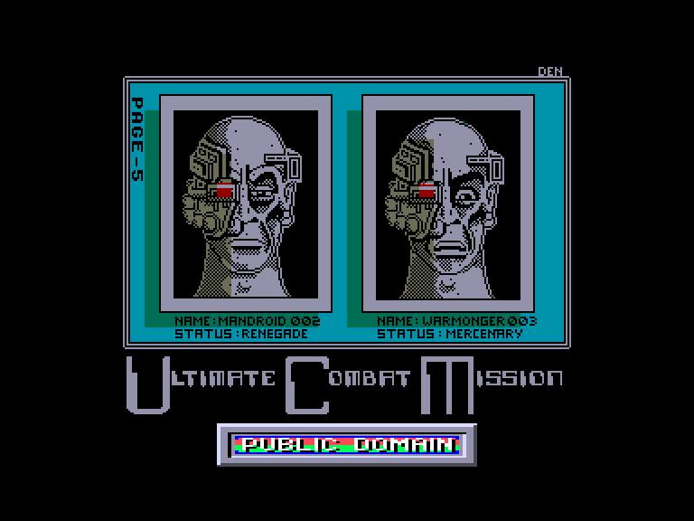
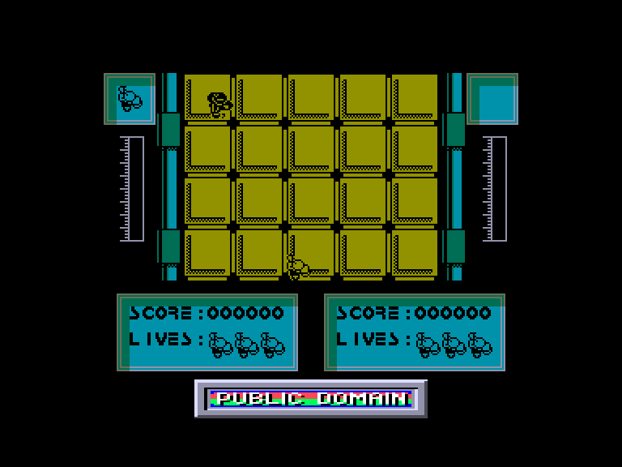
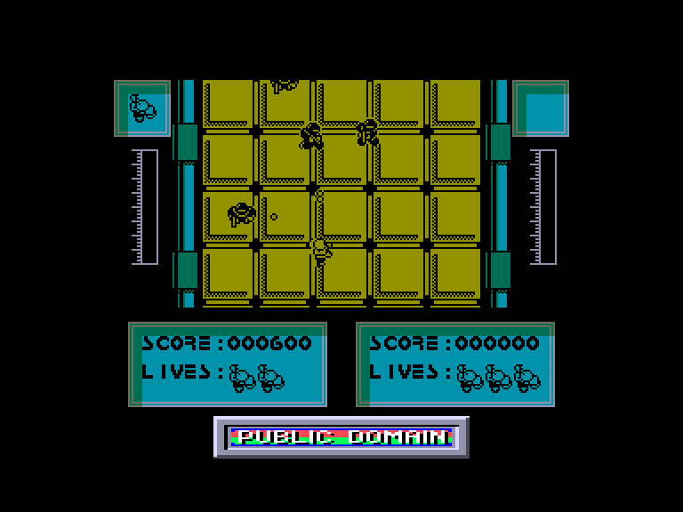
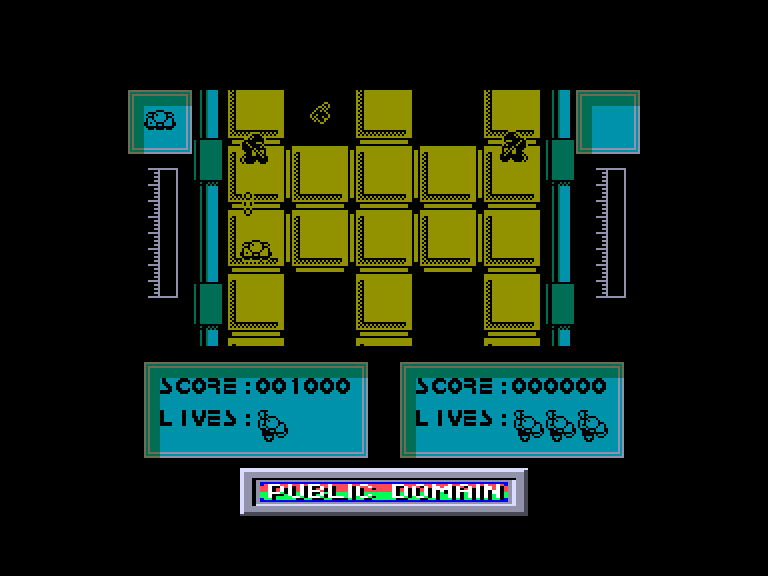

[0-9](../0/games-0.md) - [A](../a/games-a.md) - [B](../b/games-b.md) - [C](../c/games-c.md) - [D](../d/games-d.md) - [E](../e/games-e.md) - [F](../f/games-f.md) - [G](../g/games-g.md) - [H](../h/games-h.md) - [I](../i/games-i.md) - [J](../j/games-j.md) - [K](../k/games-k.md) - [L](../l/games-l.md) - [M](../m/games-m.md) - [N](../n/games-n.md) - [O](../o/games-o.md) - [P](../p/games-p.md) - [Q](../q/games-q.md) - [R](../r/games-r.md) - [S](../s/games-s.md) - [T](../t/games-t.md) - [U](../u/games-u.md) - [V](../v/games-v.md) - [W](../w/games-w.md) - [X](../x/games-x.md) - [Y](../y/games-y.md) - [Z](../z/games-z.md)

Ігри для [Enterprise 64k](../games-ep64.md) - [Enterprise 128k+RAMexp](../games-epramexp.md)

Ігри для систем [IS-DOS](../games-is-dos.md) - [SymbOS](../games-symbos.md) - [EDC Windows](../games-edcw.md)

Ігри для емуляторів [ZX Spectrum 48k/128k](../zxemu/games-zxemu.md) - [Amstrad CPC](../cpcemu/games-cpc.md) - [Sinclair ZX81](../zx81emu/games-zx81.md) - [Videoton TVC](../tvcemu/games-tvc.md) - [Commodore VIC-20](../vic20emu/games-vic20.md)

----------

# Ultimate Combat Mission

**Альтернативні назви:**
 - U.C.M.

**ID:** ultimate-combat-mission-zx

## Скріншоти

## Опис

(temporary description generated by AI [Assistant])

**Опис гри:**
UCM - це захоплююча аркадна гра, в якій гравці можуть змагатися один проти одного або грати в команді. Після завантаження гри ви можете вибрати кількість гравців та налаштувати управління. Гравці борються з ворогами, використовуючи безліч зброї, намагаючись досягти кінця рівня. Гра має вертикальну перспективу, де енергія персонажів відображається по краях екрана, а кількість життів - внизу.

**Правила гри:**
1. Гравці можуть вибрати від 1 до 2 учасників.
2. Кожен гравець має 3 життя.
3. Мета гри - досягти кінця рівня та потрапити до таблиці лідерів.
4. Гравці мають безмежну кількість патронів для автоматичної зброї, але втрачають зібрану зброю після смерті.
5. Гравці можуть стрибати, але це не вплине на гру.
6. Гра вимагає терпіння та навичок для успішного проходження.

Для отримання безсмертя, гравці можуть використовувати спеціальні коди.

## Основна інформація
- **Оригінальна платформа:** ZX Spectrum

## Посилання
- [Опис гри на ep128.hu (угорською)](http://www.ep128.hu/Games/UCM.htm)
- [Інформація про оригінальну версію](https://spectrumcomputing.co.uk/entry/5509/ZX-Spectrum/Ultimate_Combat_Mission)
- [Завантажити гру](http://www.ep128.hu/Ep_Games/Prg/UCM.rar)

**Дата генерації:** 28.07.2026

