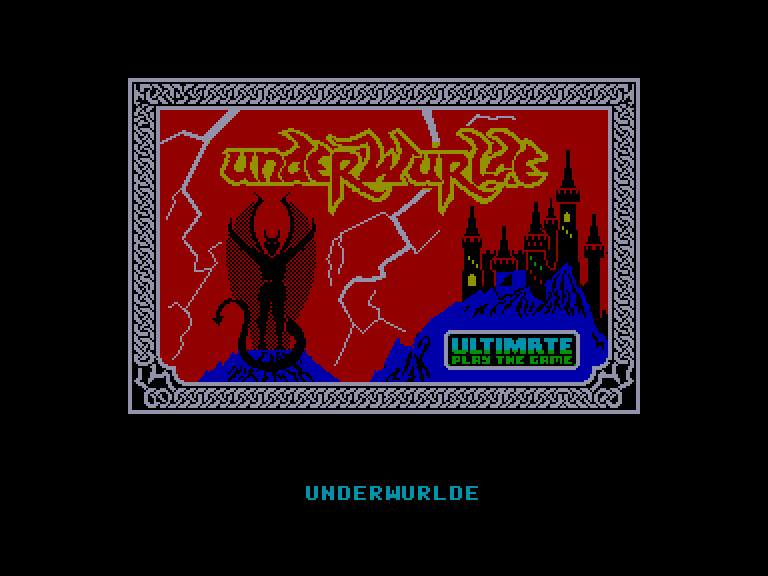
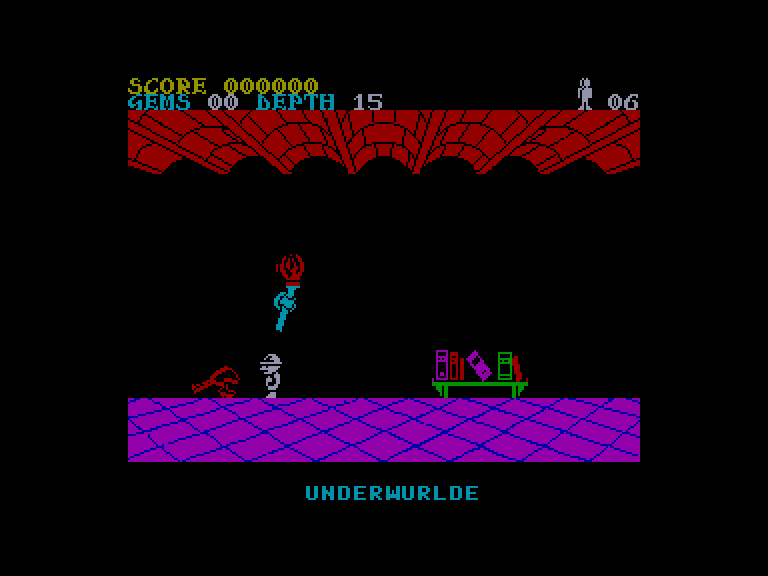
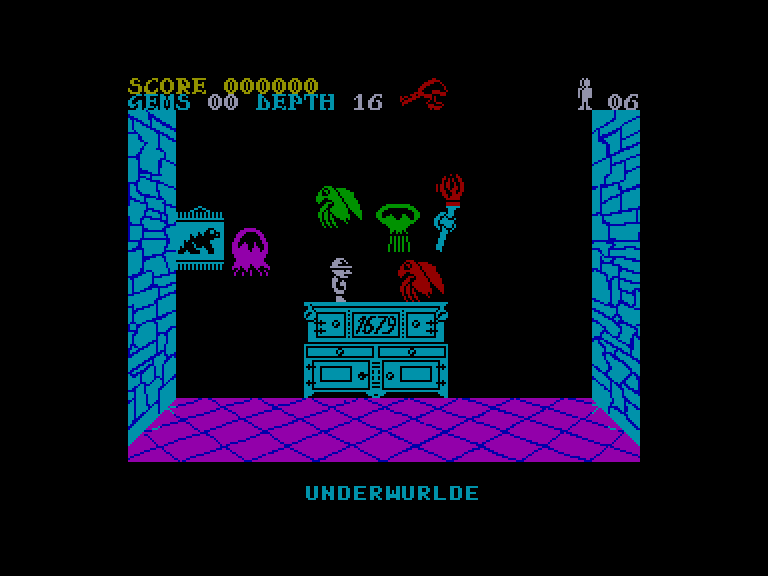
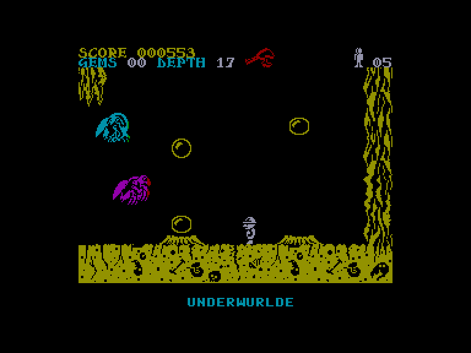

[0-9](../0/games-0.md) - [A](../a/games-a.md) - [B](../b/games-b.md) - [C](../c/games-c.md) - [D](../d/games-d.md) - [E](../e/games-e.md) - [F](../f/games-f.md) - [G](../g/games-g.md) - [H](../h/games-h.md) - [I](../i/games-i.md) - [J](../j/games-j.md) - [K](../k/games-k.md) - [L](../l/games-l.md) - [M](../m/games-m.md) - [N](../n/games-n.md) - [O](../o/games-o.md) - [P](../p/games-p.md) - [Q](../q/games-q.md) - [R](../r/games-r.md) - [S](../s/games-s.md) - [T](../t/games-t.md) - [U](../u/games-u.md) - [V](../v/games-v.md) - [W](../w/games-w.md) - [X](../x/games-x.md) - [Y](../y/games-y.md) - [Z](../z/games-z.md)

Ігри для [Enterprise 64k](../games-ep64.md) - [Enterprise 128k+RAMexp](../games-epramexp.md) - [2dfx](games-2dfx.md)

Ігри для систем [IS-DOS](../games-is-dos.md) - [SymbOS](../games-symbos.md) - [EDC Windows](../games-edcw.md)

Ігри для емуляторів [ZX Spectrum 48k/128k](../zxemu/games-zxemu.md) - [Amstrad CPC](../cpcemu/games-cpc.md) - [Sinclair ZX81](../zx81emu/games-zx81.md) - [Videoton TVC](../tvcemu/games-tvc.md) - [Commodore VIC-20](../vic20emu/games-vic20.md)

----------

# Underwurlde

**ID:** underwurlde-zx

## Скріншоти

## Опис

(temporary description generated by AI [ChatGPT])

**Опис гри: Underwurlde**

У грі "Underwurlde" ви берете на себе роль Сабремена, який після важких пригод у "Sabrewulf" потрапляє в підземне царство. Ваше завдання - втекти на поверхню, але підземелля населено літаючими чудовиськами та іншими небезпечними істотами. Гравець повинен досліджувати 597 кімнат, уникати небезпек, збирати зброю та предмети, щоб пройти через три охоронювані проходи.

**Правила гри:**
1. Використовуйте різні види зброї для боротьби з монстрами:
   - Товар проти жуків.
   - Стріла проти демонів.
   - Факел проти дияволів.
2. Збирайте предмети, такі як білі ляльки для отримання додаткових життів та блакитні магічні скарби для тимчасового захисту.
3. Досліджуйте підземелля, уникаючи небезпечних рослин та падаючих каменів.
4. Використовуйте газові бульбашки для підйому вгору.
5. Будьте обережні з висотою: падіння з великої висоти може призвести до втрати життя.
6. Керуйте персонажем за допомогою клавіатури, використовуючи призначені клавіші для переміщення, стрибків та використання предметів.

Гра продовжує історію з "Knight Lore" і пропонує захоплюючі виклики для гравців.

## Основна інформація
- **Оригінальна платформа:** ZX Spectrum

## Посилання
- [Опис на ep128.hu (угорською)](http://www.ep128.hu/Games/Underwurlde.htm)
- [Інформація про оригінальну версію](https://spectrumcomputing.co.uk/entry/9446/ZX-Spectrum/Underwurlde)
- [Завантажити](http://www.ep128.hu/Ep_Games/Prg/Underwurlde.rar)

