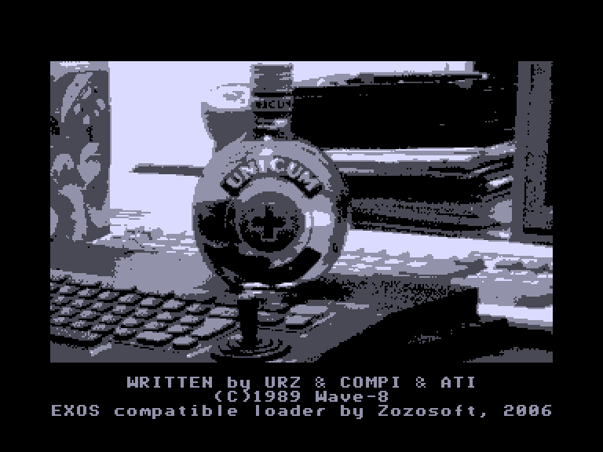
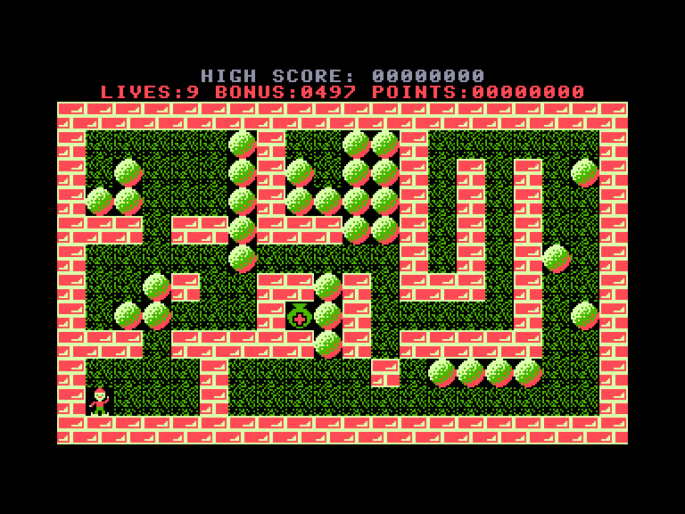
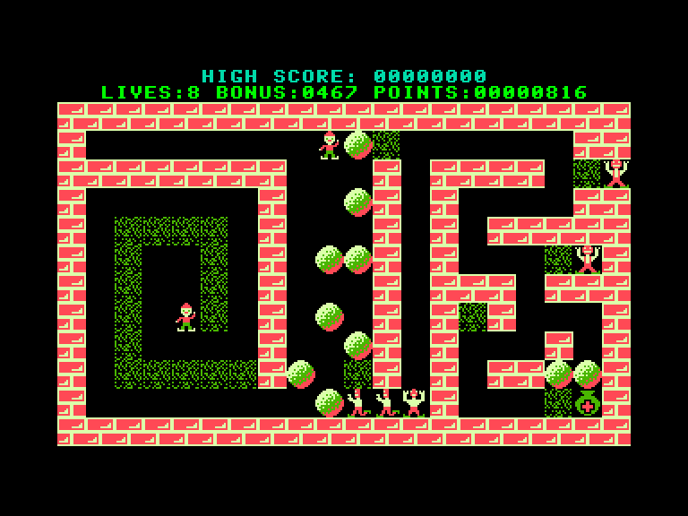
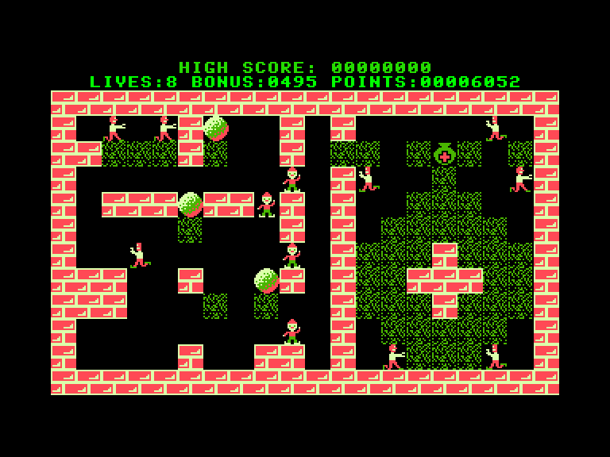

[0-9](../0/games-0.md) - [A](../a/games-a.md) - [B](../b/games-b.md) - [C](../c/games-c.md) - [D](../d/games-d.md) - [E](../e/games-e.md) - [F](../f/games-f.md) - [G](../g/games-g.md) - [H](../h/games-h.md) - [I](../i/games-i.md) - [J](../j/games-j.md) - [K](../k/games-k.md) - [L](../l/games-l.md) - [M](../m/games-m.md) - [N](../n/games-n.md) - [O](../o/games-o.md) - [P](../p/games-p.md) - [Q](../q/games-q.md) - [R](../r/games-r.md) - [S](../s/games-s.md) - [T](../t/games-t.md) - [U](../u/games-u.md) - [V](../v/games-v.md) - [W](../w/games-w.md) - [X](../x/games-x.md) - [Y](../y/games-y.md) - [Z](../z/games-z.md)

Ігри для [Enterprise 64k](../games-ep64.md) - [Enterprise 128k+RAMexp](../games-epramexp.md) - [2dfx](games-2dfx.md)

Ігри для систем [IS-DOS](../games-is-dos.md) - [SymbOS](../games-symbos.md) - [EDC Windows](../games-edcw.md)

Ігри для емуляторів [ZX Spectrum 48k/128k](../zxemu/games-zxemu.md) - [Amstrad CPC](../cpcemu/games-cpc.md) - [Sinclair ZX81](../zx81emu/games-zx81.md) - [Videoton TVC](../tvcemu/games-tvc.md) - [Commodore VIC-20](../vic20emu/games-vic20.md)

----------

# Unicum

**ID:** unicum

## Скріншоти

## Опис

(temporary description generated by AI [ChatGPT])

**Опис гри:**
Unicum - це логічна гра з елементами спритності, що нагадує Boulder Dash. Гравець повинен здобути пляшку Unicum, уникаючи перешкод і ворогів. Гра пропонує можливість створення власних рівнів.

**Правила гри:**
1. **Управління:**
   - F1-F2: Налаштування швидкості гри.
   - F5-F6: Вибір початкового рівня.
   - F3: Збереження створеного рівня.
   - F4: Завантаження створеного рівня.
   - F7: Вхід до редактора рівнів.
   - F8: Початок гри.
   - ENTER: Включення/вимкнення музики.
   - ESC: Вихід з гри.
   - SPACE: Перезапуск рівня.

2. **Геймплей:**
   - Перший рівень містить лише камені як перешкоди.
   - Гравець викопує землю під собою, створюючи порожні місця.
   - Камені падають, якщо їх викопати знизу або з боку.
   - Вороги рухаються по викопаних ділянках і можуть знищити гравця.
   - Гра проходить на час, і іноді на рівні є альтер его, яке також може бути захоплене ворогами.

3. **Редактор рівнів:**
   - За допомогою F7 можна створювати власні рівні, використовуючи різні об'єкти.
   - Для допомоги натисніть ESC у редакторі.

Гравець повинен поєднувати логіку та швидкість, щоб успішно проходити рівні та уникати пасток.

## Посилання
- [Опис на ep128.hu (угорською)](http://www.ep128.hu/Ep_Games/Leiras/Unicum.htm)
- [Завантажити](http://www.ep128.hu/Ep_Games/Prg/Unicum.rar)
- [Easy Load&Play](https://t.me/EP128k_Load_n_Play/867) *(Telegram-канал Vibrant Waves)*

## Відео

<iframe src="https://www.youtube.com/embed/Cekk4JLN5Z4"  
style="width:75%; aspect-ratio:16/9;" allowfullscreen></iframe>

