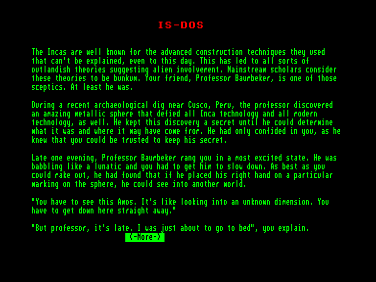
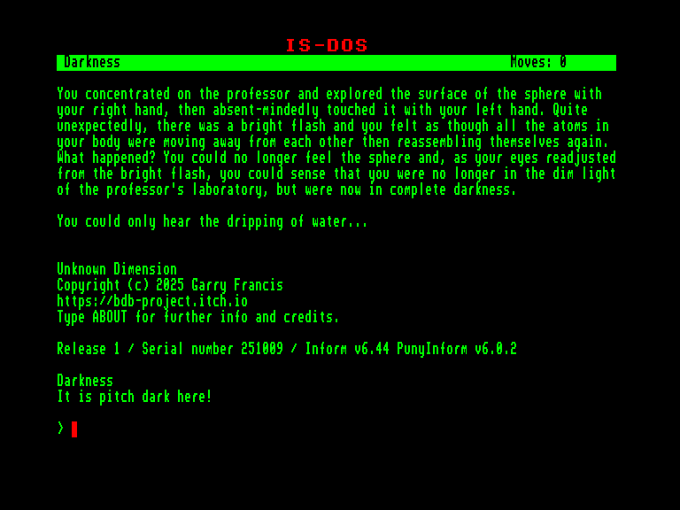
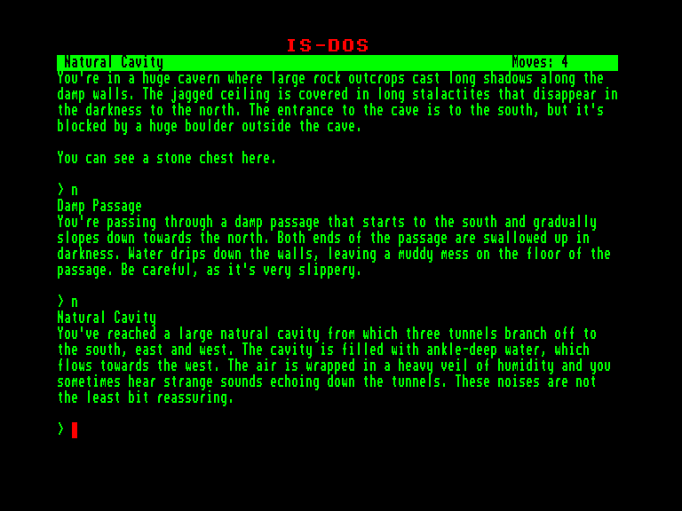
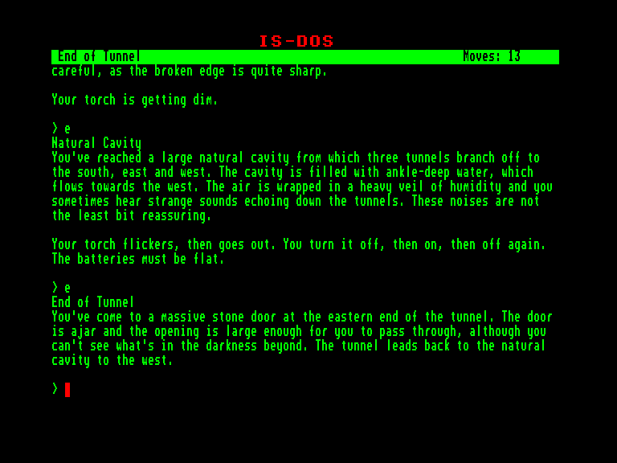

[0-9](../0/games-0.md) - [A](../a/games-a.md) - [B](../b/games-b.md) - [C](../c/games-c.md) - [D](../d/games-d.md) - [E](../e/games-e.md) - [F](../f/games-f.md) - [G](../g/games-g.md) - [H](../h/games-h.md) - [I](../i/games-i.md) - [J](../j/games-j.md) - [K](../k/games-k.md) - [L](../l/games-l.md) - [M](../m/games-m.md) - [N](../n/games-n.md) - [O](../o/games-o.md) - [P](../p/games-p.md) - [Q](../q/games-q.md) - [R](../r/games-r.md) - [S](../s/games-s.md) - [T](../t/games-t.md) - [U](../u/games-u.md) - [V](../v/games-v.md) - [W](../w/games-w.md) - [X](../x/games-x.md) - [Y](../y/games-y.md) - [Z](../z/games-z.md)

Ігри для [Enterprise 64k](../games-ep64.md) - [Enterprise 128k+RAMexp](../games-epramexp.md)

Ігри для систем [IS-DOS](../games-is-dos.md) - [SymbOS](../games-symbos.md) - [EDC Windows](../games-edcw.md)

Ігри для емуляторів [ZX Spectrum 48k/128k](../zxemu/games-zxemu.md) - [Amstrad CPC](../cpcemu/games-cpc.md) - [Sinclair ZX81](../zx81emu/games-zx81.md) - [Videoton TVC](../tvcemu/games-tvc.md) - [Commodore VIC-20](../vic20emu/games-vic20.md)

----------

# Unknown Dimension

**ID:** unknown-dimension-zcode

**Жанри:** Текстова пригода

## Скріншоти

## Опис

Ваш давній друг, професор Баумбекер, під час недавніх розкопок у Перу натрапив на воістину загадкову металеву кулю. Вона не піддавалася жодним поясненням — ні стародавнім технологіям інків, ні нашим сучасним знанням. Професор приховував свою знахідку, поки не з'ясував, що це таке і звідки воно могло з'явитися.

Аж ось, пізньої ночі, професор подзвонив вам у повному захваті, ледь не задихаючись від емоцій. Він повідомив, що використав сферу, аби зазирнути до іншого світу! Звісно, ви пообіцяли одразу ж приїхати до його лабораторії вранці, щоб особисто побачити це диво, але коли ви прибули, професора там не було.

Поки ви чекали на його появу, ваша права рука мимоволі доторкнулася до металевої кулі саме в тому місці, яке описував професор. Вас пронизав шок, коли перед очима постало яскраве видіння професора.

Потім, зовсім не думаючи, ваша ліва рука торкнулася сфери, і в ту ж мить ви були перенесені в непроглядну темряву, де єдиним звуком було лише крапання води.

Відтепер у цій пригоді вам доведеться досліджувати цей чудернацький світ, остерігатися його небезпек і розгадувати його загадки, аби відшукати професора та повернути його додому з цього Дивного Виміру.

## Основна інформація
- **Мови:** Англійська
### Системні вимоги
- **Апаратні:** EXDOS
- **Програмні:** IS-DOS
### Геймплей
- **Керування:** Keyboard
- **Кількість гравців:** 1 player
- **Додаткові теги:** Z-code
### Розробка
- **Рік випуску:** 2025
- **Автор:** Garry Francis

## Посилання
- [Домашня сторінка гри](https://bdb-project.itch.io/unknown-dimension)
- [Інформація про гру (SolutionArchive.com)](https://www.solutionarchive.com/game/id%2C10903/Unknown+Dimension.html)

