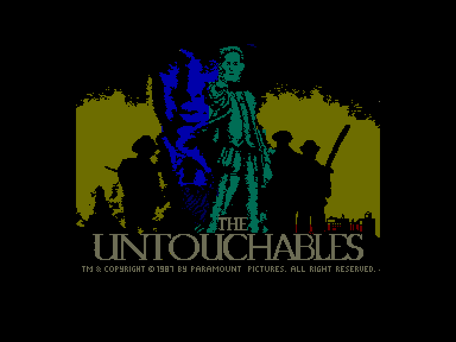
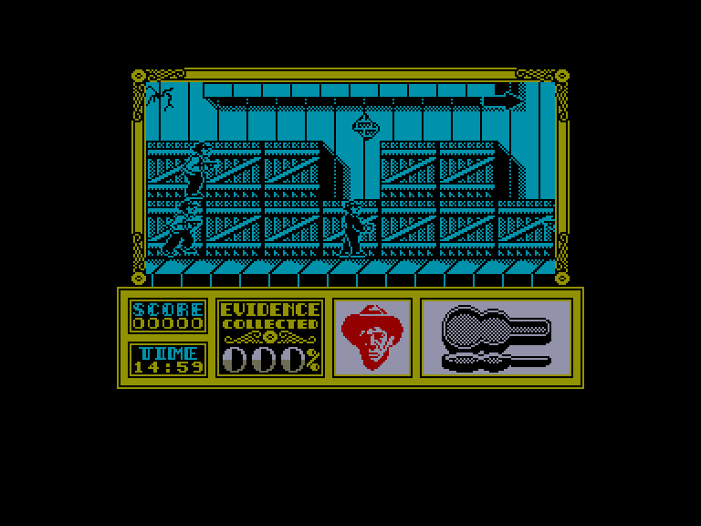
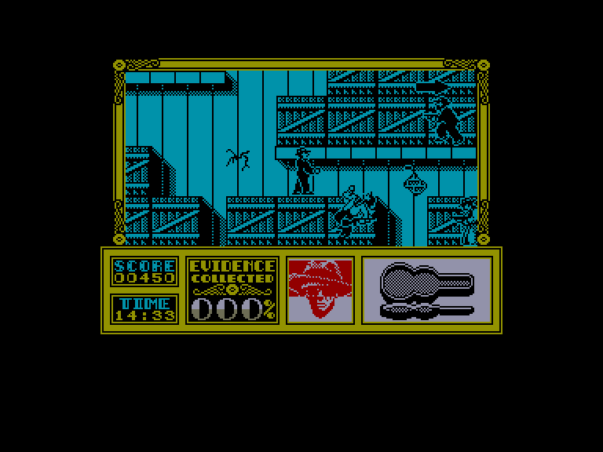
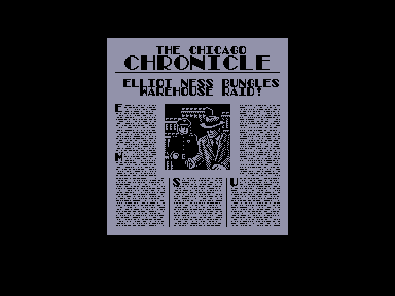

[0-9](../0/games-0.md) - [A](../a/games-a.md) - [B](../b/games-b.md) - [C](../c/games-c.md) - [D](../d/games-d.md) - [E](../e/games-e.md) - [F](../f/games-f.md) - [G](../g/games-g.md) - [H](../h/games-h.md) - [I](../i/games-i.md) - [J](../j/games-j.md) - [K](../k/games-k.md) - [L](../l/games-l.md) - [M](../m/games-m.md) - [N](../n/games-n.md) - [O](../o/games-o.md) - [P](../p/games-p.md) - [Q](../q/games-q.md) - [R](../r/games-r.md) - [S](../s/games-s.md) - [T](../t/games-t.md) - [U](../u/games-u.md) - [V](../v/games-v.md) - [W](../w/games-w.md) - [X](../x/games-x.md) - [Y](../y/games-y.md) - [Z](../z/games-z.md)

Ігри для [Enterprise 64k](../games-ep64.md) - [Enterprise 128k+RAMexp](../games-epramexp.md)

Ігри для систем [IS-DOS](../games-is-dos.md) - [SymbOS](../games-symbos.md) - [EDC Windows](../games-edcw.md)

Ігри для емуляторів [ZX Spectrum 48k/128k](../zxemu/games-zxemu.md) - [Amstrad CPC](../cpcemu/games-cpc.md) - [Sinclair ZX81](../zx81emu/games-zx81.md) - [Videoton TVC](../tvcemu/games-tvc.md) - [Commodore VIC-20](../vic20emu/games-vic20.md)

----------

# The Untouchables

**ID:** untouchables-zx

## Скріншоти

## Опис

(temporary description generated by AI [Assistant])

**Опис гри: The Untouchables**

Гра "The Untouchables" переносить вас у Чикаго 1930 року, де ви берете на себе роль агента Еліота Несса, який намагається зупинити гангстерів, що тероризують місто. Гравці повинні виконувати різноманітні місії, щоб знешкодити злочинців, використовуючи різні види зброї та тактики. Гра слідкує за сюжетом однойменного фільму, пропонуючи динамічні рівні, на яких вам потрібно буде боротися з ворогами, рятувати заручників і знищувати контрабанду.

**Правила гри:**
1. **Місії:** Гравець повинен виконувати завдання на кожному рівні, знищуючи ворогів та виконуючи специфічні цілі.
2. **Час:** Багато місій мають обмежений час для виконання, тому потрібно діяти швидко.
3. **Зброя:** Використовуйте різні види зброї, включаючи гвинтівки та пістолети, щоб знищувати ворогів.
4. **Енергія:** Слідкуйте за рівнем енергії; якщо він знижується до нуля, гра закінчується.
5. **Підказки:** Збирайте корисні предмети, такі як аптечки та боєприпаси, щоб підвищити свої шанси на успіх.
6. **Цілі:** Зловіть певну кількість злочинців або знищте вказану кількість об'єктів, щоб перейти на наступний рівень.

Змагайтеся з часом і гангстерами, щоб стати непереможним агентом у "The Untouchables"!

## Основна інформація
- **Оригінальна платформа:** ZX Spectrum

## Посилання
- [Опис гри на ep128.hu (угорською)](http://www.ep128.hu/Games/Untouchables.htm)
- [Інформація про оригінальну версію](https://spectrumcomputing.co.uk/entry/5520/ZX-Spectrum/The_Untouchables)
- [Завантажити гру](http://www.ep128.hu/Ep_Games/Prg/Untouchables.rar)

