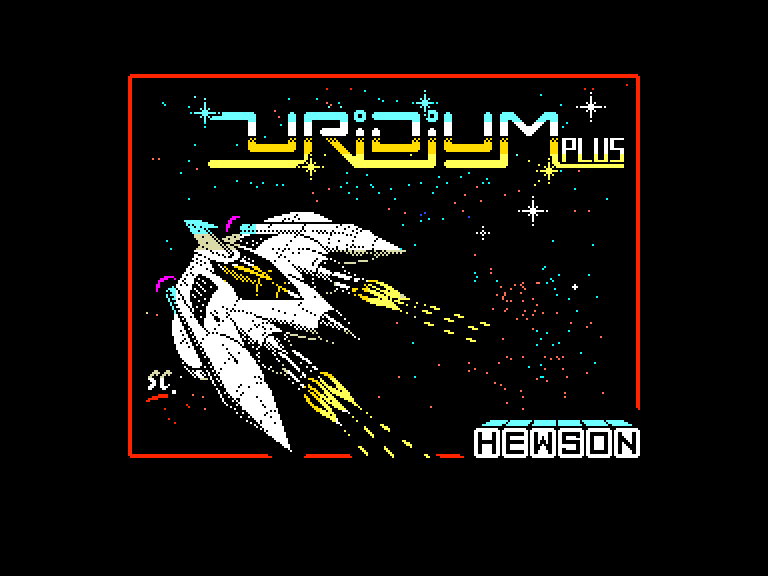
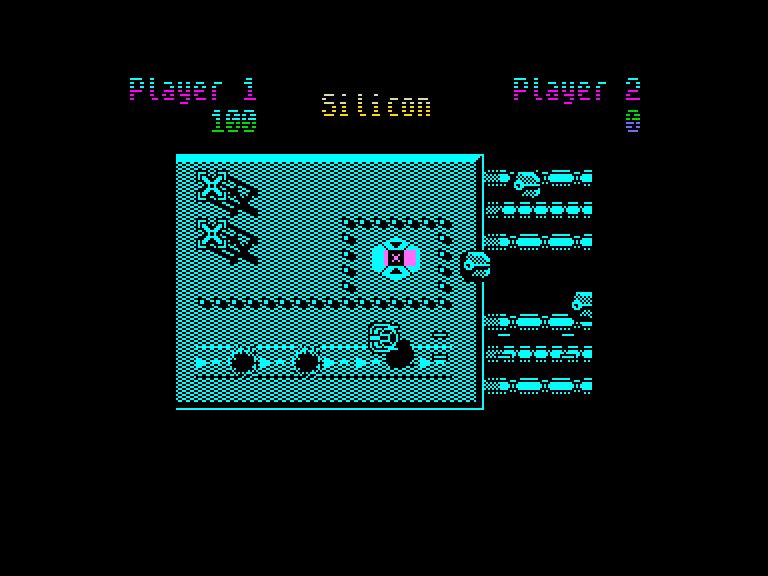
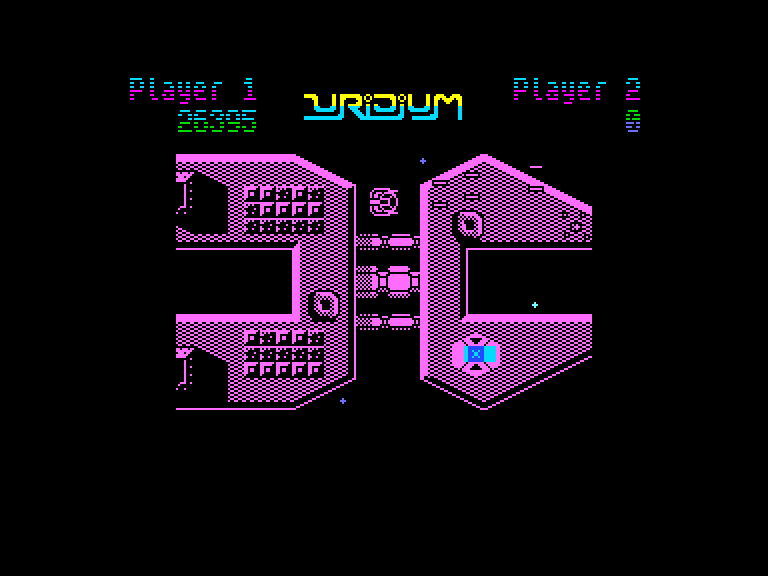
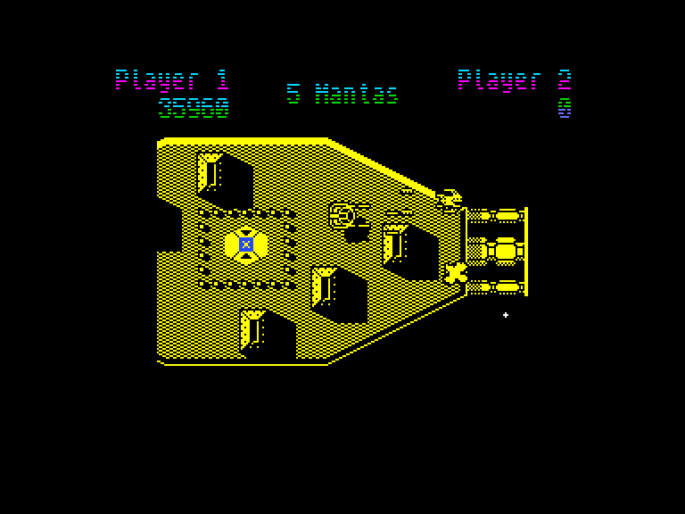

[0-9](../0/games-0.md) - [A](../a/games-a.md) - [B](../b/games-b.md) - [C](../c/games-c.md) - [D](../d/games-d.md) - [E](../e/games-e.md) - [F](../f/games-f.md) - [G](../g/games-g.md) - [H](../h/games-h.md) - [I](../i/games-i.md) - [J](../j/games-j.md) - [K](../k/games-k.md) - [L](../l/games-l.md) - [M](../m/games-m.md) - [N](../n/games-n.md) - [O](../o/games-o.md) - [P](../p/games-p.md) - [Q](../q/games-q.md) - [R](../r/games-r.md) - [S](../s/games-s.md) - [T](../t/games-t.md) - [U](../u/games-u.md) - [V](../v/games-v.md) - [W](../w/games-w.md) - [X](../x/games-x.md) - [Y](../y/games-y.md) - [Z](../z/games-z.md)

Ігри для [Enterprise 64k](../games-ep64.md) - [Enterprise 128k+RAMexp](../games-epramexp.md)

Ігри для систем [IS-DOS](../games-is-dos.md) - [SymbOS](../games-symbos.md) - [EDC Windows](../games-edcw.md)

Ігри для емуляторів [ZX Spectrum 48k/128k](../zxemu/games-zxemu.md) - [Amstrad CPC](../cpcemu/games-cpc.md) - [Sinclair ZX81](../zx81emu/games-zx81.md) - [Videoton TVC](../tvcemu/games-tvc.md) - [Commodore VIC-20](../vic20emu/games-vic20.md)

----------

# Uridium Plus

**ID:** uridium-plus-zx

## Скріншоти

## Опис

(temporary description generated by AI [Assistant])

**Опис гри: Uridium**

У грі "Uridium" ви берете на себе роль пілота сучасного винищувача класу Manta, який повинен знищити ворожі бази, що атакують вашу планету. Вам потрібно знищити ворожі винищувачі та наземні оборонні системи, а потім активувати самознищувальну систему бази. Гра пропонує різні рівні складності, де вам потрібно маневрувати між перешкодами, уникати ракет і збирати бонуси за знищення ворогів.

**Правила гри:**
1. Гравець може вибрати один або два гравці для гри.
2. Використовуйте клавіатуру або джойстик для управління літаком.
3. Уникайте ворожих атак і знищуйте їх, щоб просуватися далі.
4. Коли з'явиться повідомлення "LAND NOW", швидко приземліться на базу.
5. Збирайте бали за знищених ворогів, щоб отримати бонуси.
6. Гра має 15 рівнів складності, кожен з яких пропонує нові виклики.

Гра "Uridium" обіцяє захоплюючий досвід для шанувальників аркадних ігор!

## Основна інформація
- **Оригінальна платформа:** ZX Spectrum

## Посилання
- [Опис гри на ep128.hu (угорською)](http://www.ep128.hu/Games/Uridium.htm)
- [Інформація про оригінальну версію](https://spectrumcomputing.co.uk/entry/5528/ZX-Spectrum/Uridium_Plus)
- [Завантажити гру](http://www.ep128.hu/Ep_Games/Prg/Uridium_Plus.rar)

