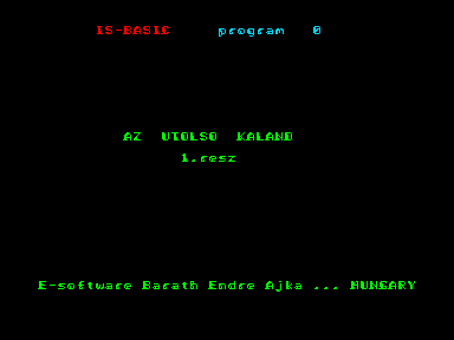
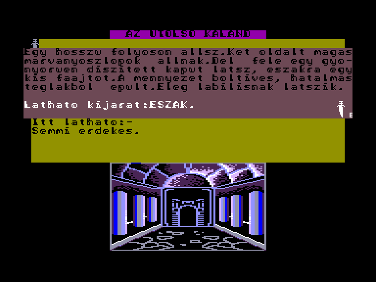
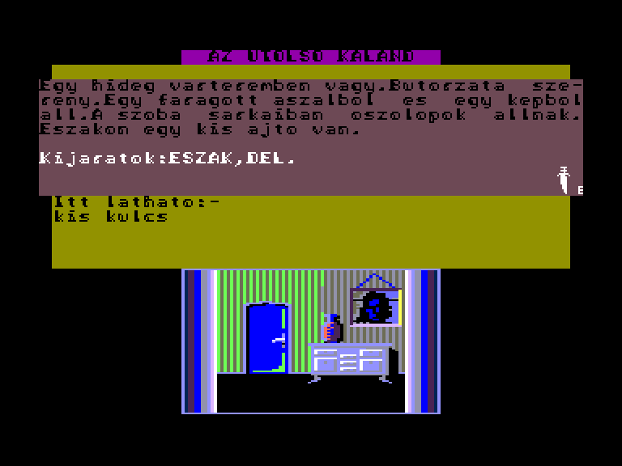

[0-9](../0/games-0.md) - [A](../a/games-a.md) - [B](../b/games-b.md) - [C](../c/games-c.md) - [D](../d/games-d.md) - [E](../e/games-e.md) - [F](../f/games-f.md) - [G](../g/games-g.md) - [H](../h/games-h.md) - [I](../i/games-i.md) - [J](../j/games-j.md) - [K](../k/games-k.md) - [L](../l/games-l.md) - [M](../m/games-m.md) - [N](../n/games-n.md) - [O](../o/games-o.md) - [P](../p/games-p.md) - [Q](../q/games-q.md) - [R](../r/games-r.md) - [S](../s/games-s.md) - [T](../t/games-t.md) - [U](../u/games-u.md) - [V](../v/games-v.md) - [W](../w/games-w.md) - [X](../x/games-x.md) - [Y](../y/games-y.md) - [Z](../z/games-z.md)

Ігри для [Enterprise 64k](../games-ep64.md) - [Enterprise 128k+RAMexp](../games-epramexp.md)

Ігри для систем [IS-DOS](../games-is-dos.md) - [SymbOS](../games-symbos.md) - [EDC Windows](../games-edcw.md)

Ігри для емуляторів [ZX Spectrum 48k/128k](../zxemu/games-zxemu.md) - [Amstrad CPC](../cpcemu/games-cpc.md) - [Sinclair ZX81](../zx81emu/games-zx81.md) - [Videoton TVC](../tvcemu/games-tvc.md) - [Commodore VIC-20](../vic20emu/games-vic20.md)

----------

# Az Utolsó Kaland

**ID:** utolso-kaland-bas

## Скріншоти

## Опис

(temporary description generated by AI [Assistant])

**Остання Пригода (Az Utolsó Kaland)**

**Опис гри:**
"Остання Пригода" — це текстова гра, в якій гравець повинен втекти з замку, обігруючи своїх охоронців. Гра не має чіткої сюжетної лінії, але пропонує п'ять рівнів, кожен з яких має свою унікальну картину. Гравець вводить команди для взаємодії з предметами та середовищем, використовуючи традиційний формат команд (дієслово або дієслово + іменник) без акцентів.

**Правила гри:**
1. Команди вводяться українською мовою без акцентів.
2. Доступні команди включають: 
   - Рух: Північ (П), Південь (Д), Схід (С), Захід (З), Вгору (ВГ), Вниз (ВН).
   - Дії: Дослідити (ДОС), Натиснути (НАТ), Взяти (ВЗЯ), Поставити (ПОСТ), Кинути (КИНУ), Відкрити (ВІДКР), тощо.
3. Слова довше чотирьох літер можна скорочувати до перших чотирьох літер.
4. Гравець повинен досліджувати всі об'єкти, описані в грі, щоб знайти предмети та вирішити головоломки.
5. Якщо введена команда не розпізнана, гра відповість "Пробач?".
6. На кожному рівні є певні предмети та перешкоди, які потрібно подолати, щоб просунутися далі.

Вдалих пригод!

## Основна інформація
- **Мови:** Угорська

## Посилання
- [Опис гри на ep128.hu (угорською)](http://www.ep128.hu/Ep_Games/Leiras/Utolso_kaland.htm)
- [Завантажити гру](http://www.ep128.hu/Ep_Games/Prg/Utolso_Kaland.rar)

