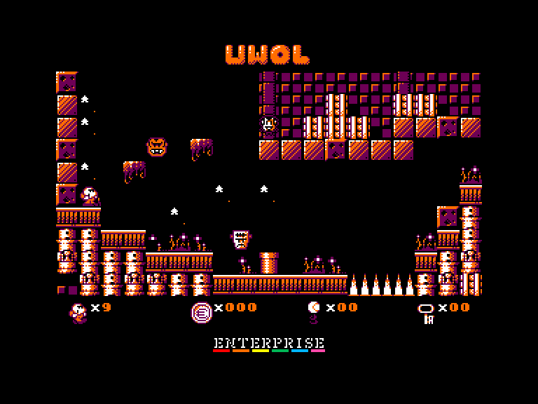
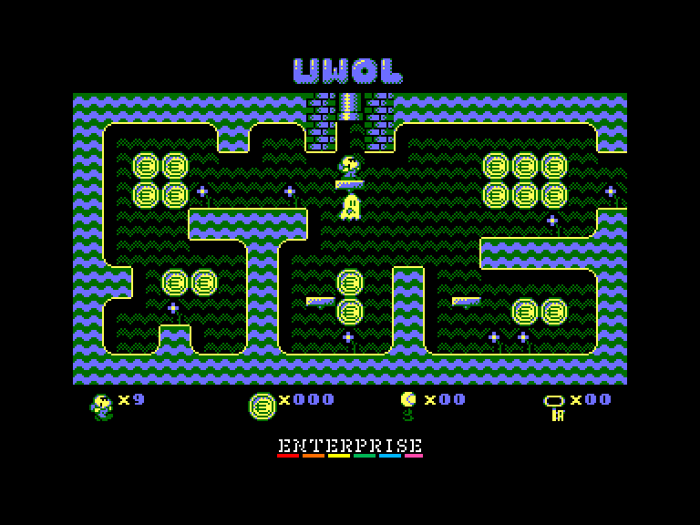
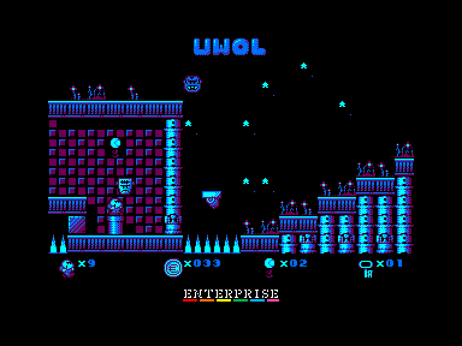

[0-9](../0/games-0.md) - [A](../a/games-a.md) - [B](../b/games-b.md) - [C](../c/games-c.md) - [D](../d/games-d.md) - [E](../e/games-e.md) - [F](../f/games-f.md) - [G](../g/games-g.md) - [H](../h/games-h.md) - [I](../i/games-i.md) - [J](../j/games-j.md) - [K](../k/games-k.md) - [L](../l/games-l.md) - [M](../m/games-m.md) - [N](../n/games-n.md) - [O](../o/games-o.md) - [P](../p/games-p.md) - [Q](../q/games-q.md) - [R](../r/games-r.md) - [S](../s/games-s.md) - [T](../t/games-t.md) - [U](../u/games-u.md) - [V](../v/games-v.md) - [W](../w/games-w.md) - [X](../x/games-x.md) - [Y](../y/games-y.md) - [Z](../z/games-z.md)

Ігри для [Enterprise 64k](../games-ep64.md) - [Enterprise 128k+RAMexp](../games-epramexp.md) - [2dfx](games-2dfx.md)

Ігри для систем [IS-DOS](../games-is-dos.md) - [SymbOS](../games-symbos.md) - [EDC Windows](../games-edcw.md)

Ігри для емуляторів [ZX Spectrum 48k/128k](../zxemu/games-zxemu.md) - [Amstrad CPC](../cpcemu/games-cpc.md) - [Sinclair ZX81](../zx81emu/games-zx81.md) - [Videoton TVC](../tvcemu/games-tvc.md) - [Commodore VIC-20](../vic20emu/games-vic20.md)

----------

# UWOL 2: Quest for Money

**ID:** uwol2-cpc

## Скріншоти

## Опис

(temporary description generated by AI [Assistant])

**Опис гри:**

Uwol 2: Quest for Money — це продовження гри Uwol: Quest for Money, випущене 6 січня 2011 року. Гравець знову керує персонажем Uwol, який після пригод у першій частині потрапляє до Електричного Саду Фантів, де втрачає всі свої монети. Тепер йому потрібно вирішити, чи намагатися вийти з саду або ризикнути і зібрати якомога більше монет. Гра складається з безлічі кімнат, які пов'язані в єдиний великий рівень, де Uwol повинен знаходити ключі для відкриття воріт і уникати ворогів, оскільки він не може атакувати.

**Правила гри:**

1. Досліджуйте сад та збирайте монети, уникаючи ворогів.
2. Збирайте ключі, щоб відкрити ворота, які ведуть до виходу.
3. Уникайте ударів ворогів, оскільки після отримання удару Uwol втрачає одяг і потребує знайти нову сорочку для захисту.
4. Збирайте тенісні м'ячі, які можна знайти у важкодоступних місцях.
5. Досліджуйте підземні печери через труби, щоб знайти більше монет, уникаючи Фантів, які переслідують Uwol.
6. Гра не має обмеження часу на кімнату, але у печерах потрібно бути швидким, щоб зібрати монети та вийти.

Гра Uwol 2: Quest for Money поєднує елементи платформера та аркади, пропонуючи захопливий ігровий процес у фентезійному сеттингу.

## Основна інформація
- **Оригінальна платформа:** Amstrad CPC

## Посилання
- [Домашня сторінка](https://www.mojontwins.com/juegos_mojonos/uwol-2-cpc/)
- [Інформація про оригінальну версію](https://www.cpc-power.com/index.php?page=detail&num=6371)
- [Завантажити](http://www.ep128.hu/Ep_Games/Prg/UWOL2-Quest_for_Money.rar)
- [Easy Load&Play](https://t.me/EP128k_Load_n_Play/871) *(Telegram-канал Vibrant Waves)*

