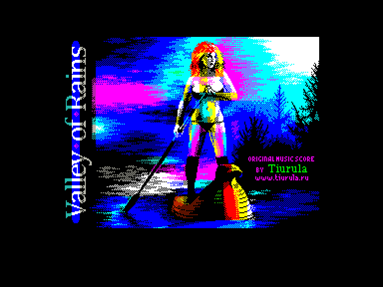
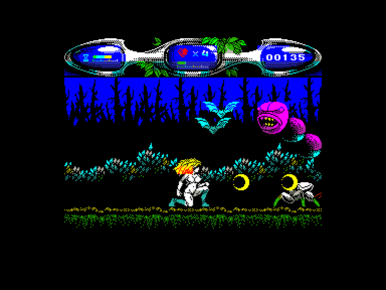
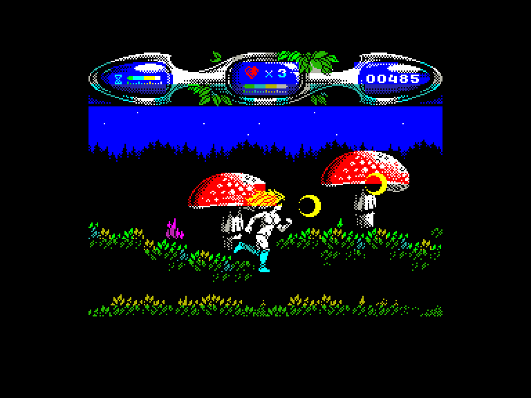
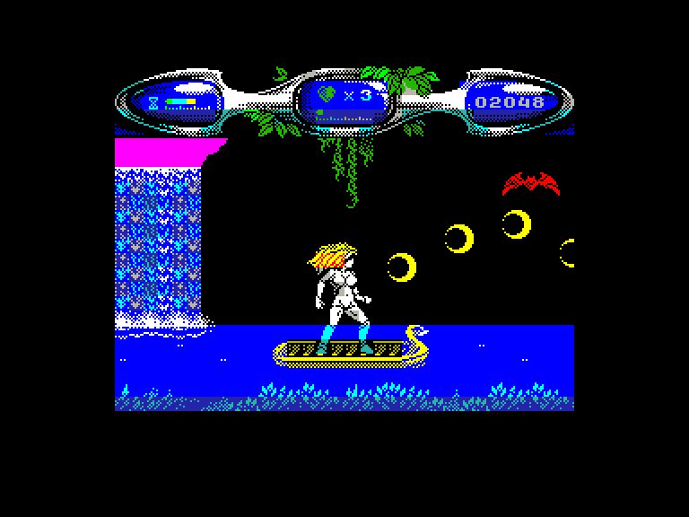

# Valley of Rains

| | | | |
| --- | --- | --- | --- |
|||||

Жанр: екшн  
Кількість гравців: 1

## Опис

Відколи на землі оселилися темні сили, в країні панує посуха. Як принцеса Долини Дощів, ви повинні перемогти злі сили.

### Поради у проходженні

* Рекомендується перед грою [увімкнути саундтрек гри](https://zosya.bandcamp.com/album/valley-of-rains-zx-spectrum-game-ost) та натиснути `Fire` для початку гри.

* Не витрачайте час на дрібних ворогів. Але, щоб пройти рівень, вам доведеться вбивати босів. З убитих ворогів можуть випадати корисні предмети:

	- **жовтий півмісяць** — звичайний постріл
	- **зелений півмісяць** — посилений постріл
	- **фіолетовий ромб** — параболічний постріл
	- **дві блакитні кульки** — подвійний постріл
	- **серце** — поповнення здоров'я
	- **пісочний годинник** — додатковий час
	- **щит** — додатковий захист
	- **синя куля** — тимчасове безсмертя

* Білі квіти дадуть вам трохи здоров'я.

* Іноді ви також знайдете інші предмети, які потрібно використовувати: наприклад, ключ для відкриття воріт. В інших випадках ворота можна відчинити, вбивши охоронців.

* Час, життя, здоров'я і рахунок відображаються в рядку стану. Додаткове життя дається, коли гравець досягає 1000 очок.

* Коли ви втратите все своє здоров'я, ви втратите життя і почнете з того ж місця. Коли закінчується час, ви втрачаєте життя і починаєте рівень заново.

* Якщо ви втратите всі свої життя, гру буде завершено, і вам доведеться починати з самого початку.  

## Системні вимоги

|Мінімальні системні вимоги:|Рекомендовані системні вимоги:|
|---------------------------|------------------------------|
|Оперативна пам'ять: **128 КБ**|Оперативна пам'ять: **128 КБ (або більше)**|  

## Керування

### Основні [елементи керування](../controllers.md):
⌨ Клавіатура (`Q`, `A`, `O`, `P`, `M`)  
🕹 Вбудований джойстик + `Alt`/`0`  
🎮 Зовнішній джойстик 1/2 *(натисніть `Space` для початку гри)*

`⬇` *(на землі та на високій платформі)*: присісти  
`⬇` *(на низькій платформі)*: зістрибнути на землю  
`⬇` *(у визначених місцях)*: активувати предмет  

`Space`: Пауза *(для продовження гри натисніть `Fire`)*  

## Чіт-коди та допомога у проходженні

### Активація під час завантаження:
Безкінечна кількість життів (**Так**/**Ні**)  
Нескінченність часу (**Так**/**Ні**)

### Відеопроходження:

## Посилання

▶ [Easy Load&Play](https://t.me/EP128k_Load_n_Play/742) *(Telegram-канал Vibrant Waves)*  
💾 [Завантажити гру](http://www.ep128.hu/Ep_Games/Prg/Valley_of_Rains.rar)  
📃 [Опис гри](http://www.ep128.hu/Games/Valley_of_Rains.htm) (угорська)  
🗨 [Тема на форумі enterpriseforever.com](https://enterpriseforever.com/spectrum-rol/valley-of-rains/)  
🏡 [Домашня сторінка гри](https://www.zosya.net/product/valley-of-rains/)

## Автори
### Оригінальний реліз
🖥 Платформа: [ZX Spectrum](https://spectrumcomputing.co.uk/entry/35155/ZX-Spectrum/Valley_of_Rains)  
👨‍💻 Розробник: ZOSYA entertainment  
📅 Дата релізу: 6 грудня 2019 року  

### Версія гри для Enterprise
👨‍💻 Портування: [PJV](../../community/pjv.md)  
📅 Рік релізу: 2024