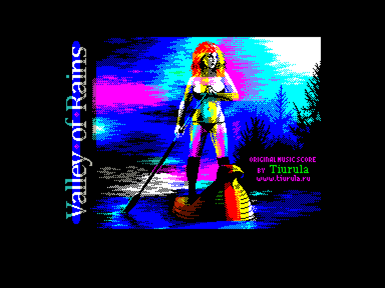
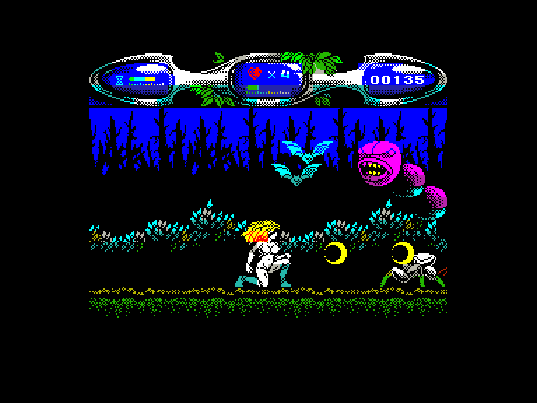
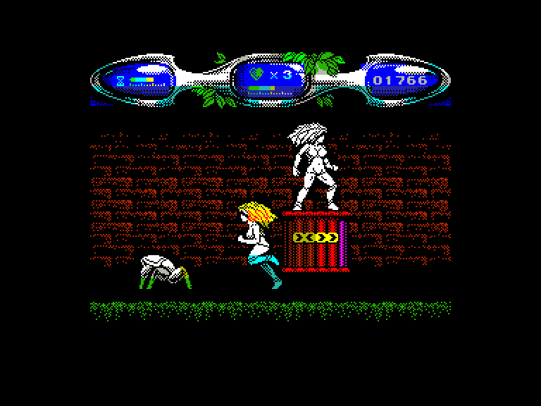
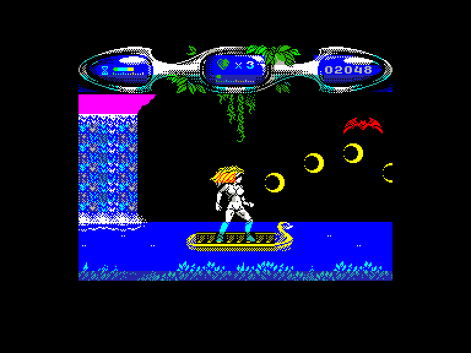

[0-9](../0/games-0.md) - [A](../a/games-a.md) - [B](../b/games-b.md) - [C](../c/games-c.md) - [D](../d/games-d.md) - [E](../e/games-e.md) - [F](../f/games-f.md) - [G](../g/games-g.md) - [H](../h/games-h.md) - [I](../i/games-i.md) - [J](../j/games-j.md) - [K](../k/games-k.md) - [L](../l/games-l.md) - [M](../m/games-m.md) - [N](../n/games-n.md) - [O](../o/games-o.md) - [P](../p/games-p.md) - [Q](../q/games-q.md) - [R](../r/games-r.md) - [S](../s/games-s.md) - [T](../t/games-t.md) - [U](../u/games-u.md) - [V](../v/games-v.md) - [W](../w/games-w.md) - [X](../x/games-x.md) - [Y](../y/games-y.md) - [Z](../z/games-z.md)

Ігри для [Enterprise 64k](../games-ep64.md) - [Enterprise 128k+RAMexp](../games-epramexp.md)

Ігри для систем [IS-DOS](../games-is-dos.md) - [SymbOS](../games-symbos.md) - [EDC Windows](../games-edcw.md)

Ігри для емуляторів [ZX Spectrum 48k/128k](../zxemu/games-zxemu.md) - [Amstrad CPC](../cpcemu/games-cpc.md) - [Sinclair ZX81](../zx81emu/games-zx81.md) - [Videoton TVC](../tvcemu/games-tvc.md) - [Commodore VIC-20](../vic20emu/games-vic20.md)

----------

# Valley of Rains

**ID:** valley-of-rains-zx

**Жанри:** Екшн

## Примітка

ℹ Сучасна неофіційна конверсія з платформи ZX Spectrum.

## Скріншоти

## Опис

Відколи на землі оселилися темні сили, в країні панує посуха. Як принцеса Долини Дощів, ви повинні перемогти злі сили.

## Основна інформація
- **Мови:** Англійська
- **Оригінальна платформа:** ZX Spectrum
### Загальні системні вимоги
- **Апаратні:** EP128
### Геймплей
- **Керування:** Keyboard, Internal Joy, External Joy 1, External Joy 2
- **Кількість гравців:** 1 player
- **Додаткові теги:** Attribute mode
### Розробка
- **Рік випуску:** 2019
- **Компанія:** ZOSYA entertainment

## Посилання
- [Домашня сторінка гри](https://www.zosya.net/product/valley-of-rains/)
- [Опис гри на ep128.hu (угорською)](http://www.ep128.hu/Games/Valley_of_Rains.htm)
- [Тема на форумі enterpriseforever](https://enterpriseforever.com/spectrum-rol/valley-of-rains/)
- [Інформація про оригінальну версію](https://spectrumcomputing.co.uk/entry/35155/ZX-Spectrum/Valley_of_Rains)
- [Завантажити гру](http://www.ep128.hu/Ep_Games/Prg/Valley_of_Rains.rar)
- [Easy Load&Play](https://t.me/EP128k_Load_n_Play/742) *(Telegram-канал Vibrant Waves)*

## Відео

<iframe src="https://www.youtube.com/embed/b5_Scx2u63I"  
style="width:75%; aspect-ratio:16/9;" allowfullscreen></iframe>

- [Відео](https://www.youtube.com/watch?v=7tLrfTcEIM0)

## [Керування](../controllers.md)

`Keyboard`: `Q`, `A`, `O`, `P`, `M`  
`Internal Joystick` + `Alt`/`0`  
`External Joystick 1` *(натисніть `Space` для початку гри)*  
`External Joystick 2` *(натисніть `Space` для початку гри)*  

`⬇` *(на землі та на високій платформі)*: присісти  
`⬇` *(на низькій платформі)*: зістрибнути на землю  
`⬇` *(у визначених місцях)*: активувати предмет  

`Space`: Пауза *(для продовження гри натисніть `Fire`)*

## Детальна інформація

### Системні вимоги  

#### Мінімальні системні вимоги  

Оперативна пам'ять: **128 КБ (або більше)**  

### Допомога у проходженні  

- Рекомендується перед грою [увімкнути саундтрек гри](https://zosya.bandcamp.com/album/valley-of-rains-zx-spectrum-game-ost) та розпочати нову гру.  
- Не витрачайте час на дрібних ворогів. Але, щоб пройти рівень, вам доведеться вбивати босів. З убитих ворогів можуть випадати корисні предмети:  
	- **жовтий півмісяць** — звичайний постріл  
	- **зелений півмісяць** — посилений постріл  
	- **фіолетовий ромб** — параболічний постріл  
	- **дві блакитні кульки** — подвійний постріл  
	- **серце** — поповнення здоров'я  
	- **пісочний годинник** — додатковий час  
	- **щит** — додатковий захист  
	- **синя куля** — тимчасове безсмертя  
- Білі квіти дадуть вам трохи здоров'я.  
- Іноді ви також знайдете інші предмети, які потрібно використовувати: наприклад, ключ для відкриття воріт. В інших випадках ворота можна відчинити, вбивши охоронців.  
- Час, життя, здоров'я і рахунок відображаються в рядку стану. Додаткове життя дається, коли гравець досягає 1000 очок.  
- Коли ви втратите все своє здоров'я, ви втратите життя і почнете з того ж місця. Коли закінчується час, ви втрачаєте життя і починаєте рівень заново.  
- Якщо ви втратите всі свої життя, гру буде завершено, і вам доведеться починати з самого початку.  

### Чіти  

(активація під час завантаження)  
Нескінченні життя (**Так**/**Ні**)  
Нескінченність часу (**Так**/**Ні**)