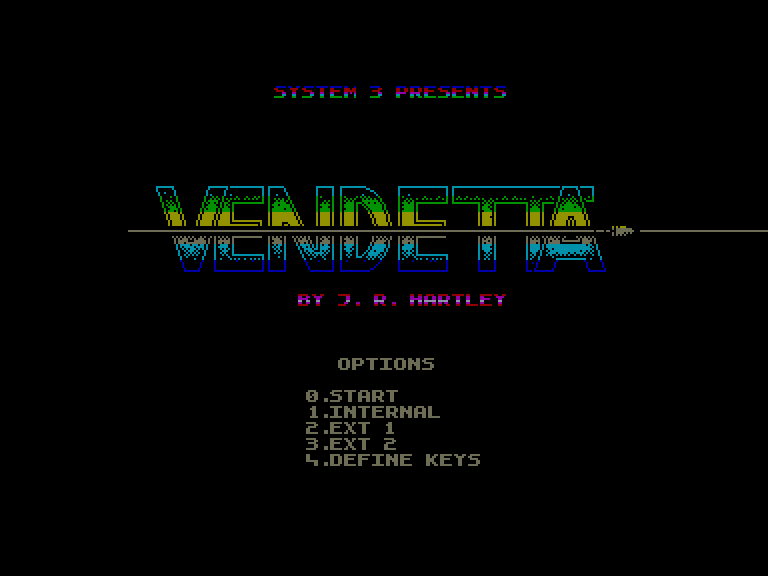
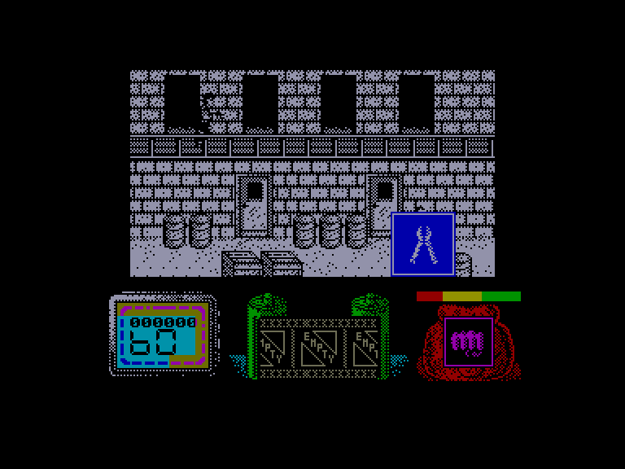
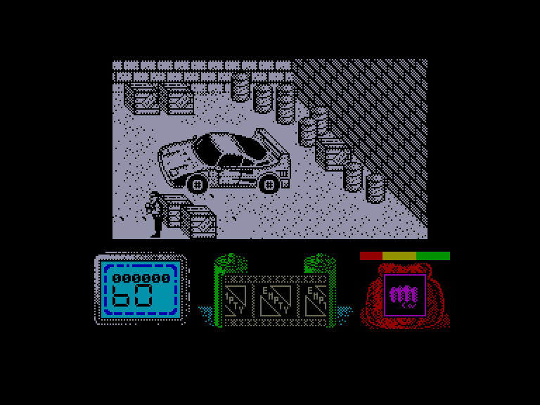
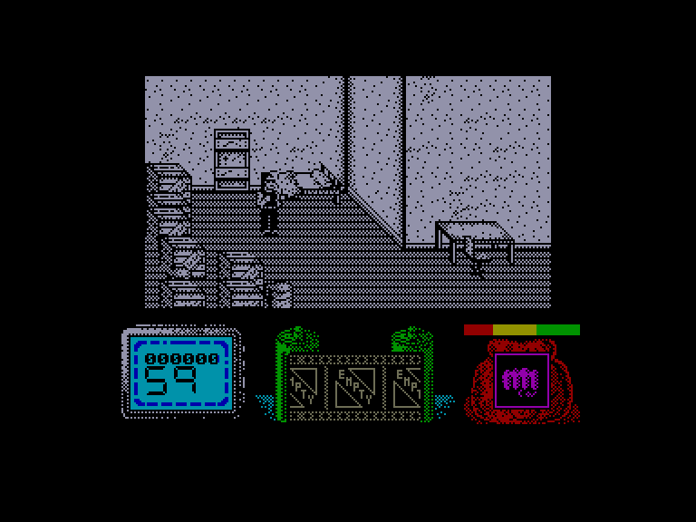

[0-9](../0/games-0.md) - [A](../a/games-a.md) - [B](../b/games-b.md) - [C](../c/games-c.md) - [D](../d/games-d.md) - [E](../e/games-e.md) - [F](../f/games-f.md) - [G](../g/games-g.md) - [H](../h/games-h.md) - [I](../i/games-i.md) - [J](../j/games-j.md) - [K](../k/games-k.md) - [L](../l/games-l.md) - [M](../m/games-m.md) - [N](../n/games-n.md) - [O](../o/games-o.md) - [P](../p/games-p.md) - [Q](../q/games-q.md) - [R](../r/games-r.md) - [S](../s/games-s.md) - [T](../t/games-t.md) - [U](../u/games-u.md) - [V](../v/games-v.md) - [W](../w/games-w.md) - [X](../x/games-x.md) - [Y](../y/games-y.md) - [Z](../z/games-z.md)

Ігри для [Enterprise 64k](../games-ep64.md) - [Enterprise 128k+RAMexp](../games-epramexp.md) - [2dfx](../games-2dfx.md)

Ігри для систем [IS-DOS](../games-is-dos.md) - [SymbOS](../games-symbos.md) - [EDC Windows](../games-edcw.md)

Ігри для емуляторів [ZX Spectrum 48k/128k](../zxemu/games-zxemu.md) - [Amstrad CPC](../cpcemu/games-cpc.md) - [Sinclair ZX81](../zx81emu/games-zx81.md) - [Videoton TVC](../tvcemu/games-tvc.md) - [Commodore VIC-20](../vic20emu/games-vic20.md)

----------

# Vendetta

**ID:** vendetta-zx

## Скріншоти

## Опис

(тимчасовий опис, згенерований ШІ Assistant)

**Опис гри:**
"Vendetta" — це екшн-гра, в якій ви граєте за героя, чия подруга була викрадена злим ворогом. Гравець повинен пройти через різні рівні, збираючи предмети, використовуючи зброю та вирішуючи головоломки, щоб врятувати свою подругу і помститися ворогу.

**Правила гри:**
1. Гравець починає без зброї, лише з ножем та кулаками.
2. Використовуйте клавіші для вибору зброї та управління персонажем.
3. Збирайте предмети, які можуть бути корисними на різних етапах гри.
4. Вибирайте правильний момент для використання предметів та зброї.
5. Кожен рівень містить кілька кімнат, у яких потрібно шукати предмети та вирішувати головоломки.
6. Взаємодійте з об'єктами в грі, щоб відкрити нові можливості та проходити далі.
7. Завершіть гру, зібравши всі необхідні предмети, щоб врятувати свою подругу.

**Успіх залежить від вашої здатності логічно мислити та швидко реагувати!**

## Основна інформація
- **Оригінальна платформа:** ZX Spectrum

## Посилання
- [Опис на ep128.hu (угорською)](http://www.ep128.hu/Games/Vendetta.htm)
- [Інформація про оригінальну версію](https://spectrumcomputing.co.uk/entry/5552/ZX-Spectrum/Vendetta)
- [Завантажити](http://www.ep128.hu/Ep_Games/Prg/Vendetta.rar)

