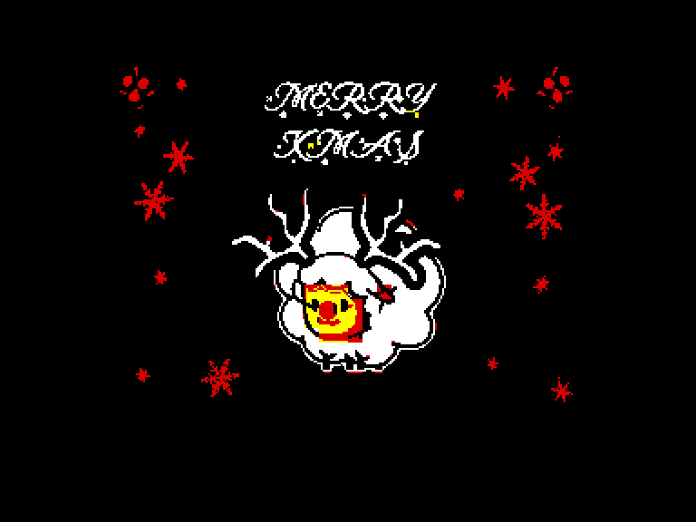
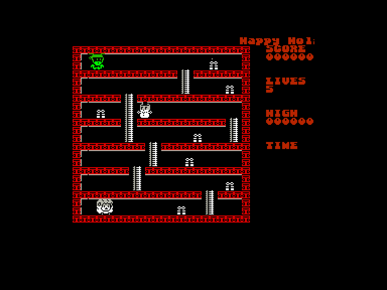
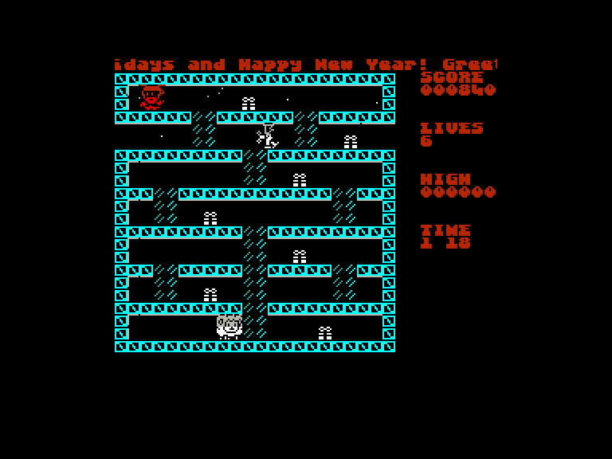
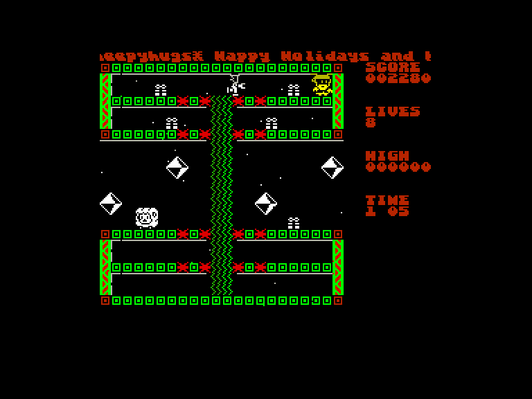

[0-9](../0/games-0.md) - [A](../a/games-a.md) - [B](../b/games-b.md) - [C](../c/games-c.md) - [D](../d/games-d.md) - [E](../e/games-e.md) - [F](../f/games-f.md) - [G](../g/games-g.md) - [H](../h/games-h.md) - [I](../i/games-i.md) - [J](../j/games-j.md) - [K](../k/games-k.md) - [L](../l/games-l.md) - [M](../m/games-m.md) - [N](../n/games-n.md) - [O](../o/games-o.md) - [P](../p/games-p.md) - [Q](../q/games-q.md) - [R](../r/games-r.md) - [S](../s/games-s.md) - [T](../t/games-t.md) - [U](../u/games-u.md) - [V](../v/games-v.md) - [W](../w/games-w.md) - [X](../x/games-x.md) - [Y](../y/games-y.md) - [Z](../z/games-z.md)

Ігри для [Enterprise 64k](../games-ep64.md) - [Enterprise 128k+RAMexp](../games-epramexp.md)

Ігри для систем [IS-DOS](../games-is-dos.md) - [SymbOS](../games-symbos.md) - [EDC Windows](../games-edcw.md)

Ігри для емуляторів [ZX Spectrum 48k/128k](../zxemu/games-zxemu.md) - [Amstrad CPC](../cpcemu/games-cpc.md) - [Sinclair ZX81](../zx81emu/games-zx81.md) - [Videoton TVC](../tvcemu/games-tvc.md) - [Commodore VIC-20](../vic20emu/games-vic20.md)

----------

# A Very Sheepy Xmas

**ID:** very-sheepy-xmas-zx

## Скріншоти

## Опис

(temporary description generated by AI [Assistant])

**Опис гри: "Дуже овечий Різдво"**

У грі "Дуже овечий Різдво" від команди Quantum Sheep, що вийшла у 2020 році, виникла серйозна проблема! Санта настільки захопився прослуховуванням диско-музики, що зовсім забув про подарунки, які потрібно доставити на Різдво. Більш того, деякі іграшки ожили і стали небезпечними! Гравець виступає в ролі героя — овечки Quantum Sheep, яка повинна зібрати всі подарунки на 25 рівнях та доставити їх до Санти, уникаючи небезпечних іграшок. 

**Правила гри:**
1. Збирайте всі подарунки на кожному з 25 рівнів.
2. Уникайте ожилих іграшок, які можуть нашкодити.
3. Використовуйте сходи та інші засоби для підйому, щоб переміщатися по рівнях.
4. Рівні поділені на 5 секцій, кожна з яких має свій унікальний графічний стиль.
5. Ви можете безпосередньо йти до Санти, не збираючи подарунків, але за це отримаєте менше очок.
6. Чайна чашка надає додаткове життя.
7. Управління: клавіатура (O, P, Q, A) або джойстик KEMPSTON, SINCLAIR. Клавіші можна налаштовувати.

Готові до пригод? Збирайте подарунки і рятуйте Різдво!

## Основна інформація
- **Оригінальна платформа:** ZX Spectrum

## Посилання
- [Домашня сторінка гри](https://quantumsheep.itch.io/a-very-sheepy-xmas)
- [Опис гри на ep128.hu (угорською)](http://www.ep128.hu/Games/Very_Sheepy_Xmas.htm)
- [Тема на форумі enterpriseforever](https://enterpriseforever.com/spectrum-rol/sheepy-xmas/)
- [Інформація про оригінальну версію](https://spectrumcomputing.co.uk/entry/36570/ZX-Spectrum/A_Very_Sheepy_Xmas)
- [Завантажити гру](http://www.ep128.hu/Ep_Games/Prg/Very_Sheepy_Xmas.rar)
- [Easy Load&Play](https://t.me/EP128k_Load_n_Play/270) *(Telegram-канал Vibrant Waves)*

**Дата генерації:** 28.07.2026

## Відео

<iframe src="https://www.youtube.com/embed/ZYmkr47O_gM"  
style="width:75%; aspect-ratio:16/9;" allowfullscreen></iframe>
