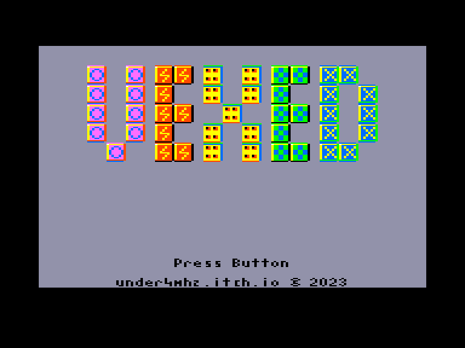
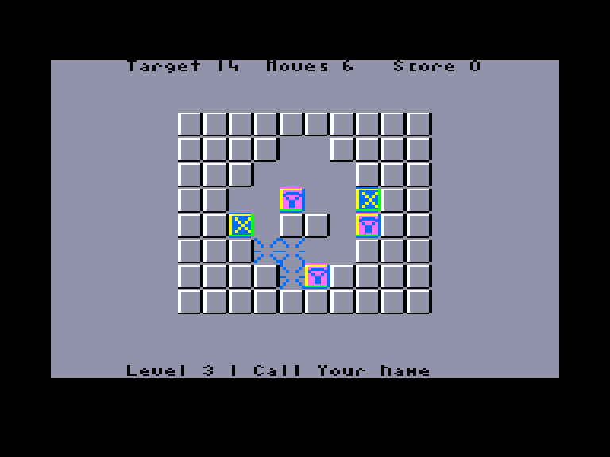
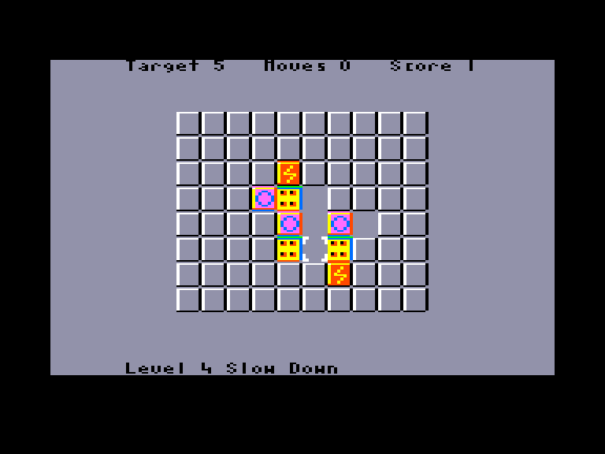
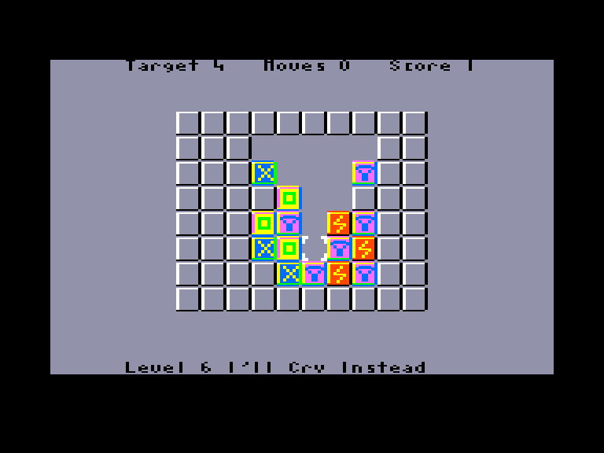

[0-9](../0/games-0.md) - [A](../a/games-a.md) - [B](../b/games-b.md) - [C](../c/games-c.md) - [D](../d/games-d.md) - [E](../e/games-e.md) - [F](../f/games-f.md) - [G](../g/games-g.md) - [H](../h/games-h.md) - [I](../i/games-i.md) - [J](../j/games-j.md) - [K](../k/games-k.md) - [L](../l/games-l.md) - [M](../m/games-m.md) - [N](../n/games-n.md) - [O](../o/games-o.md) - [P](../p/games-p.md) - [Q](../q/games-q.md) - [R](../r/games-r.md) - [S](../s/games-s.md) - [T](../t/games-t.md) - [U](../u/games-u.md) - [V](../v/games-v.md) - [W](../w/games-w.md) - [X](../x/games-x.md) - [Y](../y/games-y.md) - [Z](../z/games-z.md)

Ігри для [Enterprise 64k](../games-ep64.md) - [Enterprise 128k+RAMexp](../games-epramexp.md) - [2dfx](games-2dfx.md)

Ігри для систем [IS-DOS](../games-is-dos.md) - [SymbOS](../games-symbos.md) - [EDC Windows](../games-edcw.md)

Ігри для емуляторів [ZX Spectrum 48k/128k](../zxemu/games-zxemu.md) - [Amstrad CPC](../cpcemu/games-cpc.md) - [Sinclair ZX81](../zx81emu/games-zx81.md) - [Videoton TVC](../tvcemu/games-tvc.md) - [Commodore VIC-20](../vic20emu/games-vic20.md)

----------

# Vexed

**ID:** vexed

## Скріншоти

## Опис

(temporary description generated by AI [ChatGPT])

**Опис гри: Vexed**

Vexed - це логічна гра, в якій гравець повинен знищити всі блоки в 10x8 закритій області, переміщуючи сусідні блоки з однаковими позначеннями. Гравець може переміщувати блоки вліво та вправо, але під впливом гравітації блоки падають, і немає можливості піднімати їх вгору. Гра містить 60 рівнів, які можна проходити в будь-якому порядку.

**Правила гри:**
1. Переміщуйте блоки з однаковими позначеннями поряд один з одним, щоб їх знищити.
2. Використовуйте клавіші:
   - O - вліво
   - P - вправо
   - Q - вгору
   - A - вниз
   - SPACE - вибір блоку
3. Для перегляду рівнів використовуйте стрілки вліво/вправо для по одному, вгору/вниз для десятками.
4. X - перезапустити рівень, R - зупинити гру.
5. У грі доступні 60 рівнів, з яких ви можете вибрати будь-які 1-59.

Бажаємо удачі у вирішенні головоломок!

## Основна інформація
### Загальні системні вимоги
- **Апаратні:** EP64, EP128

## Посилання
- [Домашня сторінка](https://under4mhz.itch.io/vexed)
- [Опис на ep128.hu (угорською)](http://www.ep128.hu/Games/Vexed.htm)
- [Завантажити](http://www.ep128.hu/Ep_Games/Prg/Vexed.rar)
- [Easy Load&Play](https://t.me/EP128k_Load_n_Play/586) *(Telegram-канал Vibrant Waves)*

## Відео

<iframe src="https://www.youtube.com/embed/EiX18_dPwLg"  
style="width:75%; aspect-ratio:16/9;" allowfullscreen></iframe>

