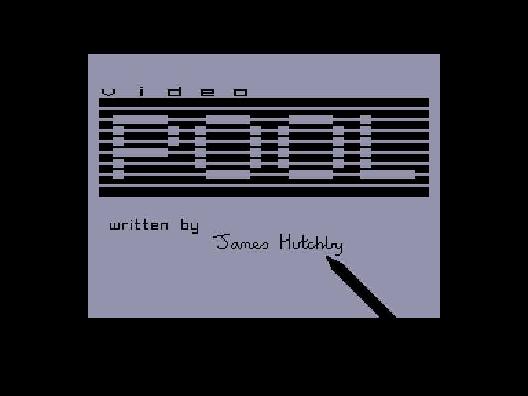
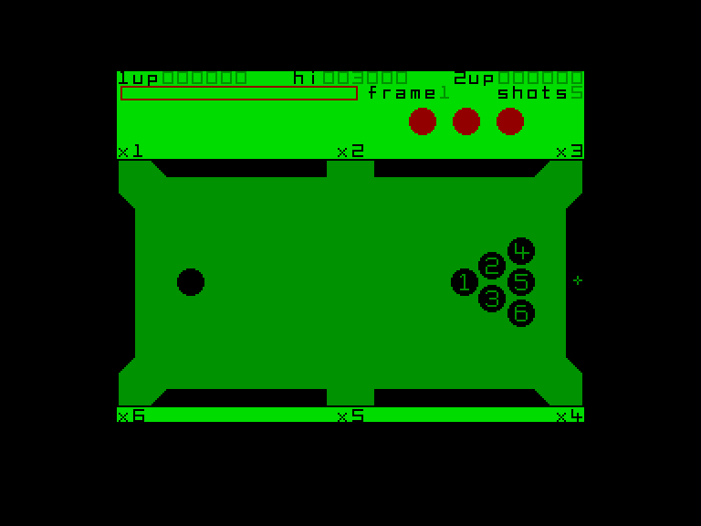
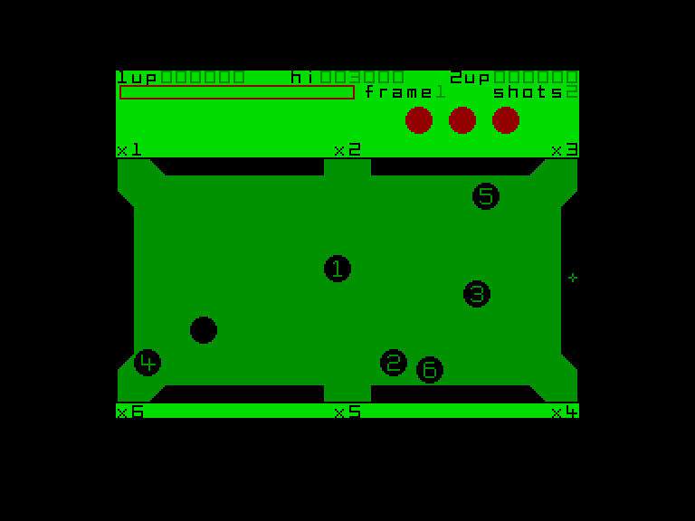
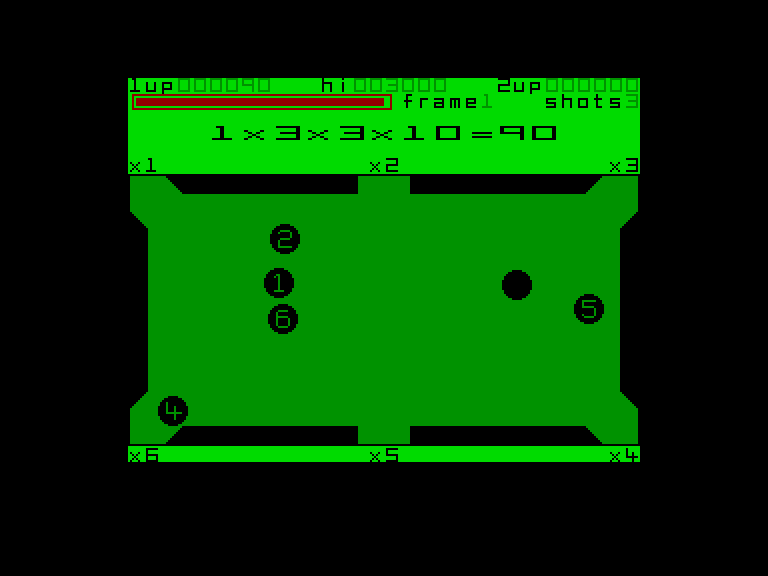

[0-9](../0/games-0.md) - [A](../a/games-a.md) - [B](../b/games-b.md) - [C](../c/games-c.md) - [D](../d/games-d.md) - [E](../e/games-e.md) - [F](../f/games-f.md) - [G](../g/games-g.md) - [H](../h/games-h.md) - [I](../i/games-i.md) - [J](../j/games-j.md) - [K](../k/games-k.md) - [L](../l/games-l.md) - [M](../m/games-m.md) - [N](../n/games-n.md) - [O](../o/games-o.md) - [P](../p/games-p.md) - [Q](../q/games-q.md) - [R](../r/games-r.md) - [S](../s/games-s.md) - [T](../t/games-t.md) - [U](../u/games-u.md) - [V](../v/games-v.md) - [W](../w/games-w.md) - [X](../x/games-x.md) - [Y](../y/games-y.md) - [Z](../z/games-z.md)

Ігри для [Enterprise 64k](../games-ep64.md) - [Enterprise 128k+RAMexp](../games-epramexp.md)

Ігри для систем [IS-DOS](../games-is-dos.md) - [SymbOS](../games-symbos.md) - [EDC Windows](../games-edcw.md)

Ігри для емуляторів [ZX Spectrum 48k/128k](../zxemu/games-zxemu.md) - [Amstrad CPC](../cpcemu/games-cpc.md) - [Sinclair ZX81](../zx81emu/games-zx81.md) - [Videoton TVC](../tvcemu/games-tvc.md) - [Commodore VIC-20](../vic20emu/games-vic20.md)

----------

# Video Pool

**ID:** video-pool-zx

## Скріншоти

## Опис

(temporary description generated by AI [Assistant])

**Опис гри: Video Pool**

Video Pool - це класична гра в більярд, випущена в 1985 році. Гравці можуть насолоджуватися простим, але захоплюючим ігровим процесом, граючи в різних режимах. Гра пропонує три різних способи гри з використанням семи куль. Незважаючи на свою просту графіку та звукові ефекти, Video Pool може стати приємним відпочинком для любителів більярду.

**Правила гри:**

1. **Режими гри:**
   - **One Player Game (1)**: Гравець грає сам, намагаючись набрати якомога більше очок.
   - **Two Player Game (2)**: Два гравці грають один проти одного.

2. **Налаштування столу:**
   - **Small pockets (S)**: Кишені на столі менші (для досвідчених гравців).
   - **Large pockets (L)**: Кишені стандартного розміру (за замовчуванням).

3. **Управління:**
   - **Keyboard (K)**: Управління за допомогою клавіатури.
   - **Interface Two Joystick (I)**: Управління за допомогою джойстика Interface II.
   - **Kempston Joystick (J)**: Управління за допомогою джойстика Kempston.
   - **Cursor Joystick (C)**: Управління за допомогою джойстика Cursor.

4. **Початок гри:**
   - **Begin Game (B)**: Запустити гру.

5. **Варіації гри:**
   - **S**: Бити кулі в будь-якому порядку.
   - **1**: Бити кулі в порядку їх номерів.
   - **2**: Бити кулі в порядку їх номерів у відповідні кишені.

6. **Редагування столу (E)**: Змінити розташування куль на столі.

7. **Перенастроювання клавіш (R)**: Визначити клавіші управління.

8. **Життя**: Гравець починає з трьома життями. Життя втрачається у випадках:
   - Неправильний удар (не торкнувся жодної кулі).
   - Удар по чорній кулі.
   - Вичерпання лічильника "Shots".

Гра триває, поки не закінчаться всі життя. У двомісному режимі обидва гравці грають на власних столах, змінюючись після втрати життя.

## Основна інформація
- **Оригінальна платформа:** ZX Spectrum

## Посилання
- [Опис гри на ep128.hu (угорською)](http://www.ep128.hu/Games/Video_Pool.htm)
- [Інформація про оригінальну версію](https://spectrumcomputing.co.uk/entry/5566/ZX-Spectrum/Video_Pool)
- [Завантажити гру](http://www.ep128.hu/Ep_Games/Prg/Video_Pool.rar)

## Відео

<iframe src="https://www.youtube.com/embed/bkJMzf3e2cg"  
style="width:75%; aspect-ratio:16/9;" allowfullscreen></iframe>
