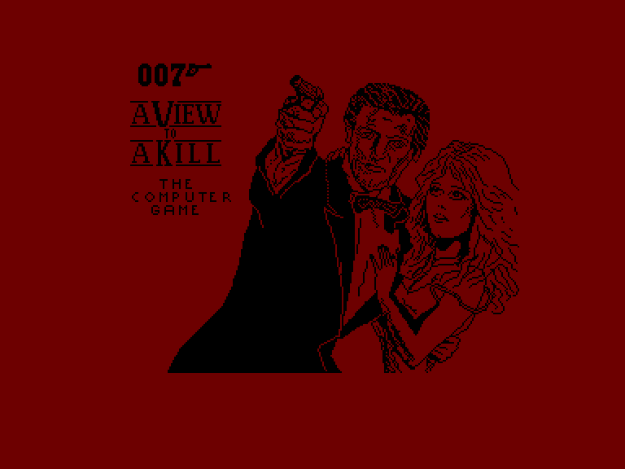
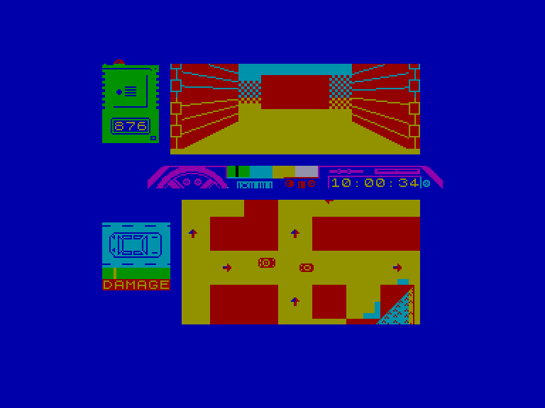
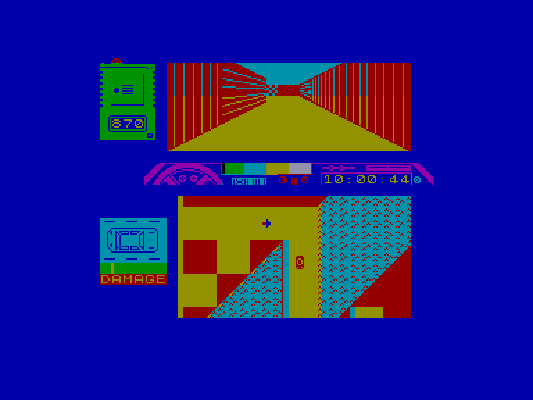
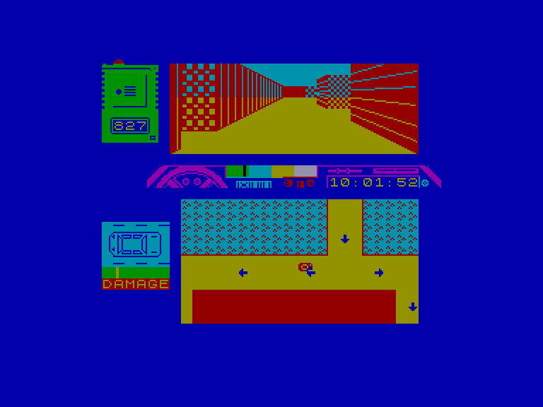

[0-9](../0/games-0.md) - [A](../a/games-a.md) - [B](../b/games-b.md) - [C](../c/games-c.md) - [D](../d/games-d.md) - [E](../e/games-e.md) - [F](../f/games-f.md) - [G](../g/games-g.md) - [H](../h/games-h.md) - [I](../i/games-i.md) - [J](../j/games-j.md) - [K](../k/games-k.md) - [L](../l/games-l.md) - [M](../m/games-m.md) - [N](../n/games-n.md) - [O](../o/games-o.md) - [P](../p/games-p.md) - [Q](../q/games-q.md) - [R](../r/games-r.md) - [S](../s/games-s.md) - [T](../t/games-t.md) - [U](../u/games-u.md) - [V](../v/games-v.md) - [W](../w/games-w.md) - [X](../x/games-x.md) - [Y](../y/games-y.md) - [Z](../z/games-z.md)

Ігри для [Enterprise 64k](../games-ep64.md) - [Enterprise 128k+RAMexp](../games-epramexp.md)

Ігри для систем [IS-DOS](../games-is-dos.md) - [SymbOS](../games-symbos.md) - [EDC Windows](../games-edcw.md)

Ігри для емуляторів [ZX Spectrum 48k/128k](../zxemu/games-zxemu.md) - [Amstrad CPC](../cpcemu/games-cpc.md) - [Sinclair ZX81](../zx81emu/games-zx81.md) - [Videoton TVC](../tvcemu/games-tvc.md) - [Commodore VIC-20](../vic20emu/games-vic20.md)

----------

# A View to a Kill: The Computer Game

**Альтернативні назви:**
 - James Bond 007: A View to a Kill

**ID:** view-to-a-kill-zx

## Скріншоти

## Опис

(temporary description generated by AI [ChatGPT])

**Опис гри: "A View to a Kill"**

Ви граєте за Джеймса Бонда і повинні зупинити Макса Зоріна від знищення Силіконової долини та домінування на ринку мікросхем. Гра перенесе вас до Парижа та Сан-Франциско. У Парижі вам потрібно буде переслідувати Мейдей у вашому транспортному засобі, поки вона спускається з парашутом до місця евакуації. У Сан-Франциско ви відвідаєте Ратушу і покинуту шахту, де вам потрібно буде знешкодити бомбу. Якщо бомба не буде знешкоджена, відбудеться величезне землетрус, і Силіконова долина буде затоплена.

**Правила гри:**
1. Гравець керує Джеймсом Бондом, використовуючи клавіатуру для управління.
2. У грі є два основні рівні: переслідування в Парижі та знешкодження бомби в Сан-Франциско.
3. У кожному рівні гравець повинен виконати завдання, щоб просунутися далі.
4. Необхідно уникати перешкод та ворогів, щоб не зазнати поразки.
5. Гравець має обмежений час для виконання завдань, тому необхідно діяти швидко та обдумано.

Гра "A View to a Kill" пропонує захоплюючий досвід для шанувальників екшн-ігор та любителів пригод Джеймса Бонда.

## Основна інформація
- **Оригінальна платформа:** ZX Spectrum

## Посилання
- [Інформація про оригінальну версію](https://spectrumcomputing.co.uk/entry/9/ZX-Spectrum/A_View_to_a_Kill-The_Computer_Game)

**Дата генерації:** 28.07.2026

