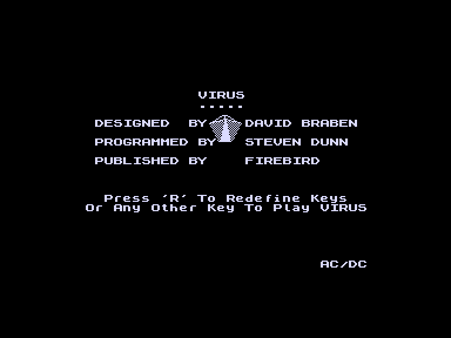
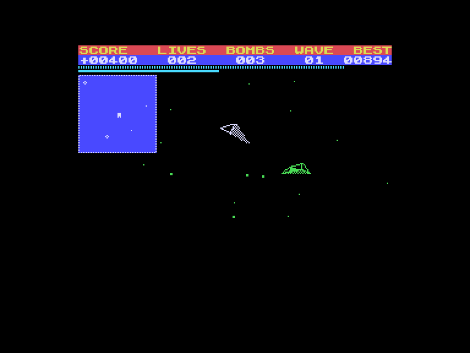

[0-9](../0/games-0.md) - [A](../a/games-a.md) - [B](../b/games-b.md) - [C](../c/games-c.md) - [D](../d/games-d.md) - [E](../e/games-e.md) - [F](../f/games-f.md) - [G](../g/games-g.md) - [H](../h/games-h.md) - [I](../i/games-i.md) - [J](../j/games-j.md) - [K](../k/games-k.md) - [L](../l/games-l.md) - [M](../m/games-m.md) - [N](../n/games-n.md) - [O](../o/games-o.md) - [P](../p/games-p.md) - [Q](../q/games-q.md) - [R](../r/games-r.md) - [S](../s/games-s.md) - [T](../t/games-t.md) - [U](../u/games-u.md) - [V](../v/games-v.md) - [W](../w/games-w.md) - [X](../x/games-x.md) - [Y](../y/games-y.md) - [Z](../z/games-z.md)

Ігри для [Enterprise 64k](../games-ep64.md) - [Enterprise 128k+RAMexp](../games-epramexp.md) - [2dfx](games-2dfx.md)

Ігри для систем [IS-DOS](../games-is-dos.md) - [SymbOS](../games-symbos.md) - [EDC Windows](../games-edcw.md)

Ігри для емуляторів [ZX Spectrum 48k/128k](../zxemu/games-zxemu.md) - [Amstrad CPC](../cpcemu/games-cpc.md) - [Sinclair ZX81](../zx81emu/games-zx81.md) - [Videoton TVC](../tvcemu/games-tvc.md) - [Commodore VIC-20](../vic20emu/games-vic20.md)

----------

# Virus

**ID:** virus-zx

## Скріншоти

## Опис

(temporary description generated by AI [Assistant])

**Опис гри: "Вірус"**

У грі "Вірус" ви берете на себе роль пілота сучасного літального апарату, який має завдання знищити ворожі літаки, що намагаються заразити територію смертельним вірусом. Ваш літальний апарат, Hoverplane, оснащений високотехнологічним обладнанням, включаючи радар, лазерну гармату та обмежену кількість "інтелектуальних" бомб. Ви повинні захищати свою базу та знищувати ворогів, перш ніж вони зможуть заразити всю територію.

**Правила гри:**

1. **Управління:** 
   - Ви можете обрати управління за допомогою джойстика або клавіатури. 
   - Клавіші: C - двигун, Z - поворот ліворуч, X - поворот праворуч, Q - нахил вперед, A - нахил назад, 1 - стрільба, 2 - бомба.

2. **Мета гри:** 
   - Знищити всі ворожі літаки, які намагаються заразити територію вірусом.
   - Захистити свою базу, яка позначена буквою "H".

3. **Вороги:**
   - **SEEDERS:** Літаючі тарілки, які розпилюють вірус.
   - **BOMBERS:** Літаки, які скидають бомби з вірусом.
   - **FIGHTERS:** Швидкі винищувачі, які намагаються вас збити.
   - **PESTS:** Маленькі дрони-камікадзе, які намагаються врізатися у ваш літак.

4. **Життя та бали:**
   - Ушкодження від ворожих літаків або падіння призводять до втрати життя.
   - За знищення ворогів ви отримуєте бали. Бонуси нараховуються за швидкість виконання завдань.
   - За кожні 5000 балів ви отримуєте додатковий літак та "інтелектуальну" бомбу.

5. **Заправка:** 
   - Для поповнення пального вам потрібно приземлитися на базу.

6. **Карта:** 
   - Натиснувши ENTER, ви можете переглянути карту, яка показує вже заражені території.

Гра "Вірус" є технічною демонстрацією, яка пропонує унікальний ігровий досвід з 3D-графікою та складною фізикою польоту.

## Основна інформація
- **Оригінальна платформа:** ZX Spectrum

## Посилання
- [Опис на ep128.hu (угорською)](http://www.ep128.hu/Games/Virus.htm)
- [Інформація про оригінальну версію](https://spectrumcomputing.co.uk/entry/5587/ZX-Spectrum/Virus)
- [Завантажити](http://www.ep128.hu/Ep_Games/Prg/Virus.rar)

