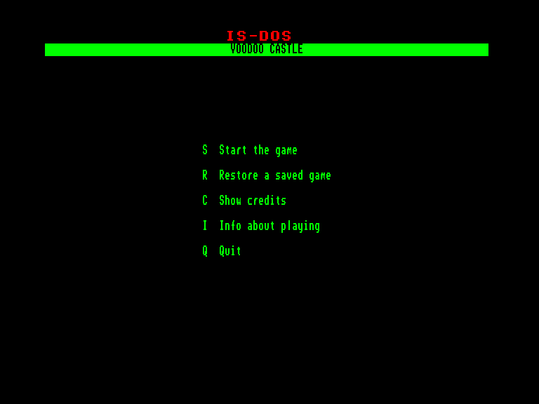
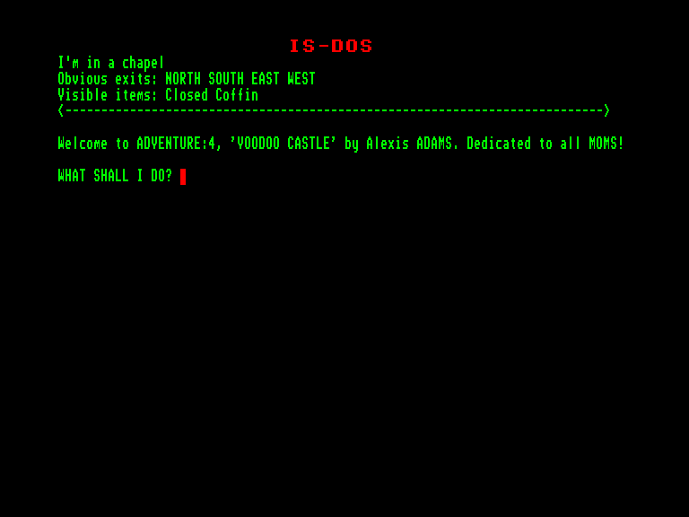
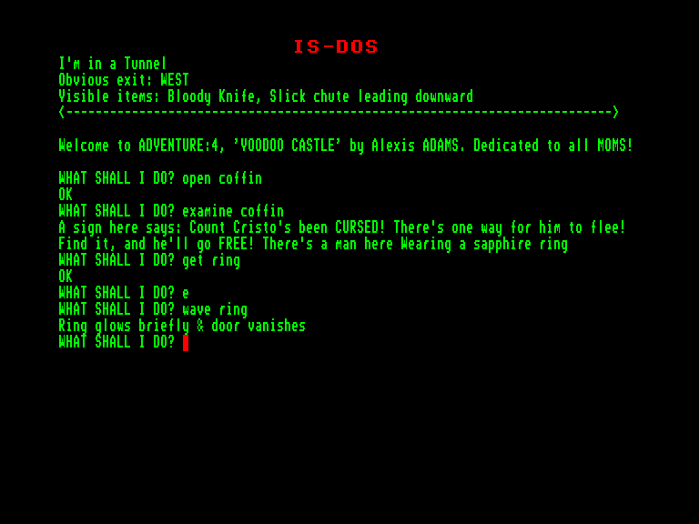

[0-9](../0/games-0.md) - [A](../a/games-a.md) - [B](../b/games-b.md) - [C](../c/games-c.md) - [D](../d/games-d.md) - [E](../e/games-e.md) - [F](../f/games-f.md) - [G](../g/games-g.md) - [H](../h/games-h.md) - [I](../i/games-i.md) - [J](../j/games-j.md) - [K](../k/games-k.md) - [L](../l/games-l.md) - [M](../m/games-m.md) - [N](../n/games-n.md) - [O](../o/games-o.md) - [P](../p/games-p.md) - [Q](../q/games-q.md) - [R](../r/games-r.md) - [S](../s/games-s.md) - [T](../t/games-t.md) - [U](../u/games-u.md) - [V](../v/games-v.md) - [W](../w/games-w.md) - [X](../x/games-x.md) - [Y](../y/games-y.md) - [Z](../z/games-z.md)

Ігри для [Enterprise 64k](../games-ep64.md) - [Enterprise 128k+RAMexp](../games-epramexp.md)

Ігри для систем [IS-DOS](../games-is-dos.md) - [SymbOS](../games-symbos.md) - [EDC Windows](../games-edcw.md)

Ігри для емуляторів [ZX Spectrum 48k/128k](../zxemu/games-zxemu.md) - [Amstrad CPC](../cpcemu/games-cpc.md) - [Sinclair ZX81](../zx81emu/games-zx81.md) - [Videoton TVC](../tvcemu/games-tvc.md) - [Commodore VIC-20](../vic20emu/games-vic20.md)

----------

# Voodoo Castle

**ID:** voodoo-castle-zcode

**Жанри:** Текстова пригода

## Скріншоти

## Опис

(temporary description generated by AI [ChatGPT])

**Voodoo Castle** – це текстова пригодницька гра, випущена у 1979 році компанією Adventure International. У цій грі ви берете на себе роль героя, який повинен врятувати графа, що став жертвою лихого прокляття, накладеного його ворогами. Ви є його єдиною надією на порятунок. Чи зможете ви виконати це завдання, чи граф дійсно приречений?

**Правила гри:**
1. Гравець взаємодіє з грою, вводячи текстові команди для виконання дій.
2. Розв'язуйте головоломки, щоб просуватися далі в сюжеті.
3. Збирайте предмети та використовуйте їх для вирішення завдань.
4. Будьте уважні до підказок та описів, оскільки вони можуть містити важливу інформацію.
5. Гра має елементи жахів, тому будьте готові до несподіваних поворотів сюжету.

## Основна інформація
- **Мови:** Англійська
### Загальні системні вимоги
- **Апаратні:** EXDOS
- **Програмні:** IS-DOS
### Геймплей
- **Керування:** Keyboard
- **Кількість гравців:** 1 player
- **Додаткові теги:** Z-code
### Розробка
- **Рік випуску:** 1979
- **Автор:** Alexis Adams, Scott Adams

## Посилання
- [Інформація про гру (SolutionArchive.com)](https://solutionarchive.com/game/id%2C578/Voodoo+Castle.html)
- [Завантажити гру](https://www.ep128.hu/Ep_Games/Prg/Scott_Adams_Adventure_Pack.rar)

