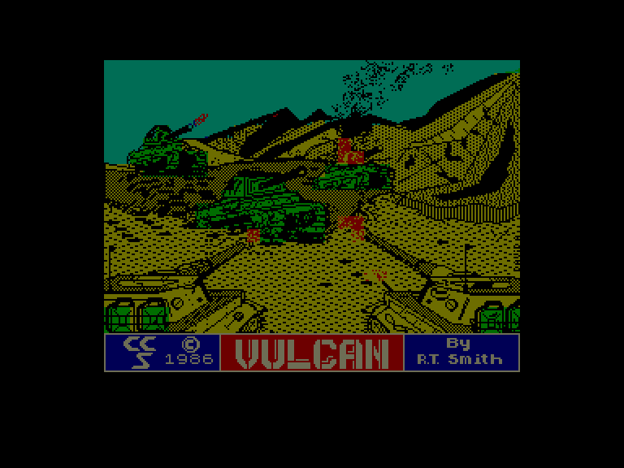
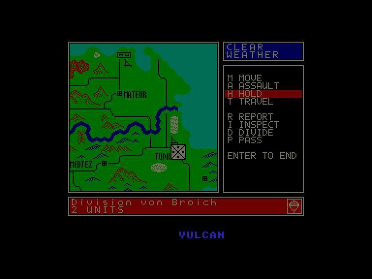
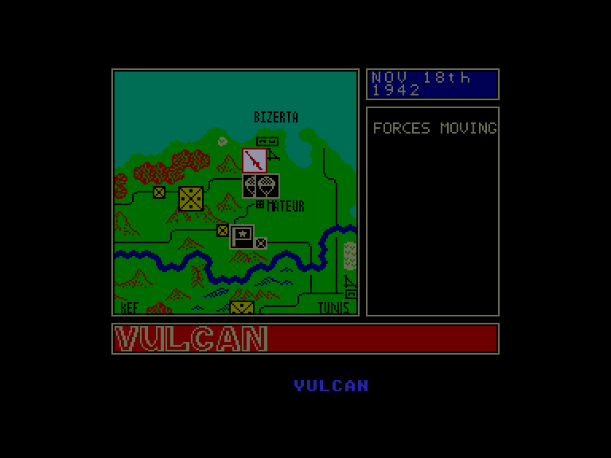
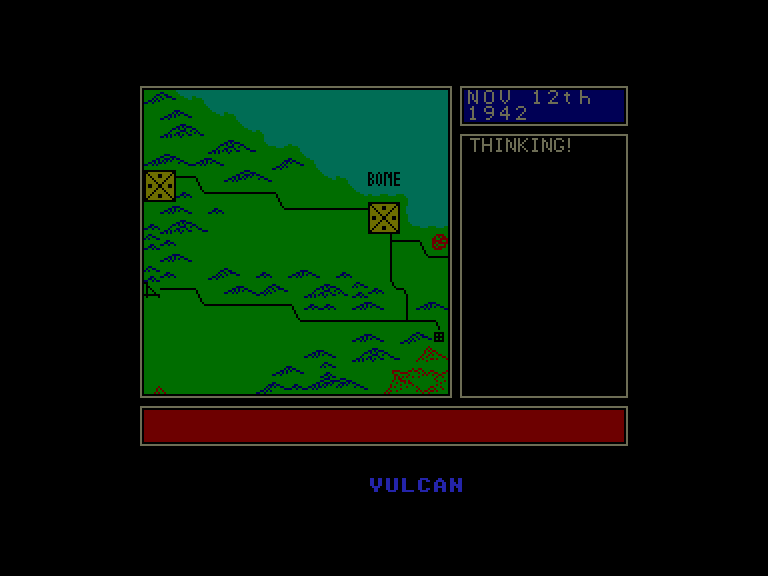

[0-9](../0/games-0.md) - [A](../a/games-a.md) - [B](../b/games-b.md) - [C](../c/games-c.md) - [D](../d/games-d.md) - [E](../e/games-e.md) - [F](../f/games-f.md) - [G](../g/games-g.md) - [H](../h/games-h.md) - [I](../i/games-i.md) - [J](../j/games-j.md) - [K](../k/games-k.md) - [L](../l/games-l.md) - [M](../m/games-m.md) - [N](../n/games-n.md) - [O](../o/games-o.md) - [P](../p/games-p.md) - [Q](../q/games-q.md) - [R](../r/games-r.md) - [S](../s/games-s.md) - [T](../t/games-t.md) - [U](../u/games-u.md) - [V](../v/games-v.md) - [W](../w/games-w.md) - [X](../x/games-x.md) - [Y](../y/games-y.md) - [Z](../z/games-z.md)

Ігри для [Enterprise 64k](../games-ep64.md) - [Enterprise 128k+RAMexp](../games-epramexp.md)

Ігри для систем [IS-DOS](../games-is-dos.md) - [SymbOS](../games-symbos.md) - [EDC Windows](../games-edcw.md)

Ігри для емуляторів [ZX Spectrum 48k/128k](../zxemu/games-zxemu.md) - [Amstrad CPC](../cpcemu/games-cpc.md) - [Sinclair ZX81](../zx81emu/games-zx81.md) - [Videoton TVC](../tvcemu/games-tvc.md) - [Commodore VIC-20](../vic20emu/games-vic20.md)

----------

# Vulcan

**Альтернативні назви:**
 - The Tunisian Campaign

**ID:** vulcan-zx

## Скріншоти

## Опис

(temporary description generated by AI [ChatGPT])

**Опис гри Vulcan**

Vulcan — це стратегічна гра, розроблена Робертом Т. Смітом та випущена компанією CCS у 1987 році для платформи Spectrum. Гравці беруть на себе командування військовими силами під час кампанії в Північній Африці в період Другої світової війни, зокрема, зосереджуючись на битвах за Туніс між союзними та осьовими силами. Гра пропонує різні сценарії, в яких гравці можуть вибрати стратегію, щоб досягти перемоги, змагаючись за контроль над територіями та знищуючи ворожі підрозділи.

**Правила гри:**

1. **Основне меню**: Після запуску гри ви потрапляєте в основне меню, де можна вибрати:
   - **Почати нову гру**: Розпочати нову кампанію.
   - **Завантажити стару гру**: Продовжити раніше збережену гру.
   - **Налаштування**: Налаштувати параметри гри (управління, звук, кількість гравців).

2. **Сценарії**: Гравці можуть вибрати один з кількох сценаріїв, що відображають різні битви в кампанії. Кожен сценарій має свої цілі та шанси на перемогу.

3. **Командування та управління**: Гравці видають команди своїм військам, включаючи:
   - **Атака**: Напад на ворога.
   - **Утримання позиції**: Залишитися на місці та підготуватися до оборони.
   - **Переміщення**: Переміщення військ до нової позиції.
   - **Фортифікація**: Укріплення позицій для підвищення обороноздатності.

4. **Оцінка боїв**: Гра оцінює результати боїв на основі втрат військ та контрольованих територій. Гравець зменшує втрати та знищує ворожі підрозділи, щоб досягти перемоги.

5. **Завершення гри**: Гра закінчується, коли досягається певний термін або одна зі сторін отримує вирішальну перевагу. Результати бою оголошуються, і гравець може продовжити збережену гру або почати нову.

Vulcan — це гра, що вимагає стратегічного мислення та планування, адже кожне рішення може вплинути на хід битви.

## Основна інформація
- **Оригінальна платформа:** ZX Spectrum

## Посилання
- [Опис гри на ep128.hu (угорською)](http://www.ep128.hu/Games/Vulcan.htm)
- [Інформація про оригінальну версію](https://spectrumcomputing.co.uk/entry/5606/ZX-Spectrum/Vulcan)
- [Завантажити гру](http://www.ep128.hu/Ep_Games/Prg/Vulcan.rar)

**Дата генерації:** 29.07.2026

