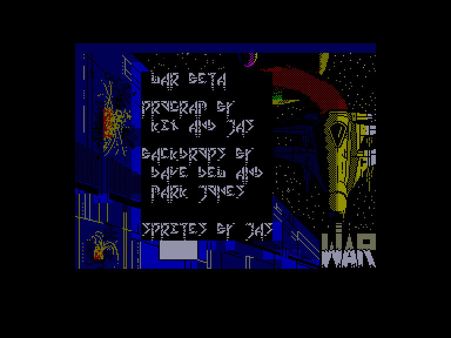
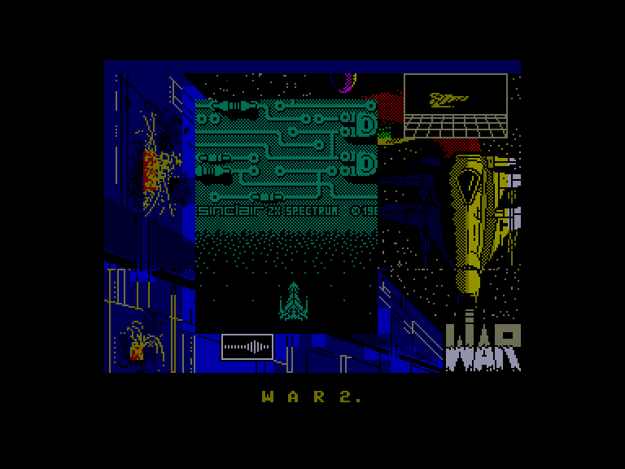
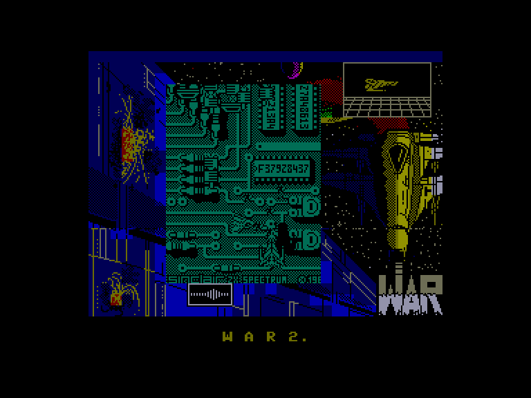

[0-9](../0/games-0.md) - [A](../a/games-a.md) - [B](../b/games-b.md) - [C](../c/games-c.md) - [D](../d/games-d.md) - [E](../e/games-e.md) - [F](../f/games-f.md) - [G](../g/games-g.md) - [H](../h/games-h.md) - [I](../i/games-i.md) - [J](../j/games-j.md) - [K](../k/games-k.md) - [L](../l/games-l.md) - [M](../m/games-m.md) - [N](../n/games-n.md) - [O](../o/games-o.md) - [P](../p/games-p.md) - [Q](../q/games-q.md) - [R](../r/games-r.md) - [S](../s/games-s.md) - [T](../t/games-t.md) - [U](../u/games-u.md) - [V](../v/games-v.md) - [W](../w/games-w.md) - [X](../x/games-x.md) - [Y](../y/games-y.md) - [Z](../z/games-z.md)

Ігри для [Enterprise 64k](../games-ep64.md) - [Enterprise 128k+RAMexp](../games-epramexp.md) - [2dfx](../games-2dfx.md)

Ігри для систем [IS-DOS](../games-is-dos.md) - [SymbOS](../games-symbos.md) - [EDC Windows](../games-edcw.md)

Ігри для емуляторів [ZX Spectrum 48k/128k](../zxemu/games-zxemu.md) - [Amstrad CPC](../cpcemu/games-cpc.md) - [Sinclair ZX81](../zx81emu/games-zx81.md) - [Videoton TVC](../tvcemu/games-tvc.md) - [Commodore VIC-20](../vic20emu/games-vic20.md)

----------

# W.A.R.

**ID:** w-a-r-zx

## Примітка

Part: BETA

## Скріншоти

## Опис

(temporary description generated by AI [Assistant])

**Опис гри: W.A.R.**

У грі W.A.R. ви стаєте пілотом космічного корабля, який повинен знищити всі об'єкти на ворожій космічній базі. Ваша мета - пройти над базою та знищити всі ворожі об'єкти, уникаючи незнищуваних перешкод. Гра має унікальний стиль, але може бути складною через обмежену видимість об'єктів на екрані. Після кожної місії ви можете купувати нові зброї та додаткові кораблі за набрані очки.

**Правила гри:**
1. Знищуйте всі поверхневі об'єкти на ворожій базі, щоб завершити місію успішно.
2. Уникайте незнищуваних об'єктів і стін, які можуть призвести до втрати життя.
3. Після кожної місії, якщо ви втратили життя, ви отримаєте меню для покупки нових зброї та кораблів за набрані очки.
4. Використовуйте клавіші управління для переміщення в меню та вибору опцій.
5. Придбані предмети зберігаються навіть після втрати корабля.
6. Гра має два варіанти: класичний космічний стиль та варіант, що відбувається всередині комп'ютера.

Удачі в боротьбі за порятунок Землі!

## Основна інформація
- **Оригінальна платформа:** ZX Spectrum

## Посилання
- [Опис на ep128.hu (угорською)](http://www.ep128.hu/Games/WAR.htm)
- [Інформація про оригінальну версію](https://spectrumcomputing.co.uk/entry/5620/ZX-Spectrum/WAR)
- [Завантажити](http://www.ep128.hu/Ep_Games/Prg/War.rar)

