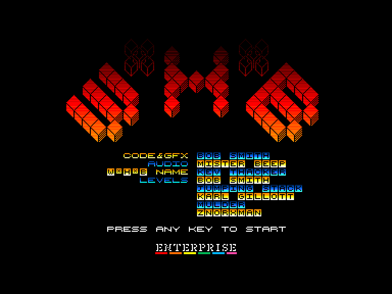
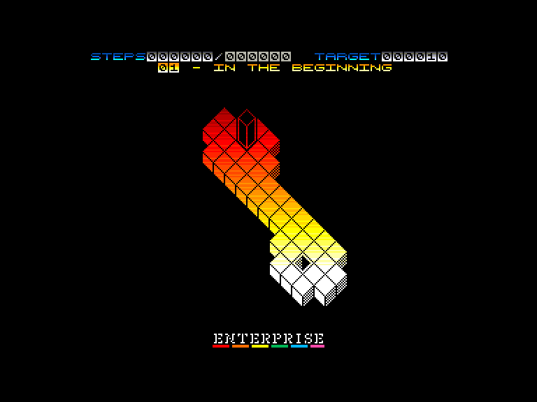
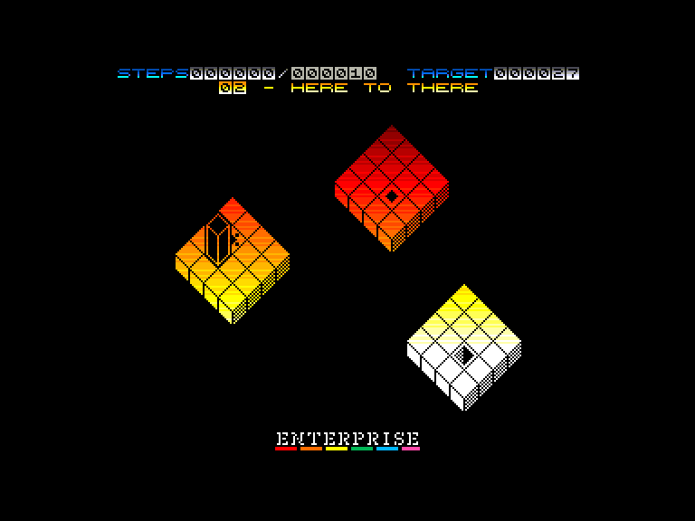
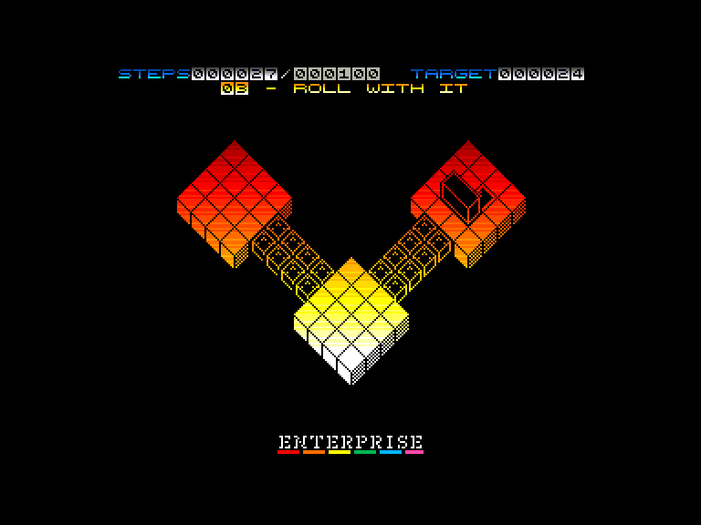

[0-9](../0/games-0.md) - [A](../a/games-a.md) - [B](../b/games-b.md) - [C](../c/games-c.md) - [D](../d/games-d.md) - [E](../e/games-e.md) - [F](../f/games-f.md) - [G](../g/games-g.md) - [H](../h/games-h.md) - [I](../i/games-i.md) - [J](../j/games-j.md) - [K](../k/games-k.md) - [L](../l/games-l.md) - [M](../m/games-m.md) - [N](../n/games-n.md) - [O](../o/games-o.md) - [P](../p/games-p.md) - [Q](../q/games-q.md) - [R](../r/games-r.md) - [S](../s/games-s.md) - [T](../t/games-t.md) - [U](../u/games-u.md) - [V](../v/games-v.md) - [W](../w/games-w.md) - [X](../x/games-x.md) - [Y](../y/games-y.md) - [Z](../z/games-z.md)

Ігри для [Enterprise 64k](../games-ep64.md) - [Enterprise 128k+RAMexp](../games-epramexp.md) - [2dfx](games-2dfx.md)

Ігри для систем [IS-DOS](../games-is-dos.md) - [SymbOS](../games-symbos.md) - [EDC Windows](../games-edcw.md)

Ігри для емуляторів [ZX Spectrum 48k/128k](../zxemu/games-zxemu.md) - [Amstrad CPC](../cpcemu/games-cpc.md) - [Sinclair ZX81](../zx81emu/games-zx81.md) - [Videoton TVC](../tvcemu/games-tvc.md) - [Commodore VIC-20](../vic20emu/games-vic20.md)

----------

# W*H*B

**Альтернативні назви:**
 - WxHxB

**ID:** w-h-b-zx

## Скріншоти

## Опис

(temporary description generated by AI [Assistant])

**Опис гри:**
W*H*B – це захоплююча логічна гра, яка обов'язково сподобається фанатам Sokoban. Ваше завдання полягає в тому, щоб перемістити 2-метровий прямокутник на вихід. Гравець може котити блок в будь-якому напрямку, але обмежений простором і різноманітними перешкодами на рівні. Гра пропонує 40 рівнів, кожен з яких є унікальним викликом.

**Правила гри:**
1. Гравець повинен перемістити блок на вихід, використовуючи обмежений простір.
2. Блок можна котити в будь-якому напрямку, але не можна "зависати" за межами рівня.
3. Рівні містять різні елементи:
   - **Кнопки**: активують або деактивують платформи.
   - **Роздільники**: ділять блок на дві частини, які потрібно об'єднати, щоб вийти.
   - **Скло**: блок можна котити лише в горизонтальному положенні.
   - **Поломаний підлога**: можна пройти лише один раз.
   - **Телепорт**: переносить на іншу частину рівня.
4. Гравець може відстежувати кількість зроблених кроків та оптимальну кількість кроків для проходження рівня.
5. Після завершення рівня гравець отримує код для переходу на наступний рівень.

**Управління:** 
Гравець може використовувати клавіатуру або джойстик для управління. Клавіші можна налаштувати, але за замовчуванням використовуються: K, Z, X, M для руху, L для дій, R для перезапуску рівня, Q для виходу з гри.

## Основна інформація
- **Оригінальна платформа:** ZX Spectrum
### Загальні системні вимоги
- **Апаратні:** EP64, EP128

## Посилання
- [Опис на ep128.hu (угорською)](http://www.ep128.hu/Games/WHB.htm)
- [Інформація про оригінальну версію](https://spectrumcomputing.co.uk/entry/23478/ZX-Spectrum/W*H*B)
- [Завантажити](http://www.ep128.hu/Ep_Games/Prg/WHB.rar)
- [Easy Load&Play](https://t.me/EP128k_Load_n_Play/875) *(Telegram-канал Vibrant Waves)*

