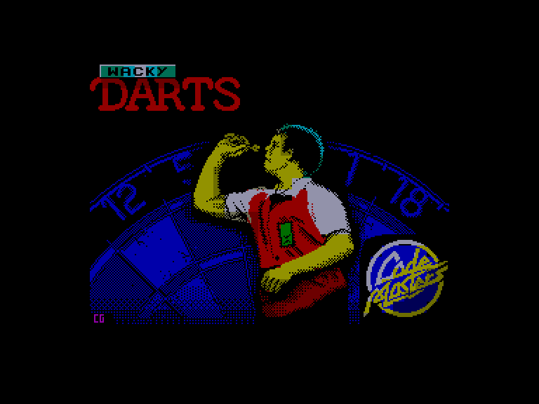
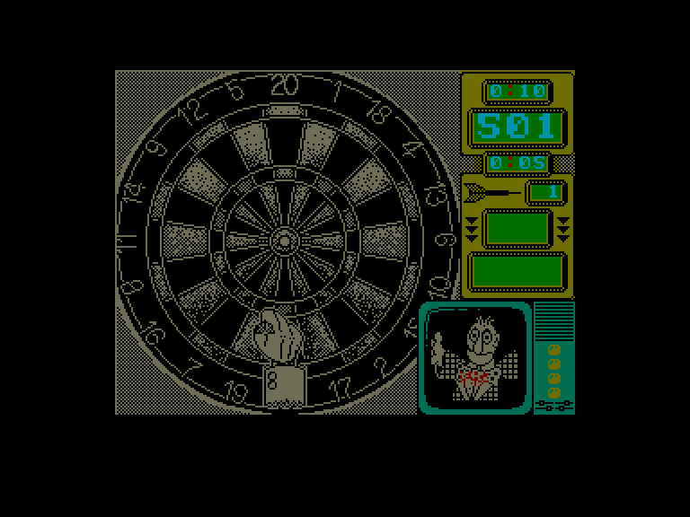
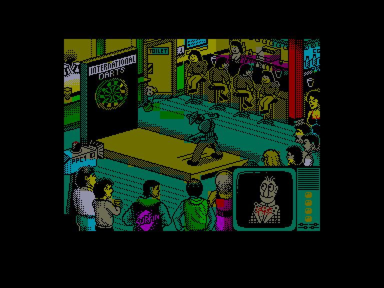
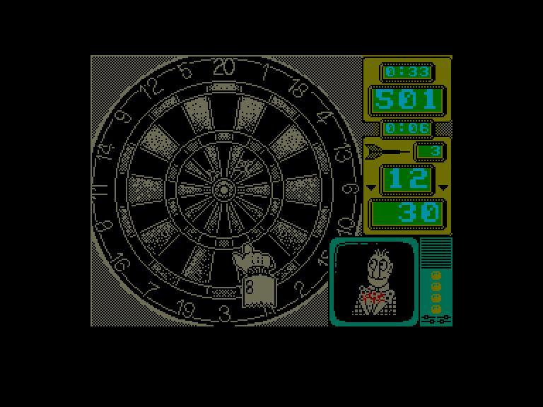

[0-9](../0/games-0.md) - [A](../a/games-a.md) - [B](../b/games-b.md) - [C](../c/games-c.md) - [D](../d/games-d.md) - [E](../e/games-e.md) - [F](../f/games-f.md) - [G](../g/games-g.md) - [H](../h/games-h.md) - [I](../i/games-i.md) - [J](../j/games-j.md) - [K](../k/games-k.md) - [L](../l/games-l.md) - [M](../m/games-m.md) - [N](../n/games-n.md) - [O](../o/games-o.md) - [P](../p/games-p.md) - [Q](../q/games-q.md) - [R](../r/games-r.md) - [S](../s/games-s.md) - [T](../t/games-t.md) - [U](../u/games-u.md) - [V](../v/games-v.md) - [W](../w/games-w.md) - [X](../x/games-x.md) - [Y](../y/games-y.md) - [Z](../z/games-z.md)

Ігри для [Enterprise 64k](../games-ep64.md) - [Enterprise 128k+RAMexp](../games-epramexp.md)

Ігри для систем [IS-DOS](../games-is-dos.md) - [SymbOS](../games-symbos.md) - [EDC Windows](../games-edcw.md)

Ігри для емуляторів [ZX Spectrum 48k/128k](../zxemu/games-zxemu.md) - [Amstrad CPC](../cpcemu/games-cpc.md) - [Sinclair ZX81](../zx81emu/games-zx81.md) - [Videoton TVC](../tvcemu/games-tvc.md) - [Commodore VIC-20](../vic20emu/games-vic20.md)

----------

# Wacky Darts

**ID:** wacky-darts-zx

## Скріншоти

## Опис

(temporary description generated by AI)

**Опис гри: Wacky Darts**

Wacky Darts — це барна гра в дартс, де гравці намагаються влучити маленькими снарядами в круглу мішень, розділену на 20 секцій, кожна з яких має значення від 1 до 20 очок. У грі є також подвійна зона та тройна зона, які множать набрані очки, а також центральна зона (bullseye) за 50 очок. Гравці завжди роблять три кидки за раз, з метою зменшити свій рахунок з 501 до 0, закінчуючи подвійним кидком або влучанням у bull. Гра також включає режим "Round The Board", де гравець повинен влучити в кожну ціль по черзі.

**Правила гри:**
1. Гравці виконують три кидки за один раунд.
2. У грі "501" мета — зменшити рахунок з 501 до 0, закінчуючи подвійним кидком або влучанням у bull.
3. Якщо рахунок досягає 1 або стає негативним, всі кидки в цьому раунді скасовуються.
4. У режимі "Round The Board" гравець повинен влучити в кожну ціль, починаючи з 20, і закінчити подвійним кидком.
5. Гравці можуть змагатися з різними опонентами, включаючи людей, інопланетян та машини, кожен з яких має свій профіль і стиль гри.

Гра Wacky Darts пропонує веселий та динамічний досвід, відтворюючи атмосферу дартс-бару.

## Основна інформація
- **Оригінальна платформа:** ZX Spectrum

## Посилання
- [Інформація про оригінальну версію](https://spectrumcomputing.co.uk/entry/9448/ZX-Spectrum/Wacky_Darts)

