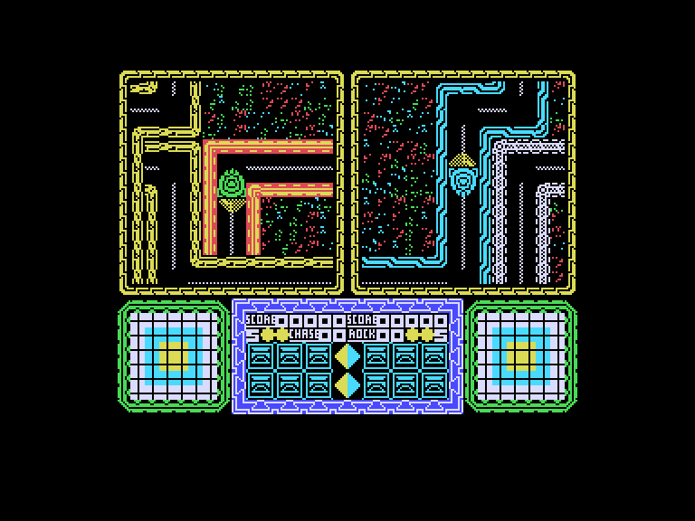
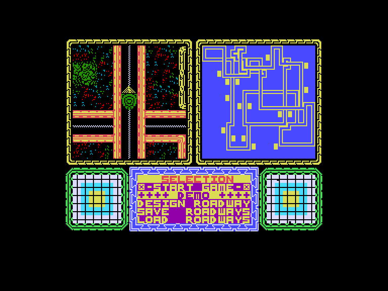
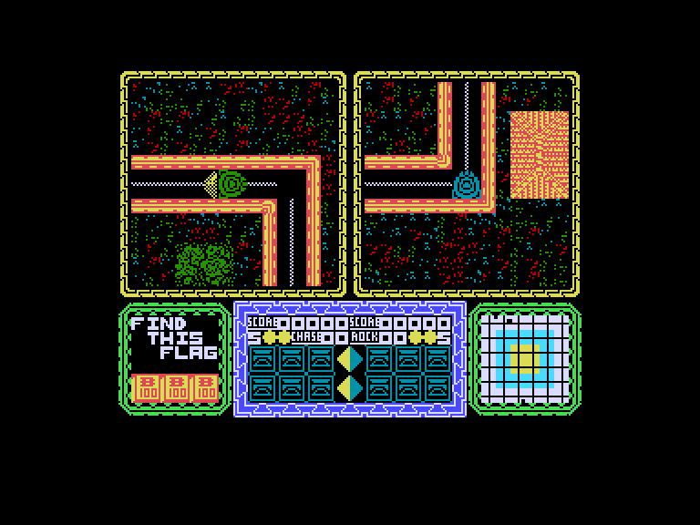
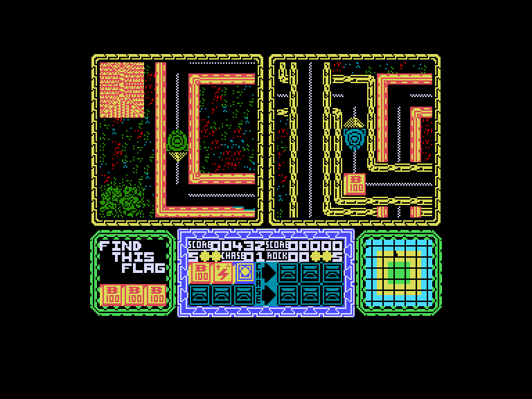

[0-9](../0/games-0.md) - [A](../a/games-a.md) - [B](../b/games-b.md) - [C](../c/games-c.md) - [D](../d/games-d.md) - [E](../e/games-e.md) - [F](../f/games-f.md) - [G](../g/games-g.md) - [H](../h/games-h.md) - [I](../i/games-i.md) - [J](../j/games-j.md) - [K](../k/games-k.md) - [L](../l/games-l.md) - [M](../m/games-m.md) - [N](../n/games-n.md) - [O](../o/games-o.md) - [P](../p/games-p.md) - [Q](../q/games-q.md) - [R](../r/games-r.md) - [S](../s/games-s.md) - [T](../t/games-t.md) - [U](../u/games-u.md) - [V](../v/games-v.md) - [W](../w/games-w.md) - [X](../x/games-x.md) - [Y](../y/games-y.md) - [Z](../z/games-z.md)

Ігри для [Enterprise 64k](../games-ep64.md) - [Enterprise 128k+RAMexp](../games-epramexp.md) - [2dfx](../games-2dfx.md)

Ігри для систем [IS-DOS](../games-is-dos.md) - [SymbOS](../games-symbos.md) - [EDC Windows](../games-edcw.md)

Ігри для емуляторів [ZX Spectrum 48k/128k](../zxemu/games-zxemu.md) - [Amstrad CPC](../cpcemu/games-cpc.md) - [Sinclair ZX81](../zx81emu/games-zx81.md) - [Videoton TVC](../tvcemu/games-tvc.md) - [Commodore VIC-20](../vic20emu/games-vic20.md)

----------

# War Cars Construction Set

**ID:** war-cars-construction-set-zx

## Скріншоти

## Опис

(temporary description generated by AI [ChatGPT])

**Опис гри: War Cars Construction Set**

War Cars Construction Set — це гоночна гра, в якій ви змагаєтеся з комп'ютером на великій карті, збираючи прапорці. Ваш автомобіль також має два камені, з яких можна використовувати лише один одночасно для блокування суперника на короткий час. Кожен автомобіль має п'ять життів, і якщо ви вріжетеся в інший автомобіль, то втрачаєте одне життя. Гра триває доти, поки не закінчаться всі життя.

На карті розкидані різні прапорці, які можуть впливати на гру. Прапорець бонусу надає 100 очок, прапорець автомобіля дає додаткове життя (максимум п’ять), прапорець каменю дає камінь (максимум два), а прапорець переслідування дозволяє вам врізатися в суперника або отримувати очки, якщо ви близько до автомобіля. Під час гонки працює таймер, і коли він досягає нуля, автомобіль з найбільшою кількістю прапорців отримує бонус у 100 очок за кожен зібраний прапорець. Через короткий час таймер скидається і починає знову відлік.

Гра також має конструктор, який дозволяє вам створювати до п'яти трас. Щоб комп'ютер міг визначити місця розташування прапорців, вам потрібно мати щонайменше десять поворотів. Якщо комп'ютер не задоволений трасою, коли ви її зберігаєте, він відмінить збереження.

**Правила гри:**
1. Гравець змагається з комп'ютером у зборі прапорців.
2. Використовуйте камені для блокування суперника.
3. Збирайте прапорці для отримання очок і додаткових життів.
4. Гра триває доти, поки не закінчаться всі життя.
5. Створюйте свої власні траси за допомогою конструктора.

## Основна інформація
- **Оригінальна платформа:** ZX Spectrum

## Посилання
- [Інформація про оригінальну версію](https://spectrumcomputing.co.uk/entry/5624/ZX-Spectrum/War_Cars_Construction_Set)

