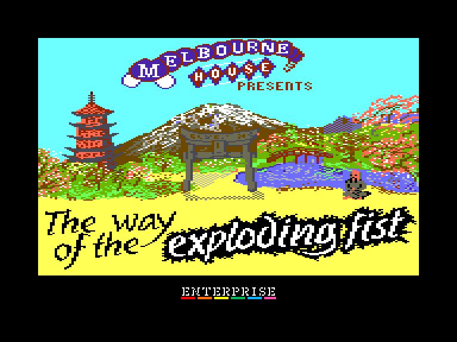
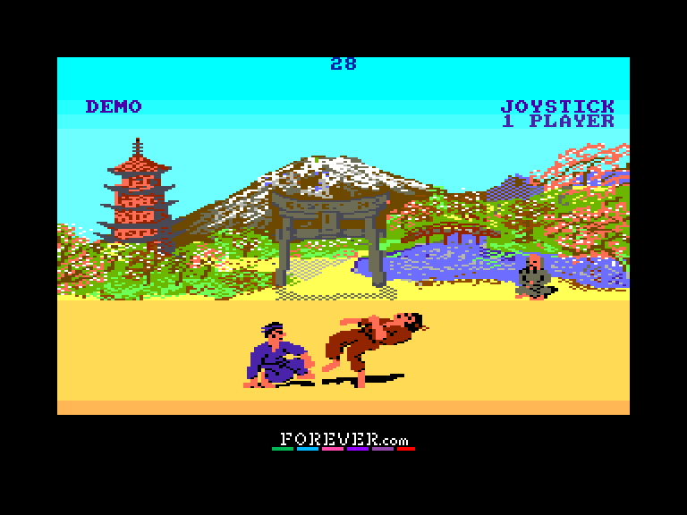
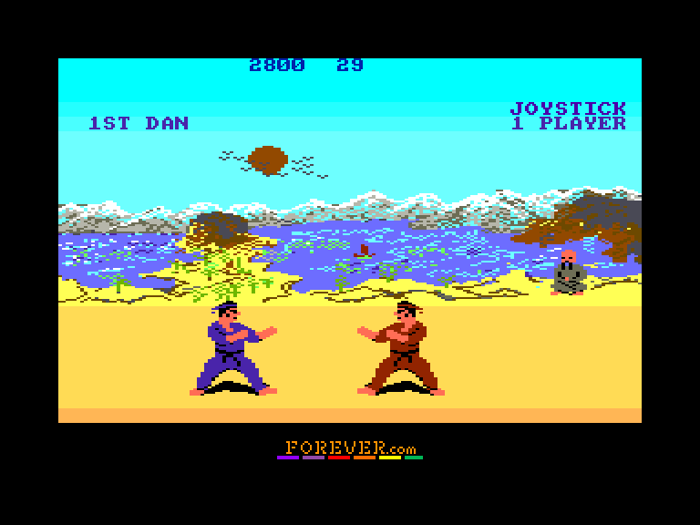

[0-9](../0/games-0.md) - [A](../a/games-a.md) - [B](../b/games-b.md) - [C](../c/games-c.md) - [D](../d/games-d.md) - [E](../e/games-e.md) - [F](../f/games-f.md) - [G](../g/games-g.md) - [H](../h/games-h.md) - [I](../i/games-i.md) - [J](../j/games-j.md) - [K](../k/games-k.md) - [L](../l/games-l.md) - [M](../m/games-m.md) - [N](../n/games-n.md) - [O](../o/games-o.md) - [P](../p/games-p.md) - [Q](../q/games-q.md) - [R](../r/games-r.md) - [S](../s/games-s.md) - [T](../t/games-t.md) - [U](../u/games-u.md) - [V](../v/games-v.md) - [W](../w/games-w.md) - [X](../x/games-x.md) - [Y](../y/games-y.md) - [Z](../z/games-z.md)

Ігри для [Enterprise 64k](../games-ep64.md) - [Enterprise 128k+RAMexp](../games-epramexp.md) - [2dfx](../games-2dfx.md)

Ігри для систем [IS-DOS](../games-is-dos.md) - [SymbOS](../games-symbos.md) - [EDC Windows](../games-edcw.md)

Ігри для емуляторів [ZX Spectrum 48k/128k](../zxemu/games-zxemu.md) - [Amstrad CPC](../cpcemu/games-cpc.md) - [Sinclair ZX81](../zx81emu/games-zx81.md) - [Videoton TVC](../tvcemu/games-tvc.md) - [Commodore VIC-20](../vic20emu/games-vic20.md)

----------

# The Way of the Exploding Fist

**Альтернативні назви:**
 - Exploding Fist

**ID:** way-of-the-exploding-fist-cpc

## Скріншоти

## Опис

(temporary description generated by AI Assistant)

**Опис гри: Exploding Fist**

Exploding Fist - це класична гра в жанрі бойовика, яка була випущена в 1985 році компанією Melbourne House. Гравці беруть на себе роль бійців, які змагаються один з одним у захоплюючих поєдинках. Гра відзначається простотою управління, різноманітністю персонажів та красивою графікою, яка була адаптована для різних платформ, зокрема Amstrad CPC і Enterprise.

**Правила гри:**
1. Гравці можуть вибрати кількість учасників (F1).
2. Для вибору управління використовується клавіша F2.
3. Гру можна розпочати натисканням F3 або кнопки "вогонь".
4. Для повернення до демонстраційного режиму натискайте F4.
5. Музику можна увімкнути (F7) або вимкнути (F8).
6. Управління можливе за допомогою джойстика або клавіатури (Q, W, E, A, D, Z, X, C, лівий SHIFT).
7. Під час введення імені курсор не відображається.
8. Для повернення до демонстраційного режиму з таблиці рекордів натискайте ENTER.

Змагайтеся з друзями та покажіть свою майстерність у боях!

## Основна інформація
- **Оригінальна платформа:** Amstrad CPC

## Посилання
- [Опис на ep128.hu (угорською)](http://www.ep128.hu/Ep_Games/Leiras/Exploding_Fist_CPC.htm)
- [Інформація про оригінальну версію](https://www.cpc-power.com/index.php?page=detail&num=1904)
- [Завантажити](http://www.ep128.hu/Ep_Games/Prg/Exploding_Fist_CPC.rar)

