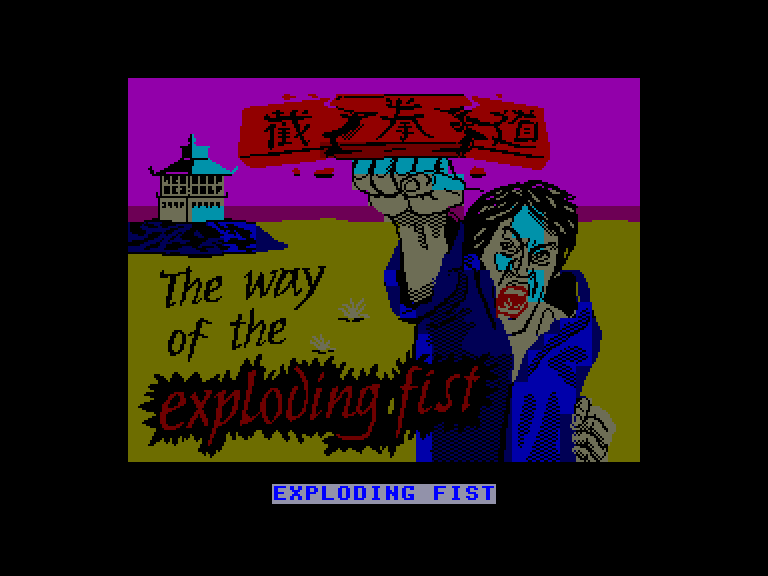
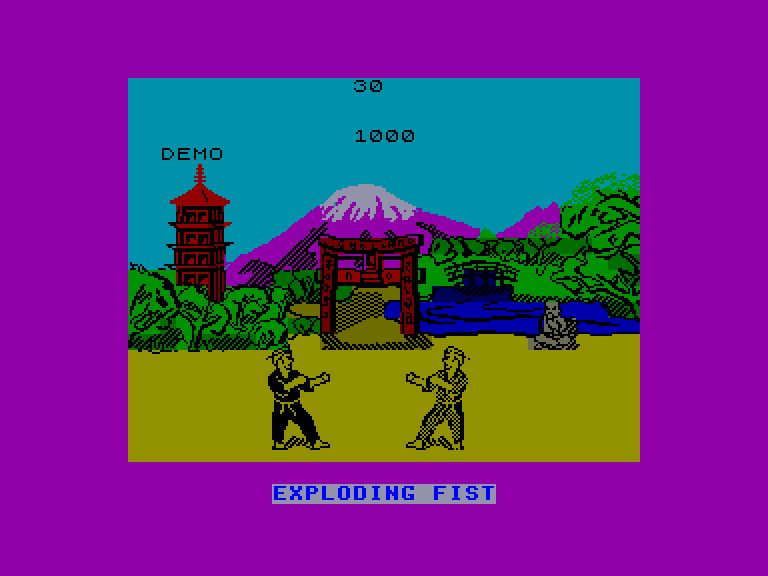
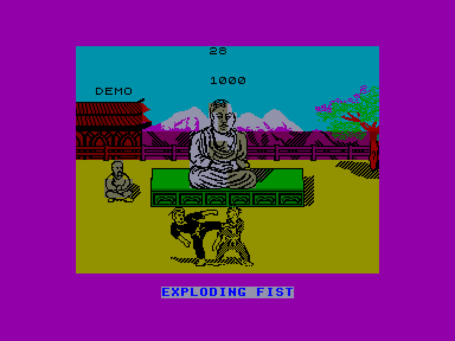
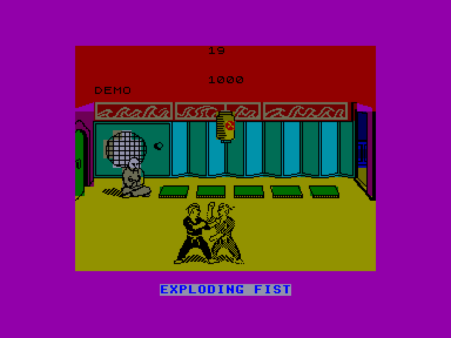

[0-9](../0/games-0.md) - [A](../a/games-a.md) - [B](../b/games-b.md) - [C](../c/games-c.md) - [D](../d/games-d.md) - [E](../e/games-e.md) - [F](../f/games-f.md) - [G](../g/games-g.md) - [H](../h/games-h.md) - [I](../i/games-i.md) - [J](../j/games-j.md) - [K](../k/games-k.md) - [L](../l/games-l.md) - [M](../m/games-m.md) - [N](../n/games-n.md) - [O](../o/games-o.md) - [P](../p/games-p.md) - [Q](../q/games-q.md) - [R](../r/games-r.md) - [S](../s/games-s.md) - [T](../t/games-t.md) - [U](../u/games-u.md) - [V](../v/games-v.md) - [W](../w/games-w.md) - [X](../x/games-x.md) - [Y](../y/games-y.md) - [Z](../z/games-z.md)

Ігри для [Enterprise 64k](../games-ep64.md) - [Enterprise 128k+RAMexp](../games-epramexp.md) - [2dfx](games-2dfx.md)

Ігри для систем [IS-DOS](../games-is-dos.md) - [SymbOS](../games-symbos.md) - [EDC Windows](../games-edcw.md)

Ігри для емуляторів [ZX Spectrum 48k/128k](../zxemu/games-zxemu.md) - [Amstrad CPC](../cpcemu/games-cpc.md) - [Sinclair ZX81](../zx81emu/games-zx81.md) - [Videoton TVC](../tvcemu/games-tvc.md) - [Commodore VIC-20](../vic20emu/games-vic20.md)

----------

# The Way of the Exploding Fist

**Альтернативні назви:**
 - Exploding Fist

**ID:** way-of-the-exploding-fist-zx

## Скріншоти

## Опис

(temporary description generated by AI [Assistant])

**Опис гри:**
Exploding Fist – це одна з найвідоміших ігор у жанрі бойових мистецтв, що нагадує аркадну гру Karate Champ 1984 року. Гравці можуть виконувати 18 різних атакуючих та захисних рухів, які імітують техніку бойового мистецтва Джит Кун До, засновану на вченні Брюса Лі. Гра пропонує можливість змагатися з комп'ютером або з іншим гравцем, проходячи різні рівні та покращуючи свої навички.

**Правила гри:**
1. Гра може бути в однокористувацькому або багатокористувацькому режимі.
2. Після запуску гри ви потрапляєте в DEMO-режим, де можете вивчити різні удари.
3. Виберіть режим гри: один гравець, два гравці або меню.
4. У меню ви можете налаштувати управління для кожного гравця та включити/вимкнути звук.
5. Гравці повинні виконати два повноцінні удари або удари за 30 секунд, щоб виграти раунд.
6. У разі нічиєї виграє той, хто набрав більше півкругів.
7. Гра проходить у чотирьох різних локаціях, і кожен наступний суперник має вищий рівень майстерності.
8. Гравці можуть виконувати різні рухи, які приносять різну кількість балів, залежно від виконаного удару.

Гра "Exploding Fist" є однією з найвищих за якістю бойових ігор для Spectrum!

## Основна інформація
- **Оригінальна платформа:** ZX Spectrum

## Посилання
- [Опис на ep128.hu (угорською)](http://www.ep128.hu/Games/Exploding_Fist.htm)
- [Інформація про оригінальну версію](https://spectrumcomputing.co.uk/entry/5643/ZX-Spectrum/The_Way_of_the_Exploding_Fist)
- [Завантажити](http://www.ep128.hu/Ep_Games/Prg/Exploding_Fist.rar)

