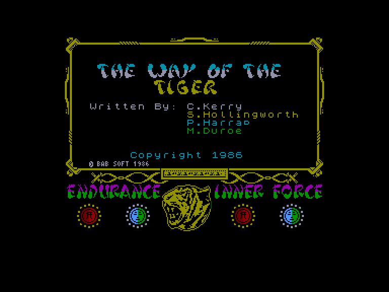
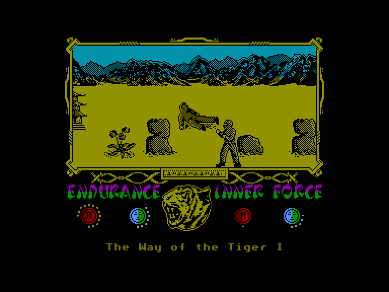
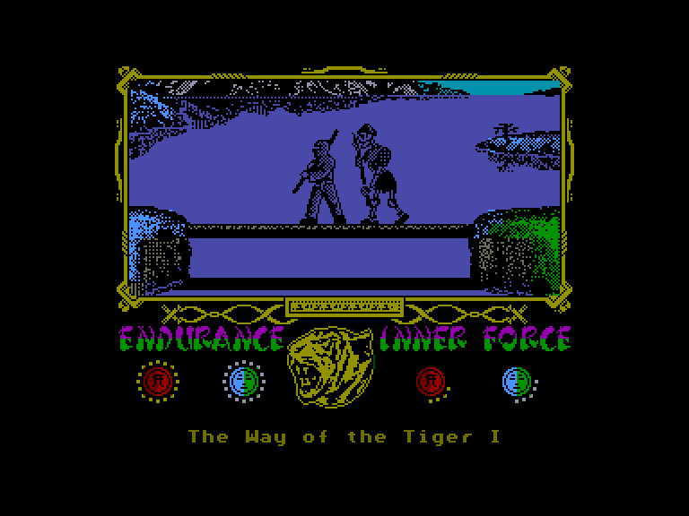
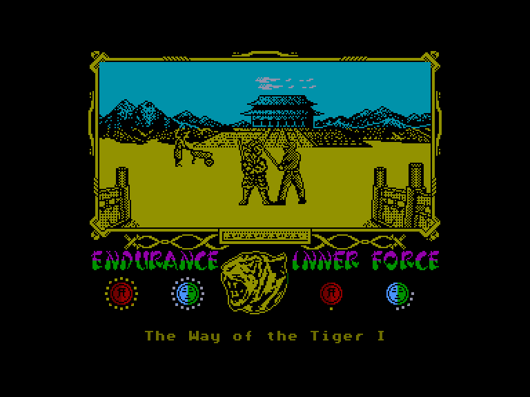

[0-9](../0/games-0.md) - [A](../a/games-a.md) - [B](../b/games-b.md) - [C](../c/games-c.md) - [D](../d/games-d.md) - [E](../e/games-e.md) - [F](../f/games-f.md) - [G](../g/games-g.md) - [H](../h/games-h.md) - [I](../i/games-i.md) - [J](../j/games-j.md) - [K](../k/games-k.md) - [L](../l/games-l.md) - [M](../m/games-m.md) - [N](../n/games-n.md) - [O](../o/games-o.md) - [P](../p/games-p.md) - [Q](../q/games-q.md) - [R](../r/games-r.md) - [S](../s/games-s.md) - [T](../t/games-t.md) - [U](../u/games-u.md) - [V](../v/games-v.md) - [W](../w/games-w.md) - [X](../x/games-x.md) - [Y](../y/games-y.md) - [Z](../z/games-z.md)

Ігри для [Enterprise 64k](../games-ep64.md) - [Enterprise 128k+RAMexp](../games-epramexp.md)

Ігри для систем [IS-DOS](../games-is-dos.md) - [SymbOS](../games-symbos.md) - [EDC Windows](../games-edcw.md)

Ігри для емуляторів [ZX Spectrum 48k/128k](../zxemu/games-zxemu.md) - [Amstrad CPC](../cpcemu/games-cpc.md) - [Sinclair ZX81](../zx81emu/games-zx81.md) - [Videoton TVC](../tvcemu/games-tvc.md) - [Commodore VIC-20](../vic20emu/games-vic20.md)

----------

# The Way of the Tiger

**ID:** way-of-the-tiger-zx

## Скріншоти

## Опис

(temporary description generated by AI [ChatGPT])

**Опис гри:**
Ця гра є якісною бойовою програмою, яка виділяється серед аналогічних ігор для Spectrum. Гравець має можливість продемонструвати свої навички в бою, використовуючи кулаки, палицю та меч. Гра містить оригінальну графіку та анімації, що додає їй привабливості.

**Правила гри:**
1. **Меню вибору:** Після завантаження гри гравець може вибрати один з шести пунктів меню (пункти 5 і 6 недоступні через помилку програми, але вони активні):
   - 1. Почати гру.
   - 2. Практика бою без зброї.
   - 3. Практика бою з палицею.
   - 4. Практика бою з мечем.
   - 5. Вибір управління з клавіатури.
   - 6. Вибір управління з джойстика (Kempston).

2. **Управління:** Гравець може використовувати клавіші для переміщення та атаки. Наприклад, натискання "Q", "W", "E" відповідає за рух вперед, назад та вліво, а "SPACE" — за атаку.

3. **Енергія:** На екрані відображається енергія гравця та супротивника. Якщо енергія вичерпається, гравець програє.

4. **Типи бою:**
   - **Бій без зброї:** Використовуйте різні комбінації для ударів і захисту.
   - **Бій з палицею:** Уникайте падіння у воду під час бою.
   - **Бій з мечем:** Використовуйте різні удари для перемоги над ворогами.

Гра пропонує три рівні бойових дій, кожен з яких має свої особливості та складність.

## Основна інформація
- **Оригінальна платформа:** ZX Spectrum

## Посилання
- [Опис гри на ep128.hu (угорською)](http://www.ep128.hu/Games/Way_of_the_Tiger.htm)
- [Інформація про оригінальну версію](https://spectrumcomputing.co.uk/entry/5646/ZX-Spectrum/The_Way_of_the_Tiger)
- [Завантажити гру](http://www.ep128.hu/Ep_Games/Prg/Way_of_the_Tiger.rar)

**Дата генерації:** 28.07.2026

