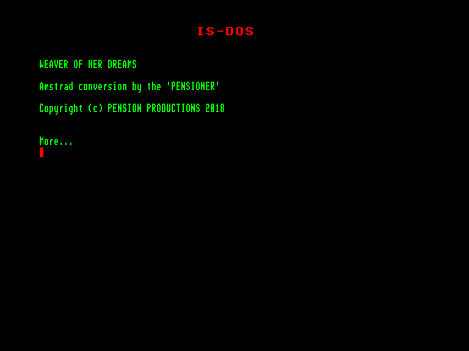
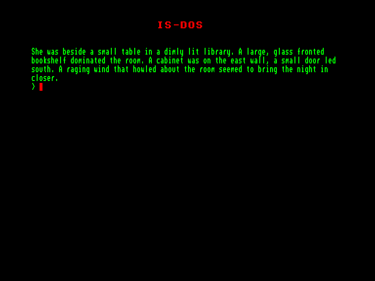

[0-9](../0/games-0.md) - [A](../a/games-a.md) - [B](../b/games-b.md) - [C](../c/games-c.md) - [D](../d/games-d.md) - [E](../e/games-e.md) - [F](../f/games-f.md) - [G](../g/games-g.md) - [H](../h/games-h.md) - [I](../i/games-i.md) - [J](../j/games-j.md) - [K](../k/games-k.md) - [L](../l/games-l.md) - [M](../m/games-m.md) - [N](../n/games-n.md) - [O](../o/games-o.md) - [P](../p/games-p.md) - [Q](../q/games-q.md) - [R](../r/games-r.md) - [S](../s/games-s.md) - [T](../t/games-t.md) - [U](../u/games-u.md) - [V](../v/games-v.md) - [W](../w/games-w.md) - [X](../x/games-x.md) - [Y](../y/games-y.md) - [Z](../z/games-z.md)

Ігри для [Enterprise 64k](../games-ep64.md) - [Enterprise 128k+RAMexp](../games-epramexp.md)

Ігри для систем [IS-DOS](../games-is-dos.md) - [SymbOS](../games-symbos.md) - [EDC Windows](../games-edcw.md)

Ігри для емуляторів [ZX Spectrum 48k/128k](../zxemu/games-zxemu.md) - [Amstrad CPC](../cpcemu/games-cpc.md) - [Sinclair ZX81](../zx81emu/games-zx81.md) - [Videoton TVC](../tvcemu/games-tvc.md) - [Commodore VIC-20](../vic20emu/games-vic20.md)

----------

# Weaver of Her Dreams

**ID:** weaver-of-her-dreams-isdos

**Жанри:** Текстова пригода

## Скріншоти

## Опис

(temporary description generated by AI Assistant)

**Опис гри: "Ткачка її мрій"**

Ви повинні втекти з ув'язнення, щоб знайти табір ворога, де старий чоловік каже вам, що ви повинні перемогти ворога, чия магічна сила заблокована в башті, що підноситься над вами. Ви одягнені в плащ з капюшоном і маєте дерев'яний посох. Спробуйте увійти в башту, але обережно — полум'я поглине вас і швидко призведе до вашої загибелі. Вам потрібно використовувати свій розум та магію, щоб виконати завдання. Окрім заклинань, вас чекають хитромудрі задачі та велика мережа локацій, де ви знайдете кільця, магічні слова, ями, що потрібно уникати, гаргулі, розмовляючі двері, вогняні гіганти, дракони, джини, мости, некроманти та печери, повні очей.

**Правила гри:**
1. Використовуйте свій розум та магічні здібності для вирішення головоломок.
2. Уникайте небезпек, таких як вогонь та пастки.
3. Збирайте предмети та заклинання, щоб допомогти у вашій подорожі.
4. Досліджуйте світ гри, взаємодіючи з персонажами та об'єктами.
5. Завершіть завдання, щоб перемогти ворога та звільнитися.

Гра "Ткачка її мрій" пропонує захоплюючу подорож у світ фантазії, де кожне ваше рішення може вплинути на результат!

## Основна інформація
- **Мови:** Англійська
- **Оригінальна платформа:** Amstrad CPC
### Системні вимоги
- **Апаратні:** EXDOS
- **Програмні:** IS-DOS
### Геймплей
- **Керування:** Keyboard
- **Кількість гравців:** 1 player
- **Додаткові теги:** Text80 mode, PAW
### Розробка
- **Рік випуску:** 1988
- **Автор:** Mike White

## Посилання
- [Інформація про оригінальну версію](https://www.cpc-power.com/index.php?page=detail&num=15786)
- [Інформація про гру (SolutionArchive.com)](https://solutionarchive.com/game/id%2C708/Weaver+of+Her+Dreams%2C+The.html)

**Дата генерації:** 29.07.2026

