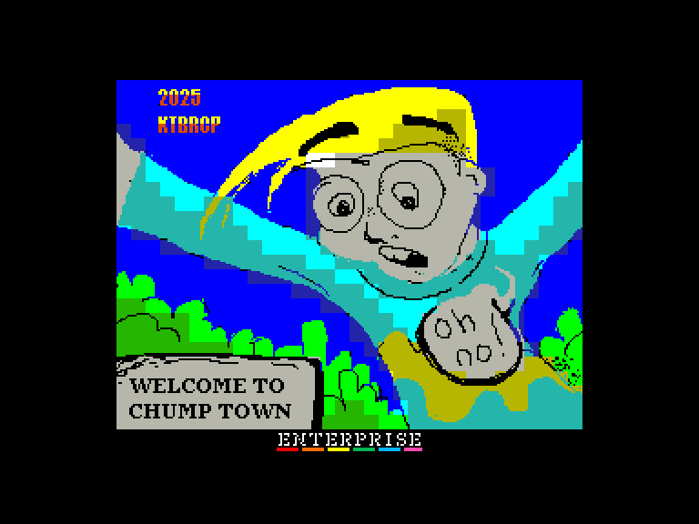
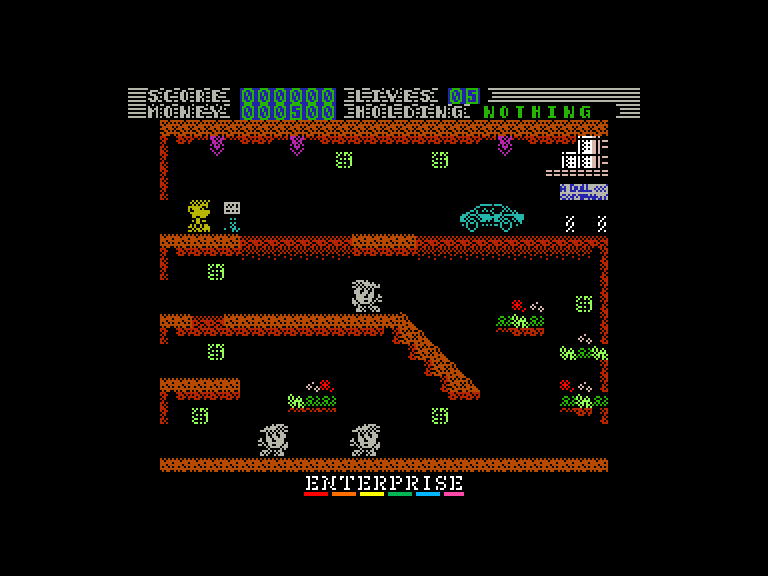
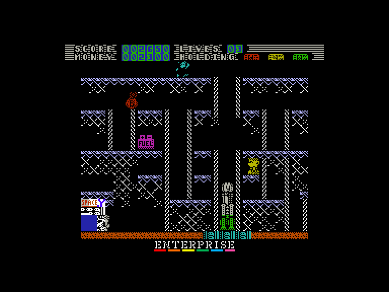
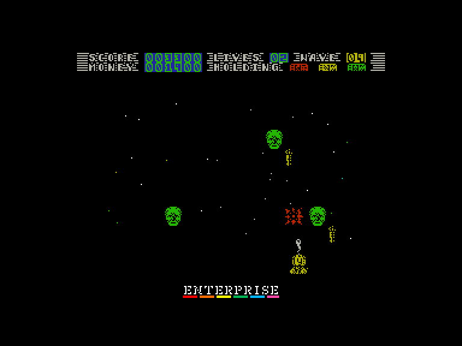

[0-9](../0/games-0.md) - [A](../a/games-a.md) - [B](../b/games-b.md) - [C](../c/games-c.md) - [D](../d/games-d.md) - [E](../e/games-e.md) - [F](../f/games-f.md) - [G](../g/games-g.md) - [H](../h/games-h.md) - [I](../i/games-i.md) - [J](../j/games-j.md) - [K](../k/games-k.md) - [L](../l/games-l.md) - [M](../m/games-m.md) - [N](../n/games-n.md) - [O](../o/games-o.md) - [P](../p/games-p.md) - [Q](../q/games-q.md) - [R](../r/games-r.md) - [S](../s/games-s.md) - [T](../t/games-t.md) - [U](../u/games-u.md) - [V](../v/games-v.md) - [W](../w/games-w.md) - [X](../x/games-x.md) - [Y](../y/games-y.md) - [Z](../z/games-z.md)

Ігри для [Enterprise 64k](../games-ep64.md) - [Enterprise 128k+RAMexp](../games-epramexp.md) - [2dfx](games-2dfx.md)

Ігри для систем [IS-DOS](../games-is-dos.md) - [SymbOS](../games-symbos.md) - [EDC Windows](../games-edcw.md)

Ігри для емуляторів [ZX Spectrum 48k/128k](../zxemu/games-zxemu.md) - [Amstrad CPC](../cpcemu/games-cpc.md) - [Sinclair ZX81](../zx81emu/games-zx81.md) - [Videoton TVC](../tvcemu/games-tvc.md) - [Commodore VIC-20](../vic20emu/games-vic20.md)

----------

# Welcome to Chump Town!! - Episode 4: A New Joke

**ID:** welcome-to-chump-town-agd

**Жанри:** Аркада, Платформер

## Примітка

ℹ Гра створена за допомогою MPAGD на основі версії для ZX Spectrum.

## Скріншоти

## Опис

Ви — Безіменний Протагоніст. Ви можете бути ким завгодно.  
Ви, ймовірно, хто завгодно.  

Ви живете в Чамп-Тауні вже багато років, але справи йдуть тільки гірше. Ставлення змінюється. Розум втрачається. Логіка здається нелогічною. Здається, що наближається повстання; загальне занепокоєння серед незадоволеного та невдоволеного населення зростає день у день.  
Ніби ви навіть не можете купити яйце, не взявши банківського кредиту.  

Але ви відчуваєте, що це щось більше, ніж просто політична недбалість. Ви чули чутки про таємну, тіньову расу, яка працює за лаштунками. Їхнє ім'я, Пудани, шепочуть тихим голосом. Як ткачі долі, вони контролюють світ, їхні пальці глибоко вплетені в процес прийняття рішень. Їхній вплив не знає меж. І їхній вплив виходить прямо звідси, з серця Чамп-Тауна.  
Знаєте, це звучить божевільно, правда? Як якась велика змова, вигадана людьми, які мають забагато вільного часу?  

Можливо, це просто так. Але ви помітили тенденції.  
Це все негативна спіраль нещастя та розчарування, яка розквітає, як вишня на полі для гольфу.  
Це не може бути просто збігом обставин, чи не так? Це не може бути просто параноїдальна змова, чи не так?  
Однак одного дня ви розумієте, що з вас досить.  

Ви пробираєтеся до таємного лігва мультимільярдера-промисловця Леона Хаска; людини з усім впливом, який можна купити за гроші. Як тільки ви проходите через ці двері до його бази операцій, ви знаходите плани Мобільної Автономної Армії Дурних Големів, або скорочено (M.A.N.G.A). Ці глиняні клони великого та шанованого лідера (у його власній свідомості) з минулого Чамп-Тауна патрулюватимуть вулиці та знову все налагодять.  
Вони все владнають.  
Ви сумніваєтеся в усьому. Це здається махінаціями божевільного.  

Бачачи цих клонів... всюди, ви легко приймаєте рішення. Ніхто не в безпеці. Ніде не в безпеці! Ви маєте покинути планету та поїхати кудись, куди не торкнуться Пудани, Чампи та Леони.  

Ви вкрадете ракету. Можливо, вам доведеться зібрати її самостійно, але це має бути легше, ніж шведські меблі.  
А потім ви підете. Але краще чекайте бою. Це ніколи не буває так просто, як вам хотілося б...

## Основна інформація
- **Мови:** Англійська
- **Оригінальна платформа:** Multiplatform
### Загальні системні вимоги
- **Апаратні:** EP128
### Геймплей
- **Керування:** Keyboard, Internal Joy, External Joy 1, External Joy 2
- **Кількість гравців:** 1 player
- **Додаткові теги:** AGD, Attribute mode
### Розробка
- **Рік випуску:** 2025
- **Компанія:** KTB Retrocomputing Productions

## Посилання
- [Домашня сторінка](https://ktbproductions.itch.io/enterprise-games)
- [Інформація про оригінальну версію](https://spectrumcomputing.co.uk/entry/44237/ZX-Spectrum/Welcome_To_Chump_Town)
- [Завантажити](http://www.ep128.hu/Ep_Games/Prg/Chump_Town.rar)
- [Easy Load&Play](https://t.me/EP128k_Load_n_Play/903) *(Telegram-канал Vibrant Waves)*

## [Керування](../controllers.md)

`Keyboard`: `Q`, `A`, `O`, `P`, `M`  
`Internal Joystick`  
`External Joystick 1`  
`External Joystick 2`  

`Fire`: високий стрибок  
`↔`+`Fire`: довгий стрибок

## Детальна інформація

### Системні вимоги  

#### Мінімальні системні вимоги  

Оперативна пам'ять: **128 КБ (або більше)**