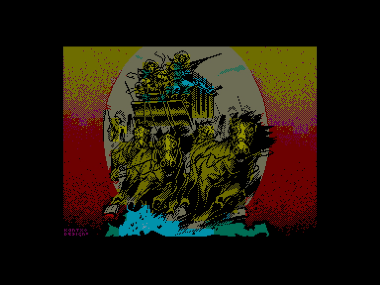
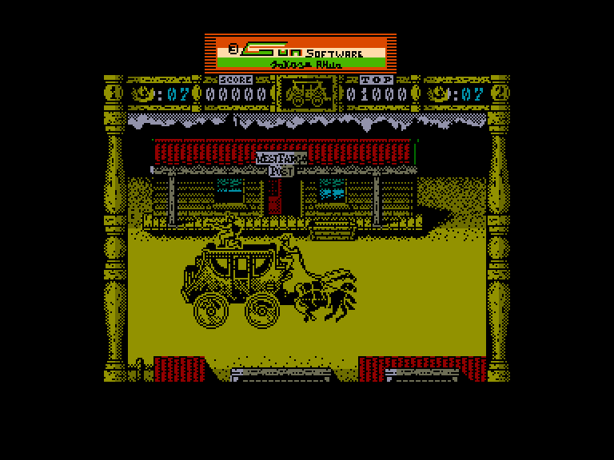
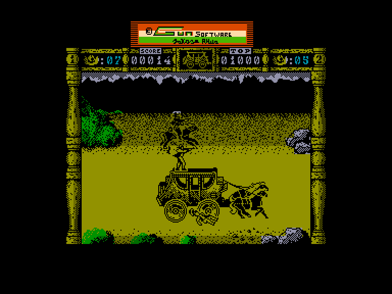
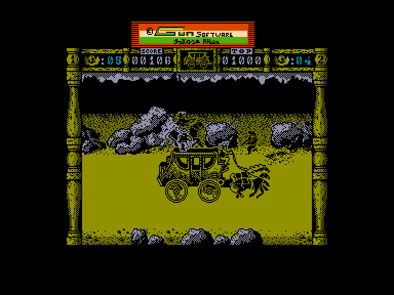

[0-9](../0/games-0.md) - [A](../a/games-a.md) - [B](../b/games-b.md) - [C](../c/games-c.md) - [D](../d/games-d.md) - [E](../e/games-e.md) - [F](../f/games-f.md) - [G](../g/games-g.md) - [H](../h/games-h.md) - [I](../i/games-i.md) - [J](../j/games-j.md) - [K](../k/games-k.md) - [L](../l/games-l.md) - [M](../m/games-m.md) - [N](../n/games-n.md) - [O](../o/games-o.md) - [P](../p/games-p.md) - [Q](../q/games-q.md) - [R](../r/games-r.md) - [S](../s/games-s.md) - [T](../t/games-t.md) - [U](../u/games-u.md) - [V](../v/games-v.md) - [W](../w/games-w.md) - [X](../x/games-x.md) - [Y](../y/games-y.md) - [Z](../z/games-z.md)

Ігри для [Enterprise 64k](../games-ep64.md) - [Enterprise 128k+RAMexp](../games-epramexp.md)

Ігри для систем [IS-DOS](../games-is-dos.md) - [SymbOS](../games-symbos.md) - [EDC Windows](../games-edcw.md)

Ігри для емуляторів [ZX Spectrum 48k/128k](../zxemu/games-zxemu.md) - [Amstrad CPC](../cpcemu/games-cpc.md) - [Sinclair ZX81](../zx81emu/games-zx81.md) - [Videoton TVC](../tvcemu/games-tvc.md) - [Commodore VIC-20](../vic20emu/games-vic20.md)

----------

# Wells & Fargo

**ID:** wells-and-fargo-zx

## Скріншоти

## Опис

(temporary description generated by AI [ChatGPT])

**Опис гри: Wells 'n' Fargo**

"Wells 'n' Fargo" — це гра, що переносить вас у часи Дикого Заходу, де ви керуєте поштовим екіпажем, що піддається атакам бандитів і індіанців. Ваше завдання — проїхати якомога далі, захищаючи екіпаж і вантаж, поки не закінчаться сили вашої команди.

**Правила гри:**
1. Гра підтримує 1 або 2 гравців. Ви можете вибрати режим гри в меню.
2. Гравці контролюють екіпаж: один керує возом, а інший стріляє з рушниці, щоб відбити атаки ворогів.
3. Управління здійснюється за допомогою клавіатури або джойстика, вибір яких також робиться в меню.
4. Якщо одного з членів екіпажу вбивають, його місце займає наступний гравець з кабіни.
5. Гра триває, поки не закінчаться сили екіпажу або не зруйнується воз.
6. У грі є перешкоди на дорозі, які можуть пошкодити ваш екіпаж.
7. Гравці отримують бали за проходження, які можна побачити на екрані.

Гра має простий, але захоплюючий геймплей, проте може бути досить складною через точність ворогів.

## Основна інформація
- **Оригінальна платформа:** ZX Spectrum

## Посилання
- [Опис гри на ep128.hu (угорською)](http://www.ep128.hu/Games/Wells_n_Fargo.htm)
- [Інформація про оригінальну версію](https://spectrumcomputing.co.uk/entry/5657/ZX-Spectrum/Wells_Fargo)
- [Завантажити гру](http://www.ep128.hu/Ep_Games/Prg/Wells_Fargo.rar)

**Дата генерації:** 29.07.2026

