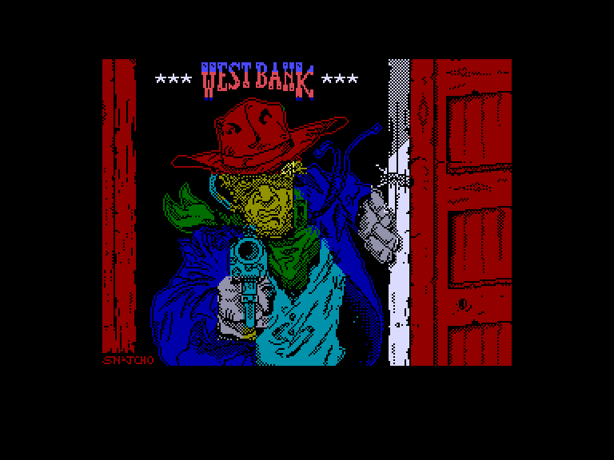
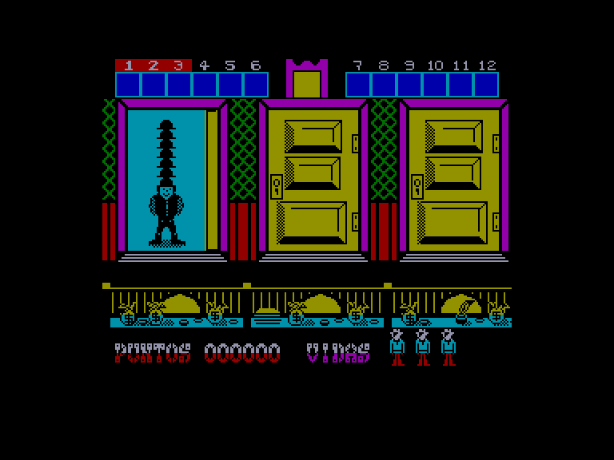
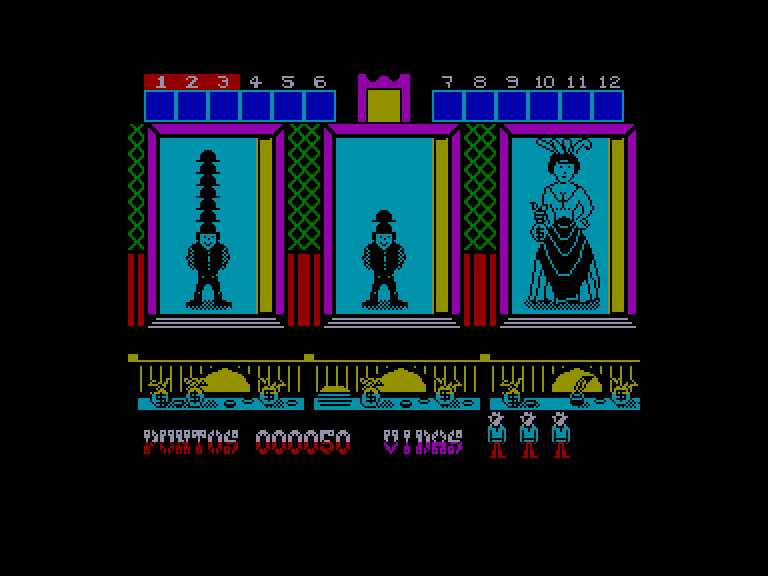
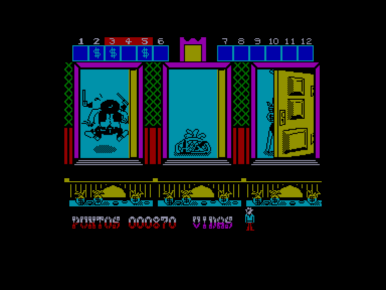

[0-9](../0/games-0.md) - [A](../a/games-a.md) - [B](../b/games-b.md) - [C](../c/games-c.md) - [D](../d/games-d.md) - [E](../e/games-e.md) - [F](../f/games-f.md) - [G](../g/games-g.md) - [H](../h/games-h.md) - [I](../i/games-i.md) - [J](../j/games-j.md) - [K](../k/games-k.md) - [L](../l/games-l.md) - [M](../m/games-m.md) - [N](../n/games-n.md) - [O](../o/games-o.md) - [P](../p/games-p.md) - [Q](../q/games-q.md) - [R](../r/games-r.md) - [S](../s/games-s.md) - [T](../t/games-t.md) - [U](../u/games-u.md) - [V](../v/games-v.md) - [W](../w/games-w.md) - [X](../x/games-x.md) - [Y](../y/games-y.md) - [Z](../z/games-z.md)

Ігри для [Enterprise 64k](../games-ep64.md) - [Enterprise 128k+RAMexp](../games-epramexp.md)

Ігри для систем [IS-DOS](../games-is-dos.md) - [SymbOS](../games-symbos.md) - [EDC Windows](../games-edcw.md)

Ігри для емуляторів [ZX Spectrum 48k/128k](../zxemu/games-zxemu.md) - [Amstrad CPC](../cpcemu/games-cpc.md) - [Sinclair ZX81](../zx81emu/games-zx81.md) - [Videoton TVC](../tvcemu/games-tvc.md) - [Commodore VIC-20](../vic20emu/games-vic20.md)

----------

# West Bank

**ID:** west-bank-zx

## Скріншоти

## Опис

(temporary description generated by AI [ChatGPT])

**Опис гри:**
У грі "Bank Panic" ви граєте роль службовця банку на Дикому Заході, де ваша основна мета - захистити банк від бандитів, які намагаються його пограбувати. Вам потрібно стріляти в бандитів, які вриваються через 12 дверей, і при цьому не влучити в чесних клієнтів, які хочуть внести свої гроші. Гра включає в себе елементи швидкості та точності, адже вам потрібно швидко реагувати на появу персонажів.

**Правила гри:**
1. У грі є 12 дверей, з яких одночасно відкриті лише 3. Ви повинні стежити за цими дверима.
2. Коли клієнт заходить у банк і робить внесок, на відповідному місці з'являється знак долара, що означає, що в цьому місці більше немає роботи.
3. Стріляти можна тільки в бандитів, які намагаються вкрасти гроші. Не стріляйте в чесних клієнтів!
4. Якщо бандит піднімає зброю, тільки тоді ви можете його вбити.
5. Після закриття всіх дверей і внесення грошей, ви повинні будете провести дуель з трьома бандитами.
6. Гра стає складнішою з кожним днем, а в останні дні персонажі стають менш помітними.
7. Управління просте: вибирайте, в яку двері стріляти, використовуючи джойстик або клавіатуру.

Гра "Bank Panic" забезпечує захопливий досвід стрільби, де вам потрібно бути уважним і швидким!

## Основна інформація
- **Оригінальна платформа:** ZX Spectrum

## Посилання
- [Опис гри на ep128.hu (угорською)](http://www.ep128.hu/Games/West_Bank.htm)
- [Інформація про оригінальну версію](https://spectrumcomputing.co.uk/entry/5664/ZX-Spectrum/West_Bank)
- [Завантажити гру](http://www.ep128.hu/Ep_Games/Prg/West_Bank.rar)

