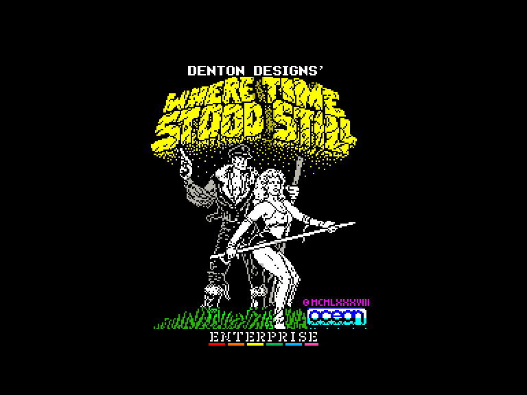
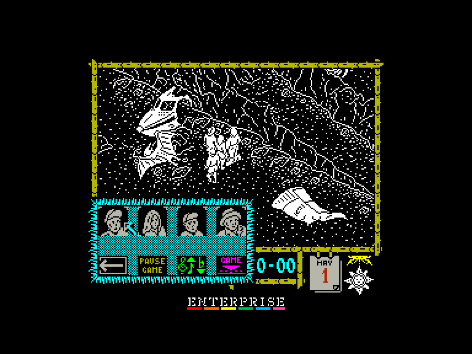
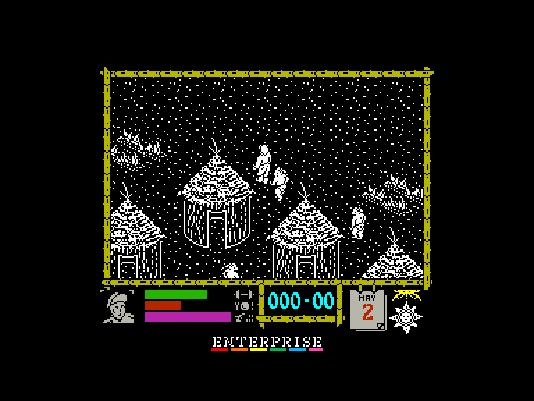
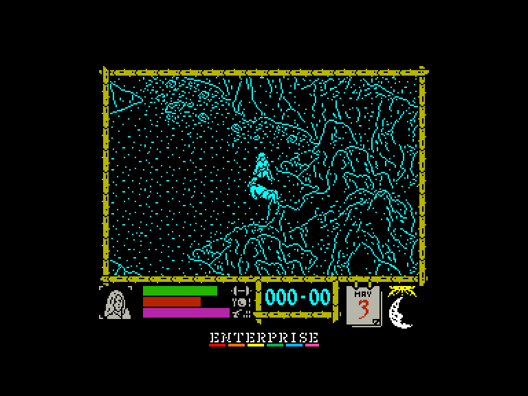

[0-9](../0/games-0.md) - [A](../a/games-a.md) - [B](../b/games-b.md) - [C](../c/games-c.md) - [D](../d/games-d.md) - [E](../e/games-e.md) - [F](../f/games-f.md) - [G](../g/games-g.md) - [H](../h/games-h.md) - [I](../i/games-i.md) - [J](../j/games-j.md) - [K](../k/games-k.md) - [L](../l/games-l.md) - [M](../m/games-m.md) - [N](../n/games-n.md) - [O](../o/games-o.md) - [P](../p/games-p.md) - [Q](../q/games-q.md) - [R](../r/games-r.md) - [S](../s/games-s.md) - [T](../t/games-t.md) - [U](../u/games-u.md) - [V](../v/games-v.md) - [W](../w/games-w.md) - [X](../x/games-x.md) - [Y](../y/games-y.md) - [Z](../z/games-z.md)

Ігри для [Enterprise 64k](../games-ep64.md) - [Enterprise 128k+RAMexp](../games-epramexp.md)

Ігри для систем [IS-DOS](../games-is-dos.md) - [SymbOS](../games-symbos.md) - [EDC Windows](../games-edcw.md)

Ігри для емуляторів [ZX Spectrum 48k/128k](../zxemu/games-zxemu.md) - [Amstrad CPC](../cpcemu/games-cpc.md) - [Sinclair ZX81](../zx81emu/games-zx81.md) - [Videoton TVC](../tvcemu/games-tvc.md) - [Commodore VIC-20](../vic20emu/games-vic20.md)

----------

# Where Time Stood Still

**ID:** where-time-stood-still-zx

## Скріншоти

## Опис

(temporary description generated by AI [Assistant])

**Опис гри:**
"Where Time Stood Still" - це захоплююча гра, що поєднує елементи екшену та пригод. Гравці беруть на себе роль чотирьох персонажів, які вижили після аварії літака в незвіданій місцевості, що нагадує доісторичний світ. Гравцям потрібно досліджувати навколишнє середовище, збирати предмети, взаємодіяти з іншими персонажами та уникати небезпечних істот, щоб знайти шлях до порятунку.

**Правила гри:**
1. **Персонажі:** Гравці контролюють одного з чотирьох персонажів, а інші три слідують за ним. Змінити контрольованого персонажа можна лише після його загибелі.
2. **Управління:** Перед початком гри налаштуйте управління. Зміни під час гри не можливі.
3. **Меню:** Використовуйте спеціальну кнопку для доступу до меню, де можна призупинити гру, налаштувати звук або перезапустити гру.
4. **Збір предметів:** Гравці можуть підбирати предмети, які потім можна використовувати для виконання різних завдань.
5. **Небезпеки:** Уникайте небезпечних істот, таких як птеродактилі, динозаври та інші вороги. Якщо персонаж зазнає шкоди, предмети залишаються на місці загибелі.
6. **Середовище:** Досліджуйте карту, щоб знайти правильний маршрут до безпечного місця. Використовуйте предмети, щоб подолати перешкоди та виконати завдання.

Гра обіцяє бути веселою та захоплюючою для всіх любителів пригод!

## Основна інформація
- **Оригінальна платформа:** ZX Spectrum
### Загальні системні вимоги
- **Апаратні:** EP128, EP128+RAM

## Посилання
- [Опис гри на ep128.hu (угорською)](http://www.ep128.hu/Games/Where_Time.htm)
- [Тема на форумі enterpriseforever](https://enterpriseforever.com/spectrum-rol/where-time-stood-still/)
- [Інформація про оригінальну версію](https://spectrumcomputing.co.uk/entry/5671/ZX-Spectrum/Where_Time_Stood_Still)
- [Завантажити гру](http://www.ep128.hu/Ep_Games/Prg/Where_Time_Stood_Still.rar)
- [Easy Load&Play](https://t.me/EP128k_Load_n_Play/887) *(Telegram-канал Vibrant Waves)*

