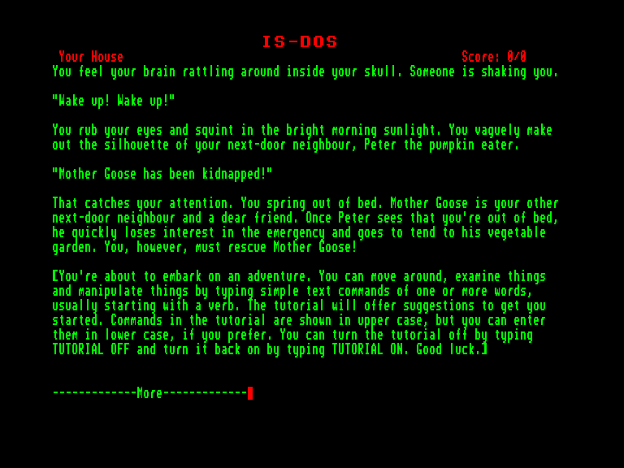
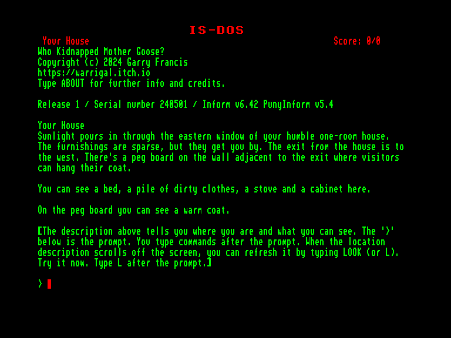

[0-9](../0/games-0.md) - [A](../a/games-a.md) - [B](../b/games-b.md) - [C](../c/games-c.md) - [D](../d/games-d.md) - [E](../e/games-e.md) - [F](../f/games-f.md) - [G](../g/games-g.md) - [H](../h/games-h.md) - [I](../i/games-i.md) - [J](../j/games-j.md) - [K](../k/games-k.md) - [L](../l/games-l.md) - [M](../m/games-m.md) - [N](../n/games-n.md) - [O](../o/games-o.md) - [P](../p/games-p.md) - [Q](../q/games-q.md) - [R](../r/games-r.md) - [S](../s/games-s.md) - [T](../t/games-t.md) - [U](../u/games-u.md) - [V](../v/games-v.md) - [W](../w/games-w.md) - [X](../x/games-x.md) - [Y](../y/games-y.md) - [Z](../z/games-z.md)

Ігри для [Enterprise 64k](../games-ep64.md) - [Enterprise 128k+RAMexp](../games-epramexp.md) - [2dfx](../games-2dfx.md)

Ігри для систем [IS-DOS](../games-is-dos.md) - [SymbOS](../games-symbos.md) - [EDC Windows](../games-edcw.md)

Ігри для емуляторів [ZX Spectrum 48k/128k](../zxemu/games-zxemu.md) - [Amstrad CPC](../cpcemu/games-cpc.md) - [Sinclair ZX81](../zx81emu/games-zx81.md) - [Videoton TVC](../tvcemu/games-tvc.md) - [Commodore VIC-20](../vic20emu/games-vic20.md)

----------

# Who Kidnapped Mother Goose

**ID:** who-kidnapped-mother-goose-zcode

**Жанри:** Текстова пригода

## Скріншоти

## Опис

(temporary description generated by AI [ChatGPT])

**Короткий опис гри:**

У грі "Хто викрав Мати Гуски?" ви граєте за Джеку Хорнера, який прокидається вранці від сусіда Пітера, що повідомляє про викрадення Мати Гуски, його доброго друга. Вам потрібно дослідити містечко та взаємодіяти з персонажами з дитячих віршів, щоб дізнатися, хто викрав Мати Гуски, і врятувати її.

**Правила гри:**
1. Досліджуйте різні локації в містечку.
2. Спілкуйтеся з персонажами з дитячих віршів, щоб отримати підказки.
3. Збирайте предмети та інформацію, щоб розкрити таємницю викрадення.
4. Використовуйте логіку та креативність для розв'язання головоломок.
5. Врятуйте Мату Гуску та дізнайтеся, що сталося з персонажами віршів, коли вони стали дорослими.

## Основна інформація
- **Мови:** Англійська
- **Оригінальна платформа:** Amstrad CPC
### Загальні системні вимоги
- **Апаратні:** EXDOS
- **Програмні:** IS-DOS
### Геймплей
- **Керування:** Keyboard
- **Кількість гравців:** 1 player
- **Додаткові теги:** Text80 mode, PAW
### Розробка
- **Рік випуску:** 2024
- **Автор:** Garry Francis

## Посилання
- [Домашня сторінка](https://warrigal.itch.io/who-kidnapped-mother-goose)
- [Інформація про оригінальну версію](https://www.cpc-power.com/index.php?page=detail&num=19485)
- [Інформація про гру (SolutionArchive.com)](https://solutionarchive.com/game/id%2C10576/Who+Kidnapped+Mother+Goose%3F.html)
- [Завантажити](https://www.ep128.hu/Ep_Games/Prg/Z-machine_Adventures.rar)

