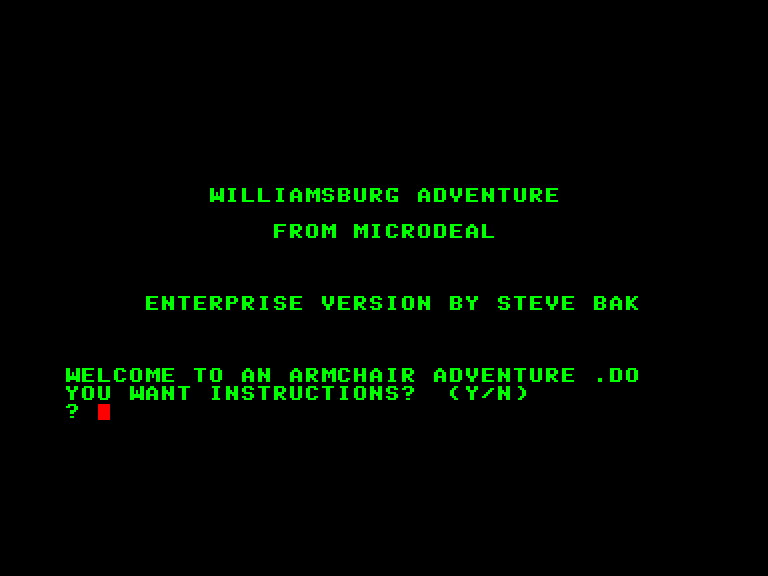
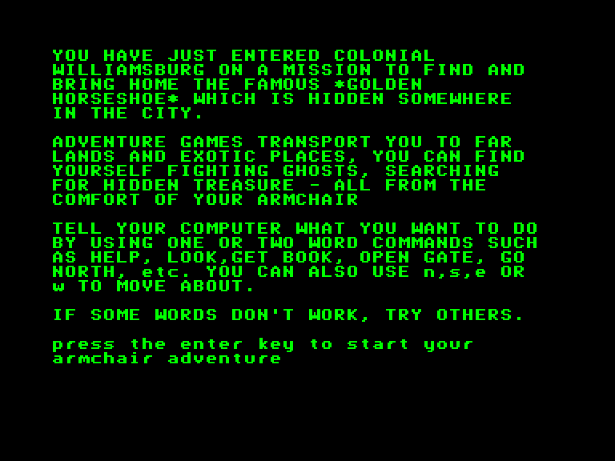
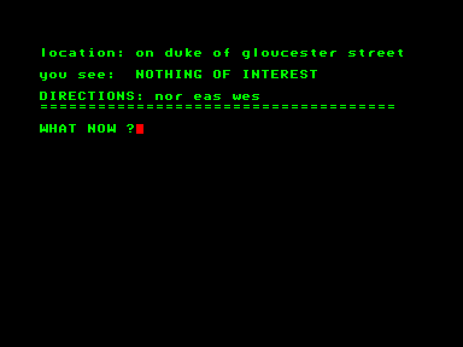
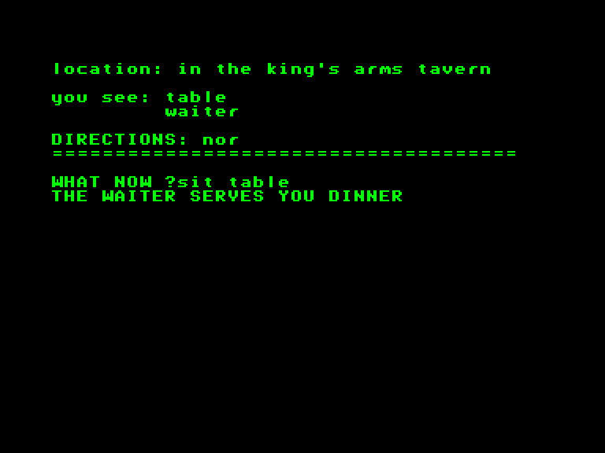

[0-9](../0/games-0.md) - [A](../a/games-a.md) - [B](../b/games-b.md) - [C](../c/games-c.md) - [D](../d/games-d.md) - [E](../e/games-e.md) - [F](../f/games-f.md) - [G](../g/games-g.md) - [H](../h/games-h.md) - [I](../i/games-i.md) - [J](../j/games-j.md) - [K](../k/games-k.md) - [L](../l/games-l.md) - [M](../m/games-m.md) - [N](../n/games-n.md) - [O](../o/games-o.md) - [P](../p/games-p.md) - [Q](../q/games-q.md) - [R](../r/games-r.md) - [S](../s/games-s.md) - [T](../t/games-t.md) - [U](../u/games-u.md) - [V](../v/games-v.md) - [W](../w/games-w.md) - [X](../x/games-x.md) - [Y](../y/games-y.md) - [Z](../z/games-z.md)

Ігри для [Enterprise 64k](../games-ep64.md) - [Enterprise 128k+RAMexp](../games-epramexp.md)

Ігри для систем [IS-DOS](../games-is-dos.md) - [SymbOS](../games-symbos.md) - [EDC Windows](../games-edcw.md)

Ігри для емуляторів [ZX Spectrum 48k/128k](../zxemu/games-zxemu.md) - [Amstrad CPC](../cpcemu/games-cpc.md) - [Sinclair ZX81](../zx81emu/games-zx81.md) - [Videoton TVC](../tvcemu/games-tvc.md) - [Commodore VIC-20](../vic20emu/games-vic20.md)

----------

# Williamsburg

**Альтернативні назви:**
 - Adventure 3

**ID:** williamsburg-adv3-bas

## Скріншоти

## Опис

(temporary description generated by AI [ChatGPT])

**Опис гри:**

"Williamsburg" — це захоплююча пригодницька гра, яка відбувається в маленькому колоніальному містечку Вільямсбург. Ваше завдання — знайти та принести додому Золоту Підкову, яка прихована десь у місті. Будьте обережні, адже на вас чекають злі духи та привид Брутон Паріш. У ваших пригодах ви можете натрапити на поліцію, бути переслідуваними м'ясником або загубитися в лабіринті. Чи зможете ви отримати Підкову? Лише ваш комп'ютер Dragon знає відповідь!

**Правила гри:**

1. Виберіть свою платформу для гри (C16/Plus4, Dragon 32/64, Enterprise, TRS-80).
2. Розпочніть гру та досліджуйте містечко Вільямсбург у пошуках Золотої Підкови.
3. Уникайте небезпек, таких як злі духи, поліція та м'ясник.
4. Використовуйте підказки та рішення, якщо застрягли.
5. Завершіть гру, знайшовши та принісши Золоту Підкову додому.

Гра була спочатку випущена журналом CLOAD для TRS-80 і пізніше адаптована для інших платформ.

## Основна інформація
- **Мови:** Англійська
### Системні вимоги
- **Апаратні:** EP64, EP128
- **Програмні:** IS-Basic
### Геймплей
- **Керування:** Keyboard
- **Кількість гравців:** 1 player

## Посилання
- [Опис гри на ep128.hu (угорською)](http://www.ep128.hu/Ep_Games/Leiras/Williamsburg.htm)
- [Інформація про гру (SolutionArchive.com)](https://solutionarchive.com/game/id%2C586/Williamsburg.html)
- [Завантажити гру](http://www.ep128.hu/Ep_Games/Prg/Williamsburg_Adventure_3.rar)

**Дата генерації:** 28.07.2026

