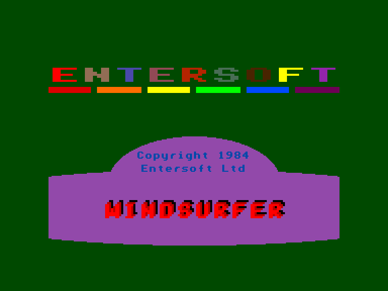
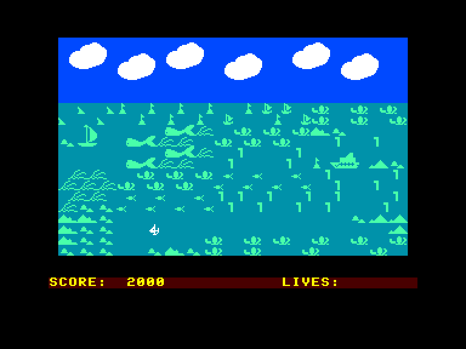
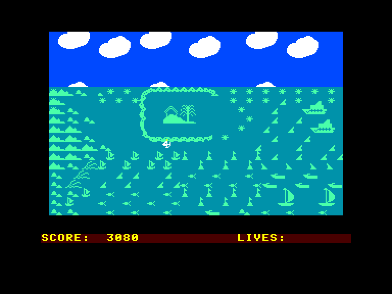
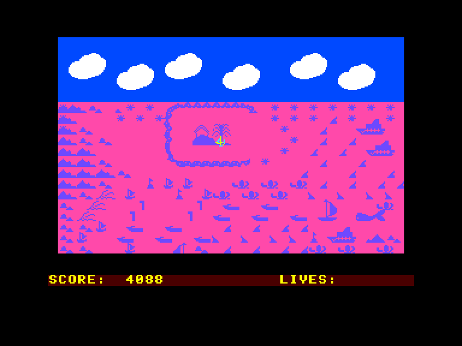

[0-9](../0/games-0.md) - [A](../a/games-a.md) - [B](../b/games-b.md) - [C](../c/games-c.md) - [D](../d/games-d.md) - [E](../e/games-e.md) - [F](../f/games-f.md) - [G](../g/games-g.md) - [H](../h/games-h.md) - [I](../i/games-i.md) - [J](../j/games-j.md) - [K](../k/games-k.md) - [L](../l/games-l.md) - [M](../m/games-m.md) - [N](../n/games-n.md) - [O](../o/games-o.md) - [P](../p/games-p.md) - [Q](../q/games-q.md) - [R](../r/games-r.md) - [S](../s/games-s.md) - [T](../t/games-t.md) - [U](../u/games-u.md) - [V](../v/games-v.md) - [W](../w/games-w.md) - [X](../x/games-x.md) - [Y](../y/games-y.md) - [Z](../z/games-z.md)

Ігри для [Enterprise 64k](../games-ep64.md) - [Enterprise 128k+RAMexp](../games-epramexp.md)

Ігри для систем [IS-DOS](../games-is-dos.md) - [SymbOS](../games-symbos.md) - [EDC Windows](../games-edcw.md)

Ігри для емуляторів [ZX Spectrum 48k/128k](../zxemu/games-zxemu.md) - [Amstrad CPC](../cpcemu/games-cpc.md) - [Sinclair ZX81](../zx81emu/games-zx81.md) - [Videoton TVC](../tvcemu/games-tvc.md) - [Commodore VIC-20](../vic20emu/games-vic20.md)

----------

# Windsurfer

**ID:** windsurfer-bas

## Скріншоти

## Опис

(temporary description generated by AI [ChatGPT])

**Опис гри: WindSurfer**

Ви — спеціально підготовлений секретний агент, який отримав небезпечне завдання! За інформацією, небезпечні терористи сховалися на групі з 10 островів. Ваше завдання — непомітно наблизитися до островів і підірвати їх бомбою. Океан у цьому районі настільки рифлений, що ви можете підійти до островів лише на серфі. Будьте обережні, адже острови оточені кораловими рифами! Ваш серф — дуже крихкий, і будь-яке зіткнення коштуватиме вам життя.

Ви керуєте серфом за допомогою обраного штурвала. Ускладнює завдання те, що ваш серф не може стояти на місці (вітер постійно дме), і ви завжди рухаєтеся в якому-небудь напрямку. Бомба вибухне, коли ви досягнете острова. Для виконання завдання у вас є три життя, удачі!

**Правила гри:**
1. Керування серфом здійснюється за допомогою штурвала.
2. Будьте обережні, адже зіткнення з рифами призводить до втрати життя.
3. Серф постійно рухається під впливом вітру.
4. Бомба вибухає при досягненні острова.
5. У вас є три життя для виконання місії.
6. Використовуйте клавішу HOLD для паузи під час гри.
7. Гру можна зупинити в будь-який момент, натиснувши клавішу STOP.

## Основна інформація
### Системні вимоги
- **Апаратні:** EP64, EP128
- **Програмні:** IS-Basic
### Геймплей
- **Керування:** Internal Joy, External Joy 1
### Розробка
- **Рік випуску:** 1984
- **Компанія:** Entersoft

## Посилання
- [Опис гри на ep128.hu (угорською)](http://www.ep128.hu/Ep_Games/Leiras/WindSurfer.htm)
- [Завантажити гру](http://www.ep128.hu/Ep_Games/Prg/WindSurfer.rar)

**Дата генерації:** 29.07.2026

