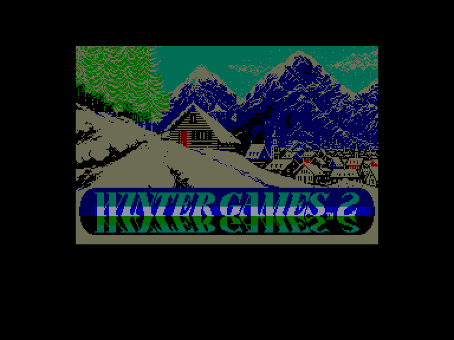
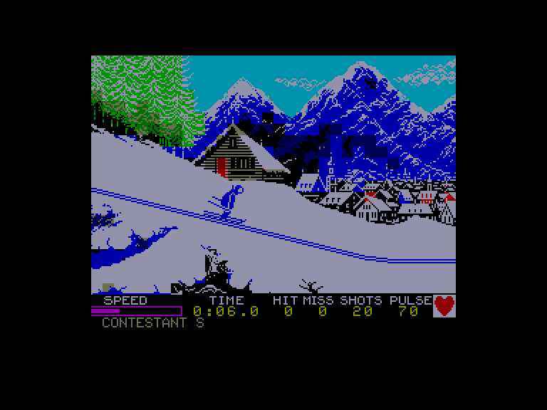
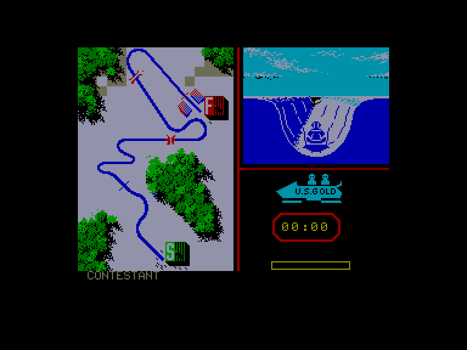
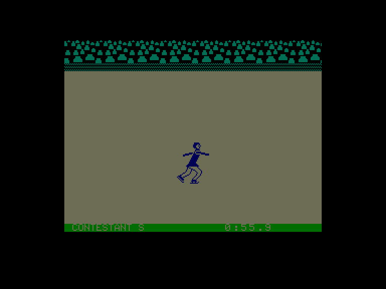

[0-9](../0/games-0.md) - [A](../a/games-a.md) - [B](../b/games-b.md) - [C](../c/games-c.md) - [D](../d/games-d.md) - [E](../e/games-e.md) - [F](../f/games-f.md) - [G](../g/games-g.md) - [H](../h/games-h.md) - [I](../i/games-i.md) - [J](../j/games-j.md) - [K](../k/games-k.md) - [L](../l/games-l.md) - [M](../m/games-m.md) - [N](../n/games-n.md) - [O](../o/games-o.md) - [P](../p/games-p.md) - [Q](../q/games-q.md) - [R](../r/games-r.md) - [S](../s/games-s.md) - [T](../t/games-t.md) - [U](../u/games-u.md) - [V](../v/games-v.md) - [W](../w/games-w.md) - [X](../x/games-x.md) - [Y](../y/games-y.md) - [Z](../z/games-z.md)

Ігри для [Enterprise 64k](../games-ep64.md) - [Enterprise 128k+RAMexp](../games-epramexp.md)

Ігри для систем [IS-DOS](../games-is-dos.md) - [SymbOS](../games-symbos.md) - [EDC Windows](../games-edcw.md)

Ігри для емуляторів [ZX Spectrum 48k/128k](../zxemu/games-zxemu.md) - [Amstrad CPC](../cpcemu/games-cpc.md) - [Sinclair ZX81](../zx81emu/games-zx81.md) - [Videoton TVC](../tvcemu/games-tvc.md) - [Commodore VIC-20](../vic20emu/games-vic20.md)

----------

# Winter Games: Part 2

**ID:** winter-games-zx

## Скріншоти

## Опис

(temporary description generated by AI [your name])

**Опис гри: Зимові Ігри**

"Зимові Ігри" - це захоплююча спортивна симуляція, яка переносить гравців у світ зимових видів спорту. Гра пропонує різноманітні дисципліни, включаючи стрибки з трампліна, лижну акробатику, швидкісне катання на ковзанах, фігурне катання, біатлон, бобслей та вільне катання. Гравці можуть змагатися в усіх видах спорту або вибрати лише деякі з них для змагань.

**Правила гри:**

1. **Меню вибору:** Гравці можуть вибрати один з кількох режимів:
   - Змагання в усіх видах спорту
   - Змагання в обраних видах спорту
   - Змагання в одному вибраному виді спорту
   - Практика в одному виді спорту
   - Налаштування кількості учасників (максимум 4)
   - Налаштування управління (Kempston, Cursor, Interface II, клавіатура)
   - Перегляд світових рекордів

2. **Управління:** Гравці використовують клавіші для виконання різних дій, таких як старт, стрибки, управління напрямком тощо.

3. **Змагання:** Гравці змагаються за найкращі результати в кожному виді спорту. Якщо гравець встановлює світовий рекорд, його результат фіксується у списку рекордів.

4. **Оцінювання:** У деяких видах спорту, таких як фігурне катання та акробатика, гравці отримують оцінки від суддів за виконання трюків.

5. **Складність:** Гравцям потрібно знайти правильний ритм та таймінг для досягнення успіху в різних дисциплінах, що вимагає практики та навичок.

Приготуйтеся до захоплюючих зимових змагань та спробуйте встановити нові рекорди!

## Основна інформація
- **Оригінальна платформа:** ZX Spectrum

## Посилання
- [Опис гри на ep128.hu (угорською)](http://www.ep128.hu/Games/Winter_Games.htm)
- [Інформація про оригінальну версію](https://spectrumcomputing.co.uk/entry/5693/ZX-Spectrum/Winter_Games)
- [Завантажити гру](http://www.ep128.hu/Ep_Games/Prg/Winter_Games_part_2.rar)

**Дата генерації:** 29.07.2026

