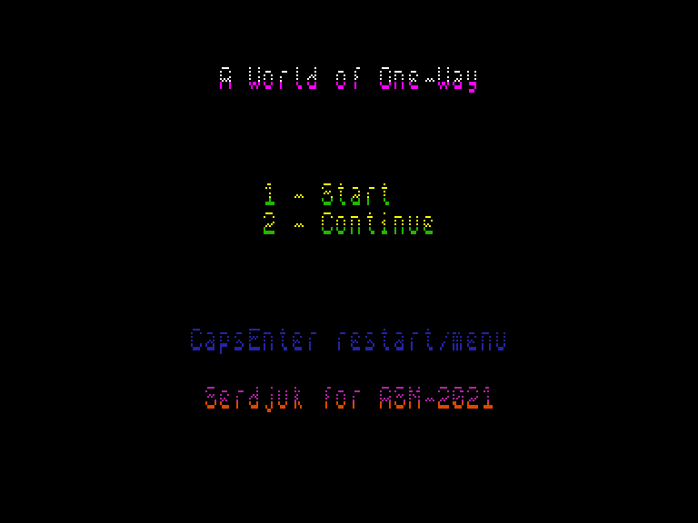
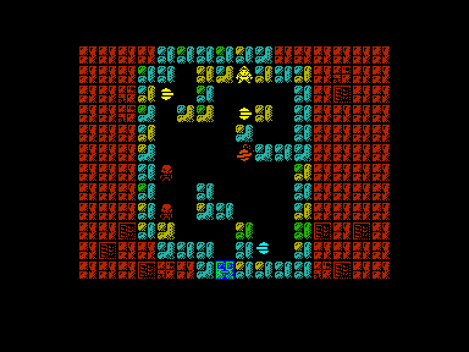
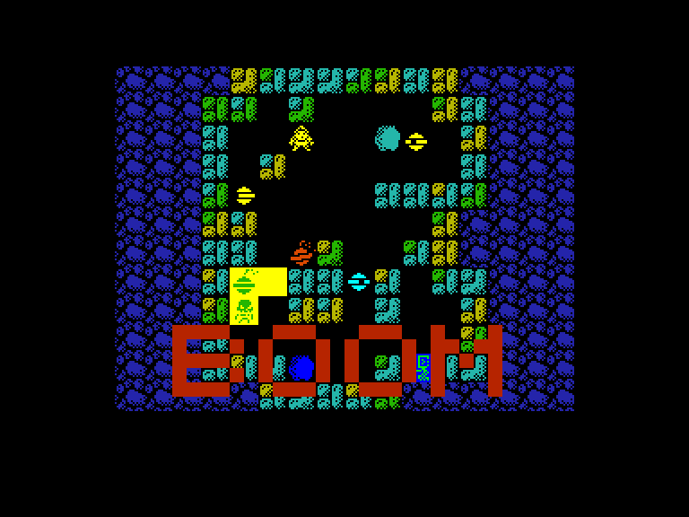
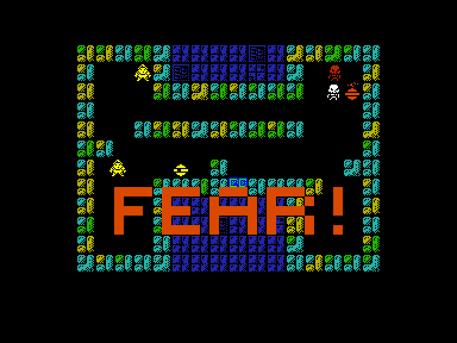

[0-9](../0/games-0.md) - [A](../a/games-a.md) - [B](../b/games-b.md) - [C](../c/games-c.md) - [D](../d/games-d.md) - [E](../e/games-e.md) - [F](../f/games-f.md) - [G](../g/games-g.md) - [H](../h/games-h.md) - [I](../i/games-i.md) - [J](../j/games-j.md) - [K](../k/games-k.md) - [L](../l/games-l.md) - [M](../m/games-m.md) - [N](../n/games-n.md) - [O](../o/games-o.md) - [P](../p/games-p.md) - [Q](../q/games-q.md) - [R](../r/games-r.md) - [S](../s/games-s.md) - [T](../t/games-t.md) - [U](../u/games-u.md) - [V](../v/games-v.md) - [W](../w/games-w.md) - [X](../x/games-x.md) - [Y](../y/games-y.md) - [Z](../z/games-z.md)

Ігри для [Enterprise 64k](../games-ep64.md) - [Enterprise 128k+RAMexp](../games-epramexp.md) - [2dfx](../games-2dfx.md)

Ігри для систем [IS-DOS](../games-is-dos.md) - [SymbOS](../games-symbos.md) - [EDC Windows](../games-edcw.md)

Ігри для емуляторів [ZX Spectrum 48k/128k](../zxemu/games-zxemu.md) - [Amstrad CPC](../cpcemu/games-cpc.md) - [Sinclair ZX81](../zx81emu/games-zx81.md) - [Videoton TVC](../tvcemu/games-tvc.md) - [Commodore VIC-20](../vic20emu/games-vic20.md)

----------

# A World of One-Way

**ID:** world-of-one-way-zx

**Жанри:** Логічна

## Примітка

ℹ Сучасна неофіційна конверсія з платформи ZX Spectrum.

## Скріншоти

## Опис

«Світ одностороннього руху» (а саме так перекладається назва) є головоломкою, у якій необхідно дістатися виходу, намагаючись не загинути від пасток або кістлявих лап ворогів. Дорогою бажано збирати цінні монетки, за які можна придбати додаткові спроби або отримати пароль для наступного рівня. Складність полягає в тому, що ми управляємо одночасно як героєм, так і його противниками, які рухаються по прямій до найближчої перешкоди.

## Основна інформація
- **Мови:** Англійська
- **Оригінальна платформа:** ZX Spectrum
### Загальні системні вимоги
- **Апаратні:** EP64, EP128
### Геймплей
- **Керування:** Keyboard, Internal Joy
- **Кількість гравців:** 1 player
- **Додаткові теги:** Attribute mode
### Розробка
- **Рік випуску:** 2021
- **Автор:** Serdjuk

## Посилання
- [Домашня сторінка](https://serdjuk.itch.io/a-world-of-one-way)
- [Тема на форумі enterpriseforever](https://enterpriseforever.com/spectrum-rol/a-world-of-one-way/)
- [Інформація про оригінальну версію](https://spectrumcomputing.co.uk/entry/37738/ZX-Spectrum/A_World_of_One-Way)
- [Завантажити](http://www.ep128.hu/Ep_Games/Prg/World_of_One-Way.rar)
- [Easy Load&Play](https://t.me/EP128k_Load_n_Play/895) *(Telegram-канал Vibrant Waves)*

## Відео

<iframe src="https://www.youtube.com/embed/jHuWgUzaOGY"  
style="width:75%; aspect-ratio:16/9;" allowfullscreen></iframe>

- [Відео](https://www.youtube.com/watch?v=fHxH_TJ2VVY)

## [Керування](../controllers.md)

`Keyboard`: `Q`, `A`, `O`, `P`  
`Internal Joystick`  

`Shift`+`Enter`: Виклик меню

## Детальна інформація

### Допомога у проходженні  

Коди рівней (?):  

1 `3836567624693166`  
2 `3376549824651089`  
3 `7525349852943210`  
4 `5539168176030867`  
5 `6773782776748698`  
6 `1452483752779880`  
7 `9876543229679796`  
8 `1096884444655399`  
9 `8647478971954596`  
10 `7399744960409449`  
11 `9763568354889348`  
12 `4502017588699244`  
13 `6089155864588608`  
14 `3930742947936405`  
15 `3000357559987404`  
16 `3317615947448971`  
17 `9337095955475355`  
18 `8467562287976506`  
19 `1546687356689996`  
20 `5826455446986834`