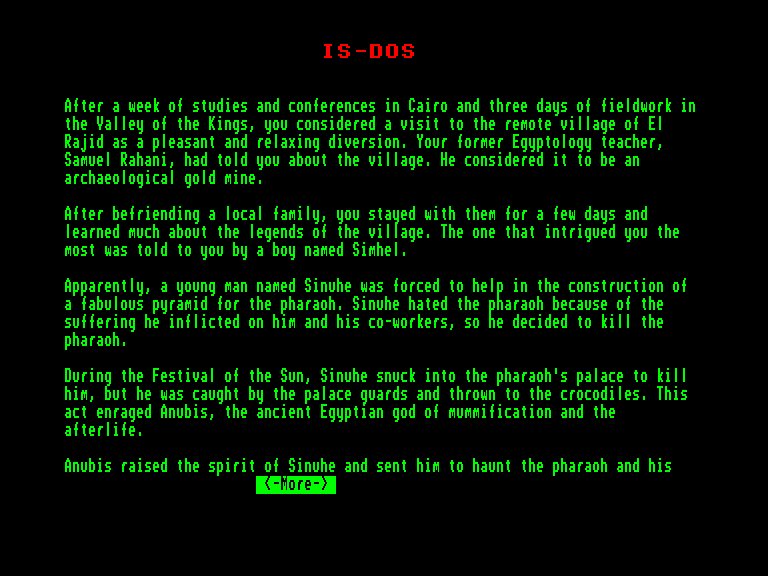
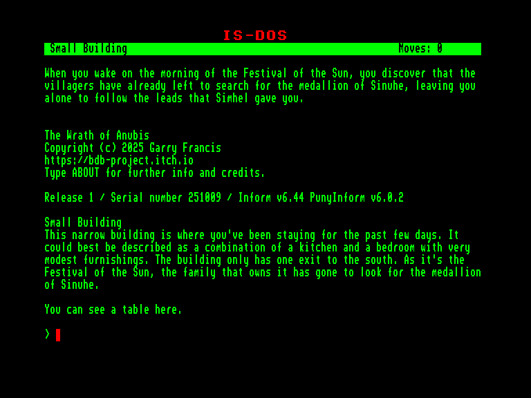
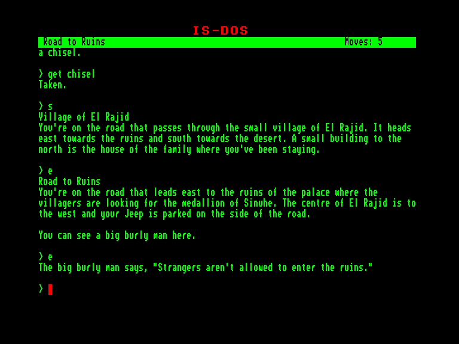
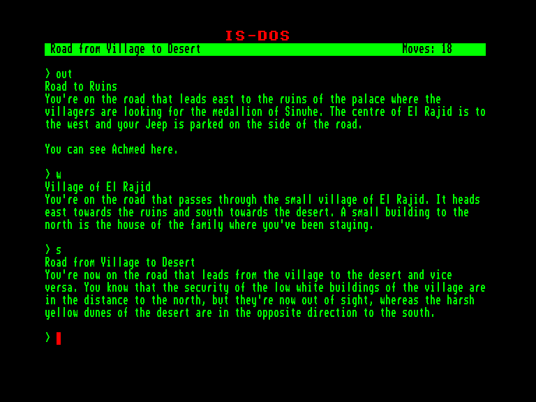

[0-9](../0/games-0.md) - [A](../a/games-a.md) - [B](../b/games-b.md) - [C](../c/games-c.md) - [D](../d/games-d.md) - [E](../e/games-e.md) - [F](../f/games-f.md) - [G](../g/games-g.md) - [H](../h/games-h.md) - [I](../i/games-i.md) - [J](../j/games-j.md) - [K](../k/games-k.md) - [L](../l/games-l.md) - [M](../m/games-m.md) - [N](../n/games-n.md) - [O](../o/games-o.md) - [P](../p/games-p.md) - [Q](../q/games-q.md) - [R](../r/games-r.md) - [S](../s/games-s.md) - [T](../t/games-t.md) - [U](../u/games-u.md) - [V](../v/games-v.md) - [W](../w/games-w.md) - [X](../x/games-x.md) - [Y](../y/games-y.md) - [Z](../z/games-z.md)

Ігри для [Enterprise 64k](../games-ep64.md) - [Enterprise 128k+RAMexp](../games-epramexp.md)

Ігри для систем [IS-DOS](../games-is-dos.md) - [SymbOS](../games-symbos.md) - [EDC Windows](../games-edcw.md)

Ігри для емуляторів [ZX Spectrum 48k/128k](../zxemu/games-zxemu.md) - [Amstrad CPC](../cpcemu/games-cpc.md) - [Sinclair ZX81](../zx81emu/games-zx81.md) - [Videoton TVC](../tvcemu/games-tvc.md) - [Commodore VIC-20](../vic20emu/games-vic20.md)

----------

# The Wrath of Anubis

**ID:** wrath-of-anubis-zcode

**Жанри:** Текстова пригода

## Скріншоти

## Опис

Коли ви завітали до цього віддаленого села Ель-Раджид, вас, без сумніву, полонили місцеві перекази. Особливо глибоко вас зворушила розповідь про молодого чоловіка на ім'я Сінухе, який працював на будівництві грандіозної піраміди для нещадного фараона. Сінухе люто зневажав цього правителя і задумав покінчити з його життям, але був спійманий палацовою вартою і жорстоко кинутий на поживу крокодилам.

Така нелюдська розправа страшенно обурила Анубіса, давнього єгипетського бога, покровителя муміфікації та загробного світу. Анубіс повернув до життя дух Сінухе і прирік його переслідувати фараона та всіх його нащадків крізь століття. Подейкують, що цей невгамовний дух і донині блукає долиною навколо Ель-Раджида, не даючи спокою нікому, незалежно від того, чи є вони спадкоємцями фараона, чи ні.

Щороку, на Фестиваль Сонця, селяни залишають свої оселі та вирушають на пошуки залишків стародавнього палацу, сподіваючись знайти той самий медальйон, що був на Сінухе в момент його трагічної смерті. За давніми повір'ями, якщо цей медальйон переплавити й відлити у вигляді фігури Анубіса, то гнів бога вщухне, а Сінухе нарешті знайде вічний спокій.

Сьогодні ранок Фестивалю Сонця, і поки всі мешканці пішли на пошуки медальйона Сінухе, ви залишаєтеся наодинці з власними дослідженнями. Чи зможете ви витримати палючу спеку пустелі та відшукати цей загублений оберіг, аби умиротворити розгніваного Анубіса?

## Основна інформація
- **Мови:** Англійська
### Системні вимоги
- **Апаратні:** EXDOS
- **Програмні:** IS-DOS
### Геймплей
- **Керування:** Keyboard
- **Кількість гравців:** 1 player
- **Додаткові теги:** Z-code
### Розробка
- **Рік випуску:** 2025
- **Автор:** Garry Francis

## Посилання
- [Домашня сторінка гри](https://bdb-project.itch.io/wrath-of-anubis)
- [Інформація про гру (SolutionArchive.com)](https://www.solutionarchive.com/game/id%2C10901/Wrath+of+Anubis%2C+The.html)

