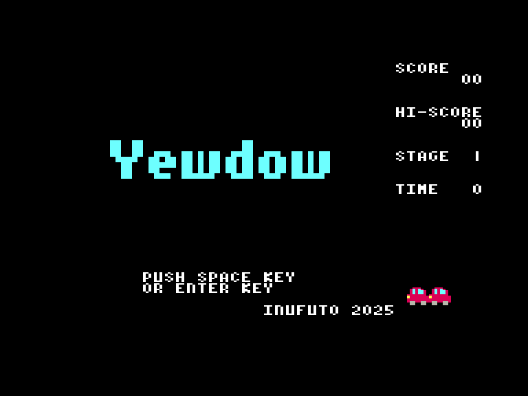
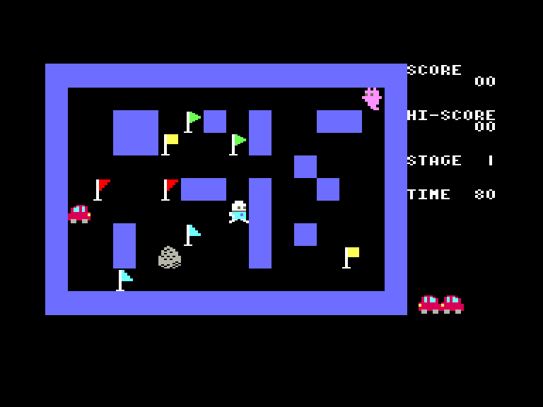
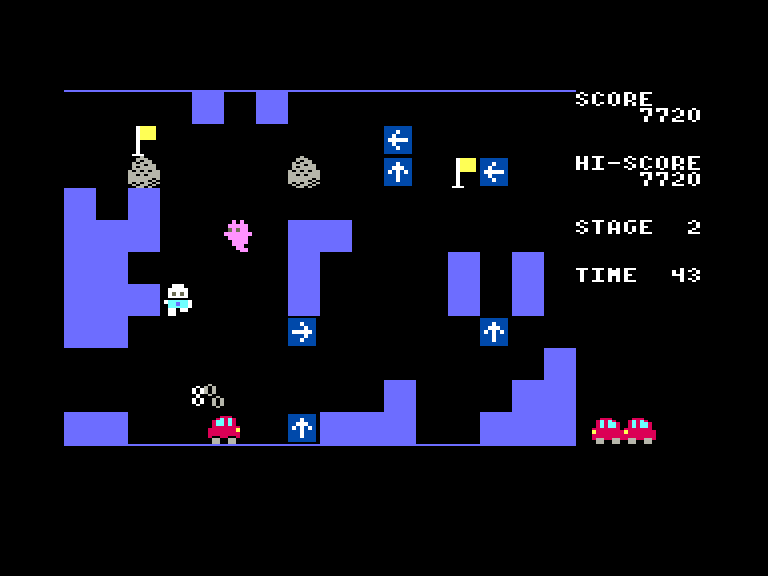
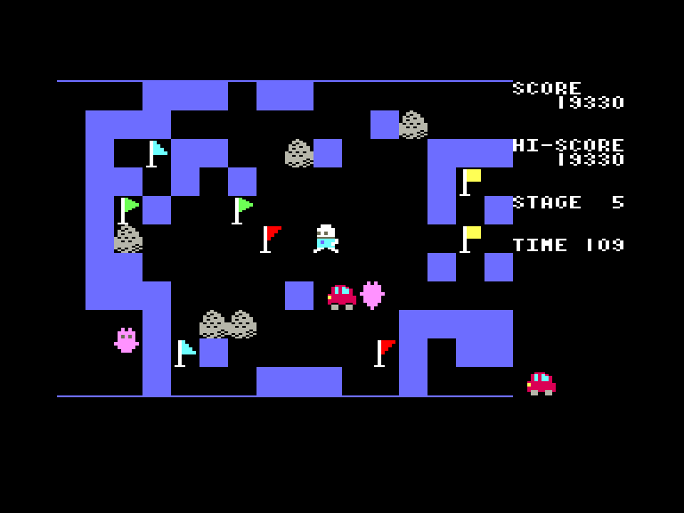

# Yewdow

| | | | |
| --- | --- | --- | --- |
|||||

Жанр: аркада, логіка  
Кількість гравців: 1

## Опис

Вам необхідно зібрати усі прапорці за допомогою автомобіля, не керуючи ним напряму. Ви можете лишати лише вказівні знаки по яким і буде рухатись авто. Збираючи однакові прапорці ви отримаєте бонус. Машина може врізатись у сині частини ландшафту (при цьому вони зникають, а авто поїде у зворотньому напрямку), але треба уникати аварій з кам'яними брилами та краями рівня. Привиди, що прогулюються навколо вас не можуть вбити, а лише паралізують на деякий час.

У грі 8 різних рівней, після чого вони починають повторюватись.

## Системні вимоги

|Мінімальні системні вимоги:|Рекомендовані системні вимоги:|
|---------------------------|------------------------------|
|Оперативна пам'ять: **64 КБ** (тільки картридж-версія)|Оперативна пам'ять: **128 КБ (або більше)**|  

## Керування та тонкощі запуску
### Елементи керування меню:

`Enter`/`Space`/`X`/`Z`: Почати гру  

### Основні [елементи керування](../controllers.md):
⌨ Клавіатура (`L`, `,`, `.`, `/`)  
🕹 Вбудований джойстик  

`Space`/`Z` + напрямок: встановити вказівник  

## Посилання

▶ [Easy Load&Play](https://t.me/EP128k_Load_n_Play/845) *(Telegram-канал Vibrant Waves)*  
💾 [Завантажити гру]()  
🏡 [Домашня сторінка гри](http://inufuto.web.fc2.com/8bit/yewdow/#ep64)

## Автори
👨‍💻 Розробник: [Inufuto](../../community/inufuto.md)  
📅 Рік релізу: [2025](../release_years/2025.md)  