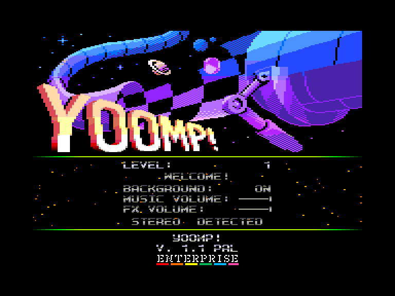
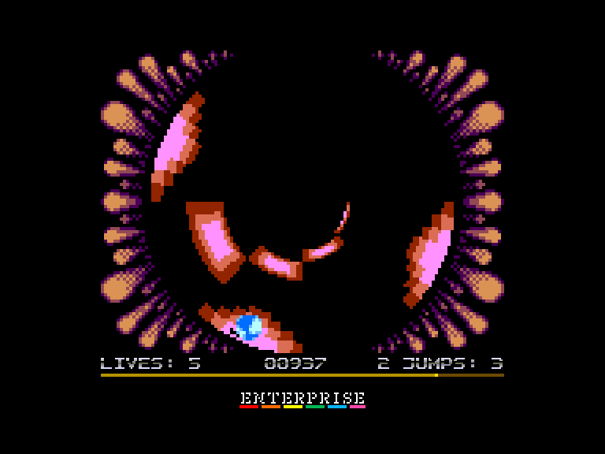
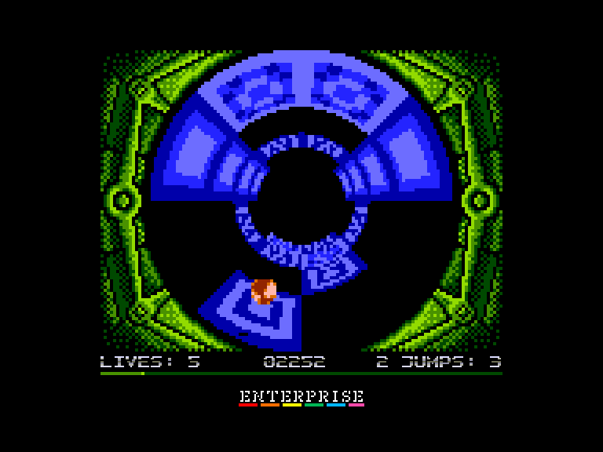
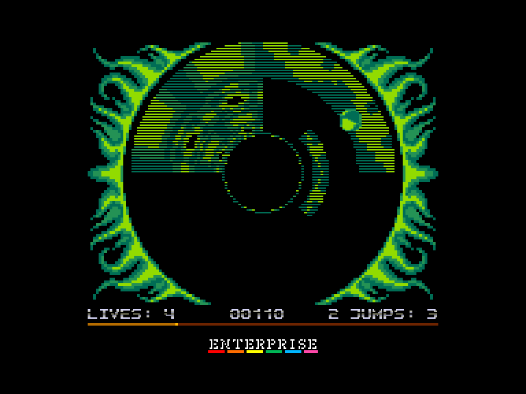

# Yoomp!

 
 
 

Жанр: аркада, платформер  
Кількість гравців: 1  
Мова гри: англійська  

## Опис

Проскачіть м'ячиком через 21 циліндричну трасу, назбирайте якомога більше очок і намагайтеся не впасти у прірву!  

<iframe width="560" height="315" src="https://www.youtube.com/embed/BXybXA11L40" title="YouTube video player" frameborder="0" allowfullscreen></iframe>

## Системні вимоги
### Мінімальні системні вимоги
Оперативна пам'ять: **128 КБ**  
### Рекомендовані системні вимоги
Швидкість процесора: **8-10 МГц**  
Оперативна пам'ять: **128 КБ (або більше)**  

**⚠ Для стандартної машини (4 МГц) рекомендується 4-колірний режим графіки.**

## Керування та тонкощі запуску
### Основні [елементи керування](../controllers.md):
⌨ Клавіатура (`Q`, `A`, `O`, `P`, `Space`)  
🕹 Вбудований джойстик + `Enter`  
🎮 Зовнішній джойстик 1/2

**⚠ ігровий контролер обирається натисканням на клавішу вогню, тому якщо гру було розпочато клавішею `Space`, то управління у грі буде здійснюватись за допомогою клавіатури.**

`Fire`, `Enter`, `Space`: Довгий стрибок *(⚠ для здійснення стрибка кнопку "вогонь" треба натискати перед дотиком м'яча до поверхні)*

### Додаткові клавіши:
`Hold`/`Pause`:	Пауза  
`Stop`:	Завершити поточну гру та вийти у головне меню  
`F4`:	Змінити режим екрану  
`F5`/`F6`:	Гучність звуків −/+  
`F7`/`F8`:	Гучність музики −/+  

*(якщо гучність звуків рівна або менша за гучність музики то звуки будуть програватись за допомогою шумового каналу, а якщо гучність звуків вища за гучність музики то звуки будуть програватись за допомогою 2 каналу, який не буде використовуватись для програвання музики)*

**Налаштування швидкості гри:**  
`F1`: швидкість гри стане 50 к/с *(потребує 8 МГц машину для 4-кольорного режиму та 10 МГц для 16-кольорного режиму)*.  
`F2`: швидкість гри стане 25 к/с *(потребує 4 МГц машину для 4-кольорного режиму та 4,6 МГц для 16-кольорного режиму)*.  
`F3`: швидкість гри стане 16,6 к/с *(це максимальна швидкість на 4 МГц машині у 16-кольорному режимі)*.

## Чіт-коди та допомога у проходженні

### Відкрити доступ до усіх рівней:
Ввести у головному меню код **736418**

### Відеопроходження:
<iframe width="560" height="315" src="https://www.youtube.com/embed/fB4Yrk6v96c" title="YouTube video player" frameborder="0" allowfullscreen></iframe>
*(версія гри для комп'ютера Atari 8-bit)*

## Посилання

▶ [Easy Load&Play](https://t.me/EP128k_Load_n_Play/673) *(Telegram-канал Vibrant Waves)*  
💾 [Завантажити гру](http://www.ep128.hu/Ep_Games/Prg/Yoomp.rar)  
📃 [Опис гри](http://www.ep128.hu/Ep_Games/Leiras/Yoomp.htm) (угорська)  
🗨 [Тема на форумі enterpriseforever.com](https://enterpriseforever.com/konvertalas/yoomp/)  

## Автори
### Оригінальний реліз
🖥 Платформа: [Atari 8-bit](https://www.atarimania.com/game-atari-400-800-xl-xe-yoomp_20790.html)  
👨‍💻 Програмісти: Marcin Żukowski, Piotr Fusik  
👨‍💻 Художник: Bartek Wasiel  
👨‍💻 Музика: Lukasz Sychowicz  
📅 Рік релізу: 2008

### Версія гри для Enterprise
👨‍💻 Портування: [Geco](../../community/geco.md)  
📅 Рік релізу: [2024](../release_years/2024.md)