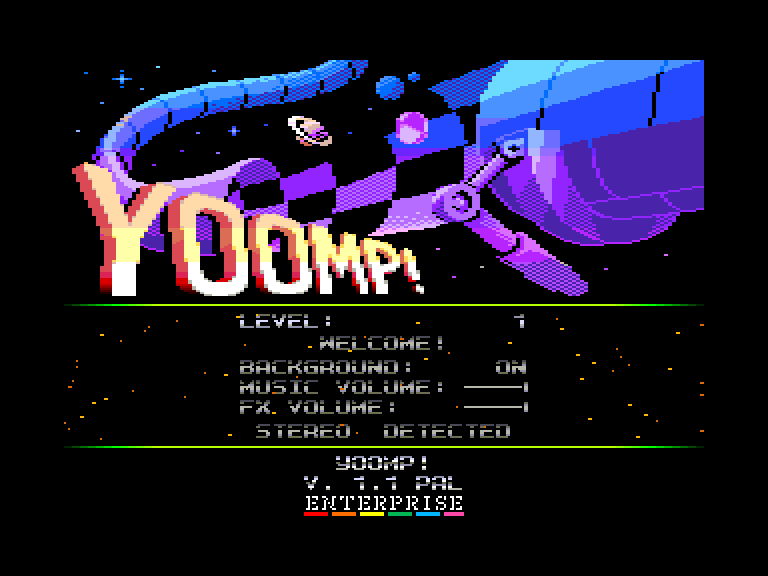
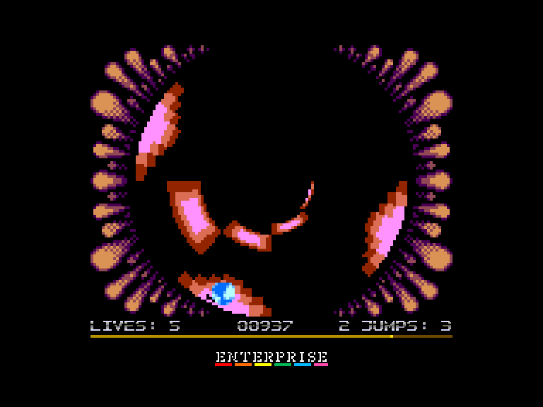
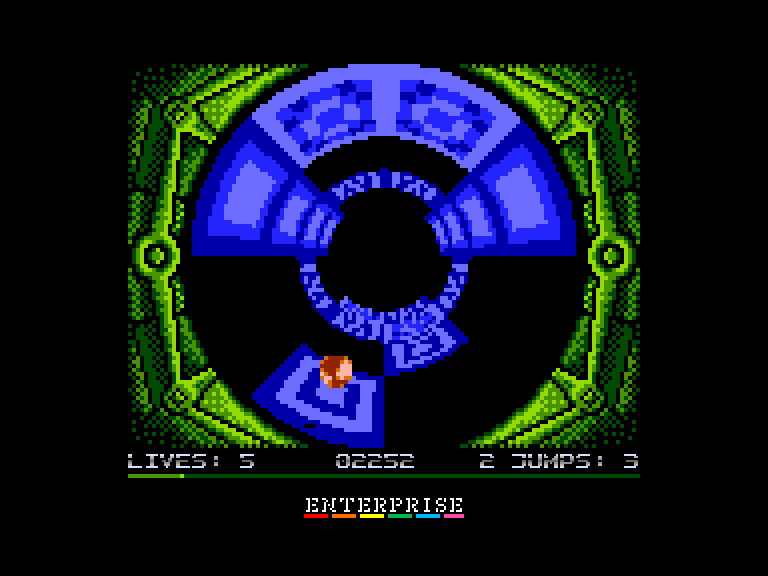
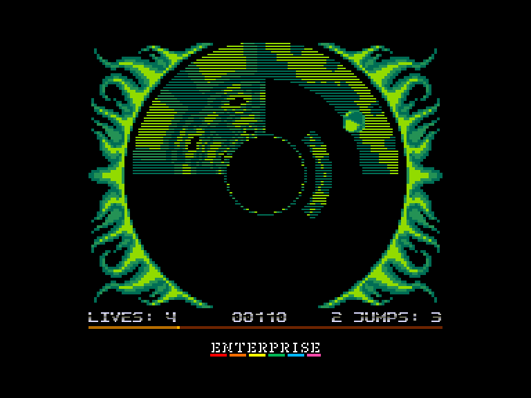

[0-9](../0/games-0.md) - [A](../a/games-a.md) - [B](../b/games-b.md) - [C](../c/games-c.md) - [D](../d/games-d.md) - [E](../e/games-e.md) - [F](../f/games-f.md) - [G](../g/games-g.md) - [H](../h/games-h.md) - [I](../i/games-i.md) - [J](../j/games-j.md) - [K](../k/games-k.md) - [L](../l/games-l.md) - [M](../m/games-m.md) - [N](../n/games-n.md) - [O](../o/games-o.md) - [P](../p/games-p.md) - [Q](../q/games-q.md) - [R](../r/games-r.md) - [S](../s/games-s.md) - [T](../t/games-t.md) - [U](../u/games-u.md) - [V](../v/games-v.md) - [W](../w/games-w.md) - [X](../x/games-x.md) - [Y](../y/games-y.md) - [Z](../z/games-z.md)

Ігри для [Enterprise 64k](../games-ep64.md) - [Enterprise 128k+RAMexp](../games-epramexp.md)

Ігри для систем [IS-DOS](../games-is-dos.md) - [SymbOS](../games-symbos.md) - [EDC Windows](../games-edcw.md)

Ігри для емуляторів [ZX Spectrum 48k/128k](../zxemu/games-zxemu.md) - [Amstrad CPC](../cpcemu/games-cpc.md) - [Sinclair ZX81](../zx81emu/games-zx81.md) - [Videoton TVC](../tvcemu/games-tvc.md) - [Commodore VIC-20](../vic20emu/games-vic20.md)

----------

# Yoomp!

**ID:** yoomp-atari

**Жанри:** Аркада

## Примітка

ℹ Сучасна неофіційна конверсія з платформи Atari 8bit (XL/XE).

## Скріншоти

## Опис

Проскачіть м'ячиком через 21 циліндричну трасу, назбирайте якомога більше очок і намагайтеся не впасти у прірву!

## Основна інформація
- **Мови:** Англійська
- **Оригінальна платформа:** Atari 8-bit
### Загальні системні вимоги
- **Апаратні:** EP128
### Геймплей
- **Керування:** Keyboard, Internal Joy, External Joy 1, External Joy 2
- **Кількість гравців:** 1 player
- **Додаткові теги:** 4-color mode, 16-color mode
### Розробка
- **Рік випуску:** 2008
- **Автор:** Marcin Żukowski, Piotr Fusik, Bartek Wasiel, Lukasz Sychowicz

## Посилання
- [Домашня сторінка гри](https://yoomp.atari.pl/index.htm)
- [Опис гри на ep128.hu (угорською)](http://www.ep128.hu/Ep_Games/Leiras/Yoomp.htm)
- [Тема на форумі enterpriseforever](https://enterpriseforever.com/konvertalas/yoomp/)
- [Завантажити гру](http://www.ep128.hu/Ep_Games/Prg/Yoomp.rar)
- [Easy Load&Play](https://t.me/EP128k_Load_n_Play/673) *(Telegram-канал Vibrant Waves)*

## Відео

<iframe src="https://www.youtube.com/embed/BXybXA11L40"  
style="width:75%; aspect-ratio:16/9;" allowfullscreen></iframe>

## [Керування](../controllers.md)

`Keyboard`: `Q`, `A`, `O`, `P`, `Space`  
`Internal Joystick` + `Enter`  
`External Joystick 1`  
`External Joystick 2`  

**⚠ ігровий контролер обирається натисканням на клавішу вогню, тому якщо гру було розпочато клавішею `Space`, то управління у грі буде здійснюватись за допомогою клавіатури.**  

`Fire`, `Enter`, `Space`: Довгий стрибок *(⚠ для здійснення стрибка кнопку "вогонь" треба натискати перед дотиком м'яча до поверхні)*  

### Додаткові клавіши  

`Hold`/`Pause`: Пауза  
`Stop`: Завершити поточну гру та вийти у головне меню  
`F4`: Змінити режим екрану  
`F5`/`F6`: Гучність звуків −/+  
`F7`/`F8`: Гучність музики −/+  

*(якщо гучність звуків рівна або менша за гучність музики то звуки будуть програватись за допомогою шумового каналу, а якщо гучність звуків вища за гучність музики то звуки будуть програватись за допомогою 2 каналу, який не буде використовуватись для програвання музики)*  

**Налаштування швидкості гри:**  
`F1`: швидкість гри стане 50 к/с *(потребує 8 МГц машину для 4-колірного режиму та 10 МГц для 16-колірного режиму)*.  
`F2`: швидкість гри стане 25 к/с *(потребує 4 МГц машину для 4-колірного режиму та 4,6 МГц для 16-колірного режиму)*.  
`F3`: швидкість гри стане 16,6 к/с *(це максимальна швидкість на 4 МГц машині у 16-колірному режимі)*.

## Детальна інформація

### Системні вимоги  

#### Мінімальні системні вимоги  

Оперативна пам'ять: **128 КБ**  

#### Рекомендовані системні вимоги  

Швидкість процесора: **8-10 МГц**  
Оперативна пам'ять: **128 КБ (або більше)**  

**⚠ Для стандартної машини (4 МГц) рекомендується 4-колірний режим графіки.**  

### Чіти та коди  

**Відкрити доступ до усіх рівней:**  
Ввести у головному меню код `736418`  

**Коди рівней:**  
Level  1: `000000` (Welcome!)  
Level  2: `198039` (Yoomp!)  
Level  3: `732663` (Lubber)  
Level  4: `760825` (Minefield)  
Level  5: `232482` (Kindergarten)  
Level  6: `367871` (Johnnie Walker)  
Level  7: `077581` (Mix Mix Mix Mix)  
Level  8: `108962` (Piece of Cake)  
Level  9: `176606` (Fear Play)  
Level 10: `995220` (Paranoia)  
Level 11: `606934` (Torreador)  
Level 12: `710811` (Jump Maniac)  
Level 13: `787699` (Voyager)  
Level 14: `712321` (Scum)  
Level 15: `034498` (Shpoongle)  
Level 16: `800673` (Grasshopper)  
Level 17: `426725` (Banja Luka)  
Level 18: `657326` (Los Kileros)  
Level 19: `065527` (Grill)  
Level 20: `685140` (Somewhere in Hell)  
Level 21: `736418` (Beam Me Up!)