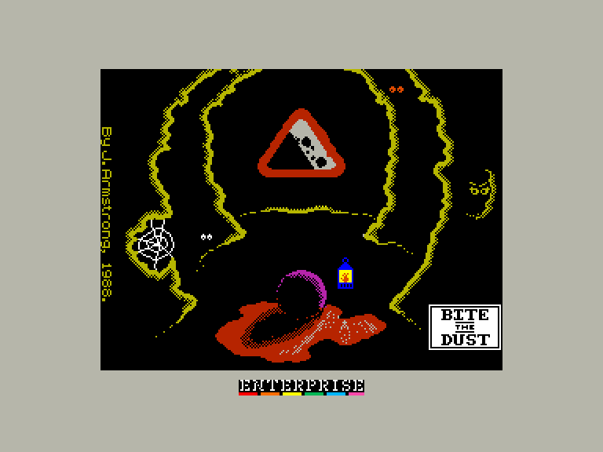
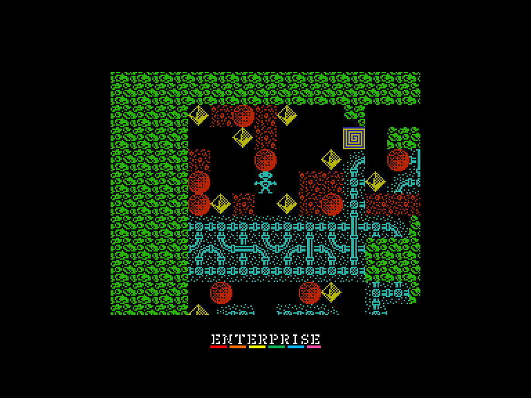
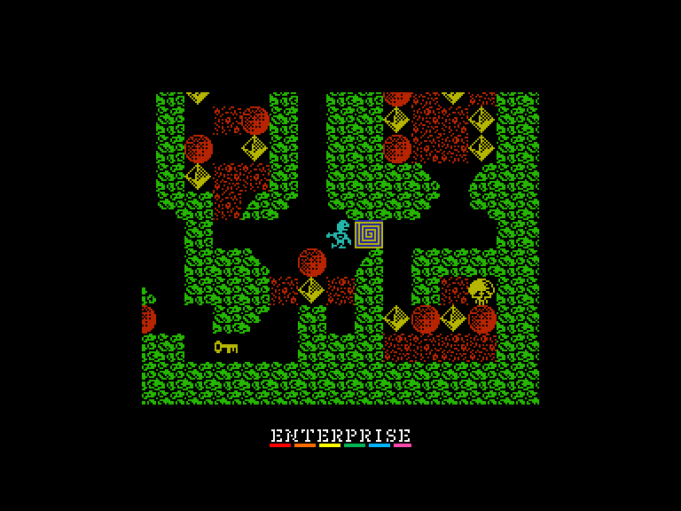
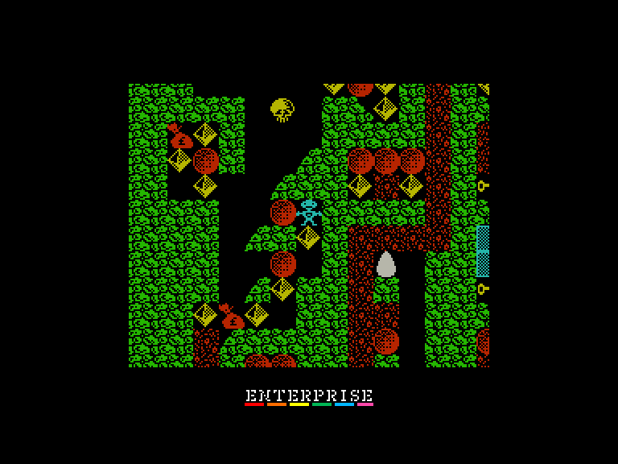

# Bite the Dust

 
 
 

Жанр: BoulderDash-like  
Кількість гравців: 1  
Мова гри: англійська  

## Емуляція
### SPEmu128
➖ швидкість гри трохи сповільнена  
➕ можна грати за допомогою джойстика  
### SPEmu
➖ завантажується тільки у вигляді снепшоту  
➖ швидкість гри трохи сповільнена  
➕ можна грати за допомогою джойстика  
### SP2
➖ грати можна лише з клавіатури  

## Опис

У Bite The Dust ви керуєте діджеєм Ніко, який шукає в алмазній шахті незліченні багатства. Ідея полягає в тому, щоб зібрати усі діаманти і мішки з грошима на кожному з 20 рівнів. Деякі місця в шахті можна прокопати, але будьте обережні: зсунете валун, і він розчавить героя на крихітні шматочки. Інші речі, на які варто звернути увагу, включають...

***Омлети*** (зроблені шляхом розбивання яєць): Вони переслідують вас, але їх можна вбити, кинувши на них камінь.

***Павуки***: Блукають по лабіринту, слідуючи за контурами лабіринту. Спрямовуйте їх у павутиння, щоб створити діаманти.

***Сейфи***: перетворюються на діаманти, коли ви знаходите ключ.

***Будильники***: дають вам додатковий час.

На проходження кожного рівня ви маєте три життя. Коли рівень завершено, ви отримуєте пароль, який можна використати, щоб не починати гру з самого початку. Після того, як ви пройдете всі 20 рівнів, вам не потрібно буде викидати гру, тому що в ній є програма-редактор.

## Системні вимоги

|Мінімальні системні вимоги:|Рекомендовані системні вимоги:|
|---------------------------|------------------------------|
|Оперативна пам'ять: **128 КБ**|Оперативна пам'ять: **128 КБ (або більше)**|  

## Керування та тонкощі запуску
### Основні [елементи керування](../controllers.md):
⌨ Клавіатура (`Q`, `A`, `O`, `P`, `Space`)  
🎮 Зовнішній джойстик 2

### Додаткові файли:
🗺 [Мапа гри](https://maps.speccy.cz/maps/BitetheDust.png)  

## Автори
### Оригінальний реліз
🖥 Платформа: [ZX Spectrum](https://spectrumcomputing.co.uk/entry/542/ZX-Spectrum/Bite_the_Dust)  
👨‍💻 Програмісти: John Armstrong  
📅 Рік релізу: 1988  