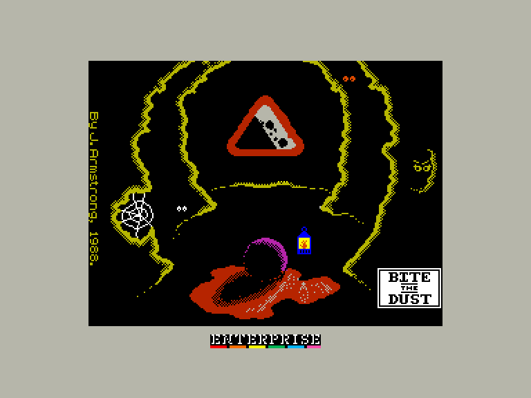
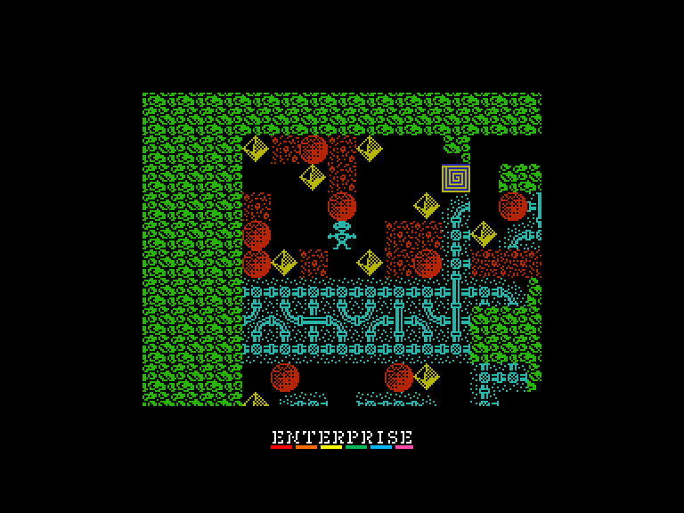
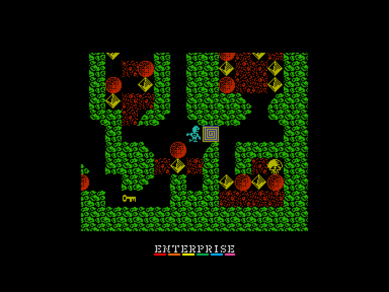
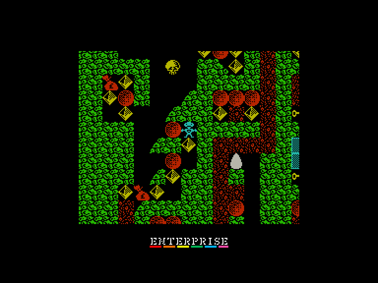

# Bite the Dust

 
 
 

Жанр: BoulderDash-like  
Кількість гравців: 1  
Мова гри: англійська  

## Емуляція
### SPEmu128
➖ швидкість гри трохи сповільнена  
➕ можна грати за допомогою джойстика  
### SPEmu
➖ завантажується тільки у вигляді снепшоту  
➖ швидкість гри трохи сповільнена  
➕ можна грати за допомогою джойстика  
### SP2
➖ грати можна лише з клавіатури  

## Опис

Джулі, подружка Діджея Ніко, бажає мільярди діамантів. Та наш герой не зовсім багатий, але він відкрив місцезнаходження секретної алмазної шахти.

Керуйте Ніко, досліджуючи шахту в пошуках незліченних багатств. Ваше завдання — зібрати всі діаманти та мішки з грошима на кожному з 20 рівнів. Ви можете прокопуватися крізь деякі ділянки, але будьте обережні: обвал валуна розчавить Діджея Ніко! 

Серед інших небезпек та особливостей:

 - **Омлети:** Переслідують вас, але їх можна знищити, скинувши на них валун.
 - **Павуки:** Блукають лабіринтом; направте їх у павутиння, щоб створити діаманти.
 - **Сейфи:** Перетворюються на діаманти, коли ви знаходите ключ.
 - **Будильники:** Дають додатковий час.

У вас є три життя на рівень. Після завершення рівня ви отримаєте пароль, який дозволить продовжити гру з цього місця. А після того, як ви пройдете всі 20 рівнів, вам не потрібно буде видаляти гру, тому що в ній є програма-редактор.

## Системні вимоги

### Мінімальні системні вимоги
Оперативна пам'ять: **128 КБ**

## Керування та тонкощі запуску
### Основні [елементи керування](../controllers.md):
⌨ Клавіатура (`Q`, `A`, `O`, `P`, `Space`)  
🎮 Зовнішній джойстик 2

### Додаткові файли:
🗺 [Мапа гри](https://maps.speccy.cz/maps/BitetheDust.png)  

## Автори
### Оригінальний реліз
🖥 Платформа: [ZX Spectrum](https://spectrumcomputing.co.uk/entry/542/ZX-Spectrum/Bite_the_Dust)  
👨‍💻 Програмісти: John Armstrong  
📅 Рік релізу: 1988  