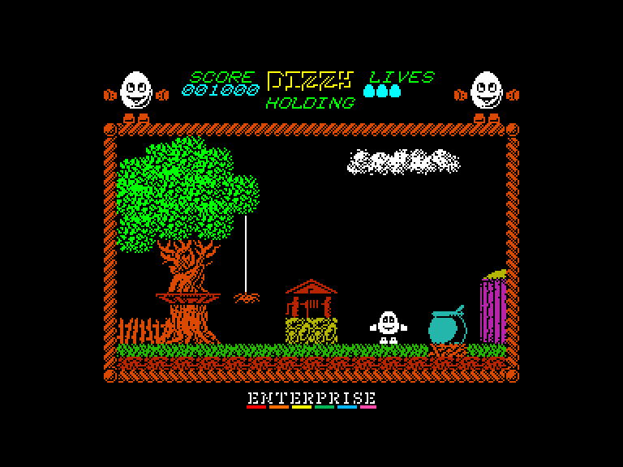
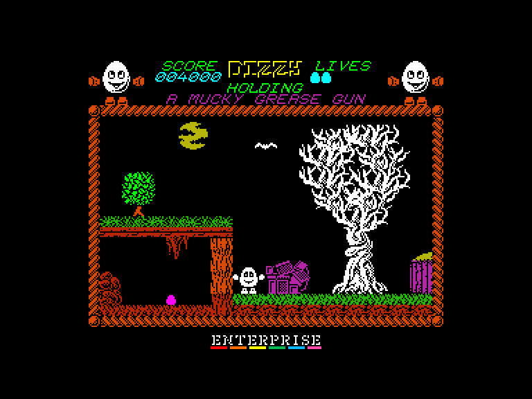
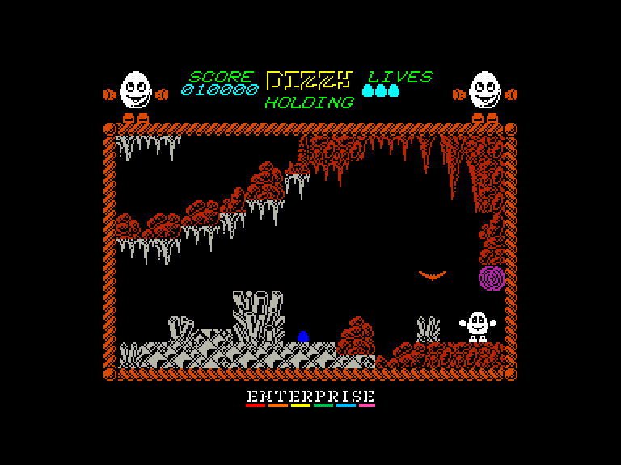

# Dizzy 1: Extended (The Ultimate Cartoon Adventure)

 
 
 

Жанр: пригода, платформер  
Кількість гравців: 1  
Мова гри: англійська, російська  

## Емуляція
### SPEmu
➖ погано працює звук  
➖ керування лише з клавіатури  
### SP2
➕ звук працює задовільно  
➕ можна грати за допомогою джойстиків  

## Опис
Діззі досліджував зачарований ліс у пошуках ресурсів, коли натрапив на таємничу кам'яну плиту. Очистивши її, він прочитав ледь помітний напис: "Зілля Ававіффові".

Діззі згадав, як його Яйце-батько розповідав про це зілля: воно єдине здатне позбавити їхні землі від грибка стопи і також може знищити злого чаклуна Закса. Закс тероризував містечко, насилаючи закляття, які старіли людей, осліплювали чоловіків і викликали дощ кожної неділі під час крикету.

Сповнений рішучості зупинити це зло, Діззі прочитав далі рецепт: "Наповніть пляшку зілля вареним волоссям лепрекона, срібною підкладкою хмар, пером качки-вампіра та чистим золотим жолудем – зваріть зілля та киньте його в Закса, щоб покінчити з його пануванням."

Діззі швидко приготувався визволяти землі Катманду.

Ця версія має низку оновлень та покращень:

- Гра тепер працюватиме в режимі 128k.
- Додано 16 абсолютно нових кімнат.
- Додано нові предмети.
- Деякі з добре відомих предметів тепер мають нову графіку.
- Виправлено те, як Dizzy зливається з фоном.
- Виправлено проблеми зі швидкістю роботи Dizzy та прокручуванням тексту.
- Міст, що руйнується, тепер з'являється знову, коли ви втрачаєте життя в ямі.
- Магніт підкови тепер виконує певну функцію, він є ключовим предметом для початку відвідування нових локацій.

У вас є три життя (їх можна збільшити, знайшовши яйця).  
За допомогою пружинистих грибів можна стрибати вище.  
Стережіться пасток!

## Системні вимоги

### Мінімальні системні вимоги
Оперативна пам'ять: **128 КБ**

## Керування та тонкощі запуску
### Елементи керування меню:

`Space`: Почати гру з керуванням на клавіатурі  
`K`: Почати гру з керуванням джойстиком (Int/Ext1)  

### Основні [елементи керування](../controllers.md):
⌨ Клавіатура (`Z`, `X`, `Space`, `Enter`)  
🕹 Вбудований джойстик + `Enter` *(тільки у емуляторі SP2)*  
🎮 Зовнішній джойстик 1 *(тільки у емуляторі SP2)*  

`Fire`: Підняти, викласти чи застосувати предмет  
`P`: Пауза  
`Q`: Вихід на головний екран  

### Додаткові файли:
🗺 [Мапа гри](https://maps.speccy.cz/maps/DizzyExtendedEdition2021.png)  

### Відеопроходження:
<iframe width="100%" src="https://www.youtube.com/embed/guNCHODHj3o" title="YouTube video player" frameborder="0" allowfullscreen></iframe>

## Посилання

🏡 [Домашня сторінка гри](https://yolkfolk.com/games/dizzy-the-ultimate-cartoon-adventure-2021-extended-edition/)  
🗨 [Тема на форумі zx-pk.ru](https://zx-pk.ru/threads/32932-dizzy-1-48k-extended-version-2021.html)  

## Автори
### Оригінальний реліз
👨‍💻 Розробник: The Oliver Twins  
👨‍💻 Розробник: Jon Paul Eldridge  
📅 Рік релізу: 1987  

### Модифікація
👨‍💻 Автор: Titus  
📅 Рік релізу: 2021  
