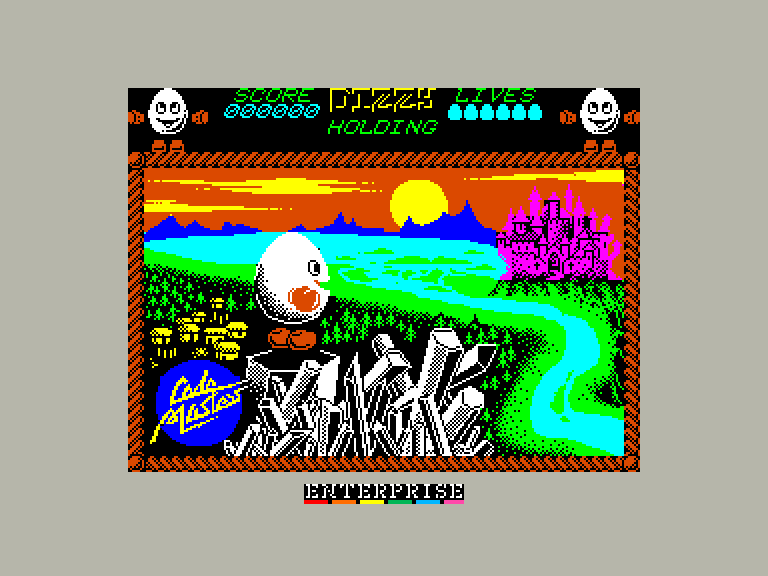
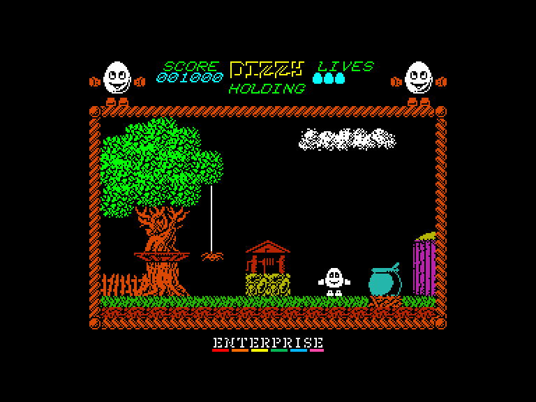
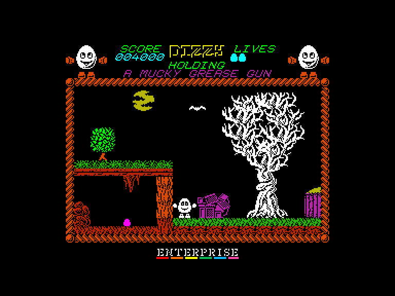
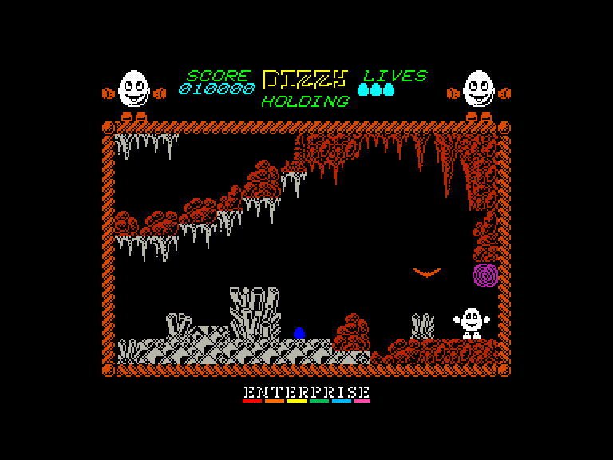

# Dizzy 1: Extended (The Ultimate Cartoon Adventure)

| | | | |
| --- | --- | --- | --- |
|||||

Жанр: пригода, платформер  
Кількість гравців: 1

## Емуляція
### SPEmu
➖ погано працює звук  
➖ керування лише з клавіатури  
### SP2
➕ звук працює задовільно  
➕ можна грати за допомогою джойстиків  

## Опис
*Fill a potion bottle with cooked*  
*Leprechauns wig, clouds silver lining,*  
*Vampire dux feather and some troll*  
*brew — cook the potion and throw it at*  
*Zaks to dissolve his reign.*  

У вас є три життя (їх можна збільшити, знайшовши яйця).
За допомогою пружинистих грибів можна стрибати вище.
Стережіться пасток!

Щоб перемогти Чарівника, потрібно розпалити вогонь під казаном і кинути в нього необхідні інгредієнти.
Потім киньте в нього порожню пляшку, вона наповниться і чарівним чином вискочить звідти.

Нарешті, розбийте цю пляшку біля Закса, і ви перемогли!

## Керування та тонкощі запуску
### Елементи керування меню:

`Space`: Почати гру з керуванням на клавіатурі  
`K`: Почати гру з керуванням джойстиком (Int/Ext1)  

### Основні [елементи керування](../controllers.md):
⌨ Клавіатура (`Z`, `X`, `Space`, `Enter`)  
🕹 Вбудований джойстик + `Enter` *(тільки у емуляторі SP2)*  
🎮 Зовнішній джойстик 1 *(тільки у емуляторі SP2)*  

`Fire`: Підняти/викласти предмет або взаємодія

### Відеопроходження:

## Мова гри
 - англійська
 - російська

## Посилання

🗨 [Тема на форумі zx-pk.ru](https://zx-pk.ru/threads/32932-dizzy-1-48k-extended-version-2021.html)  

## Автори
### Оригінальний реліз
