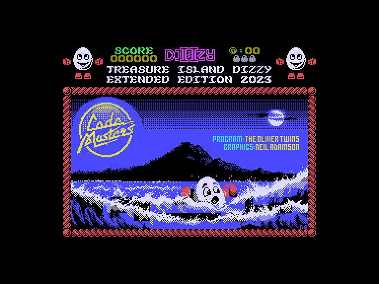
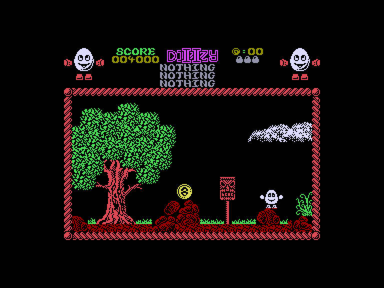
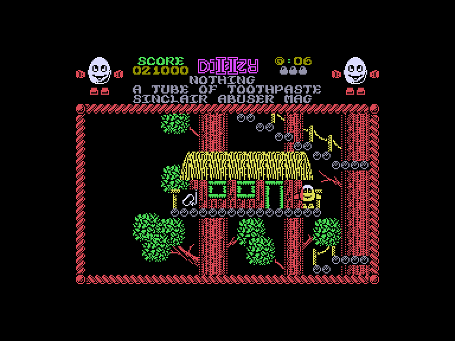
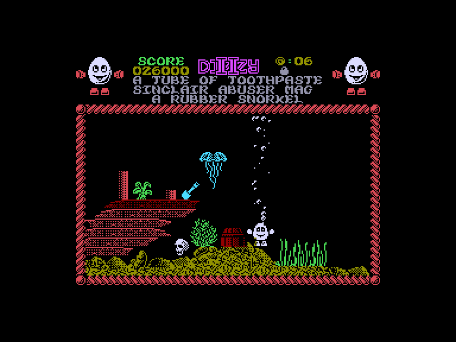

# Dizzy 2: Extended (Treasure Island Dizzy)

 
 
 

Жанр: пригода, платформер  
Кількість гравців: 1  
Мова гри: англійська, російська  

## Емуляція
### SPEmu
❌ не працює  

### SP2
➕ звук працює задовільно  
➕ можна грати за допомогою джойстиків  

## Опис
Діззі з нетерпінням чекав круїзу навколо світу, який він забронював. Хоча на кораблі було забагато піратів, а капітан Довгов'язий Джон Сільвер виявився грубіяном, Діззі насолоджувався подорожжю. Одного разу, під час гри в крикет, Діззі, у пориві нестримної дурості, використав запасні дерев'яні ноги капітана замість "пеньків". Коли ці ноги випадково опинилися за бортом, Діззі змусили "прогулятися по дошці".

Так він опинився на, здавалося б, безлюдному острові. Тепер йому доведеться знайти спосіб повернутися до своїх друзів, Яйценародців, і подати позов про відшкодування збитків у своєму туристичному агентстві.

Ця версія має низку оновлень та покращень:

* Гру краще розфарбовано, зменшено клешинг.
* Додано кілька життів.
* Швидкість виведення графіки прискорено в кілька разів, гру по можливості синхронізовано з кадровою розгорткою. Все стало плавнішим, швидшим і рівномірнішим.
* Додано +18 екранів.
* Додано +7 предметів і деяку кількість іншої графіки.
* Деякі старі предмети намальовані краще.
* Сюжет гри розширено.
* Додані додаткові звуки.
* Максимальне число очок у грі: 143600

## Системні вимоги

### Мінімальні системні вимоги
Оперативна пам'ять: **128 КБ**

## Керування та тонкощі запуску
### Елементи керування меню:

`Space`/`0`: Почати гру з керуванням на клавіатурі (1-й або 2-й варіант)  
`K`: Почати гру з керуванням джойстиком (Int/Ext1)  

### Основні [елементи керування](../controllers.md):
⌨ Клавіатура (`Z`, `X`, `Space`, `Enter`)  
⌨ Клавіатура (`6`, `7`, `8`, `9`, `0`)  
🕹 Вбудований джойстик + `Enter`  
🎮 Зовнішній джойстик 1  

`Fire`: Підняти, викласти чи застосувати предмет  
`P`: Пауза  
`Q`: Вихід на головний екран  

### Додаткові файли:
🗺 [Мапа гри](https://yolkfolk.com/media/images/maps/TreasureIslandDizzy_2023ExtendedEdition_Spectrum.png)  

### Відеопроходження:
<iframe width="560" height="315" src="https://www.youtube.com/embed/oygm5nGmK58" title="YouTube video player" frameborder="0" allowfullscreen></iframe>

## Посилання

🏡 [Домашня сторінка гри](https://yolkfolk.com/games/treasure-island-dizzy-2023-extended-edition/)  
🗨 [Тема на форумі zx-pk.ru](https://zx-pk.ru/threads/34933-dizzy-2-48-128k-extended-edition-2023.html?p=1172427#post1172427)  

## Автори
### Оригінальний реліз
👨‍💻 Розробник: The Oliver Twins  
👨‍💻 Розробник: Neil Adamson  
📅 Рік релізу: 1989  

### Модифікація
👨‍💻 Автор: Titus  
📅 Рік релізу: 2023  
