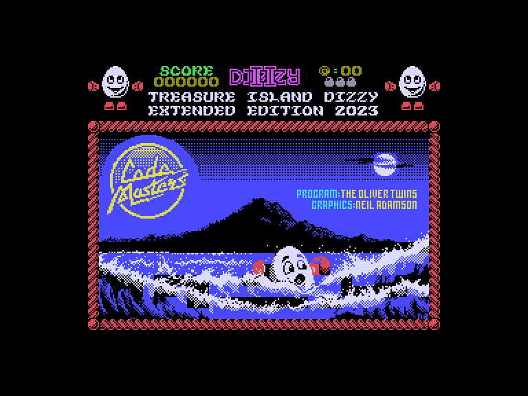
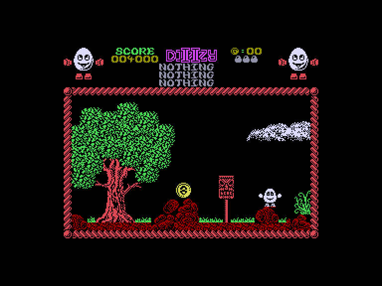
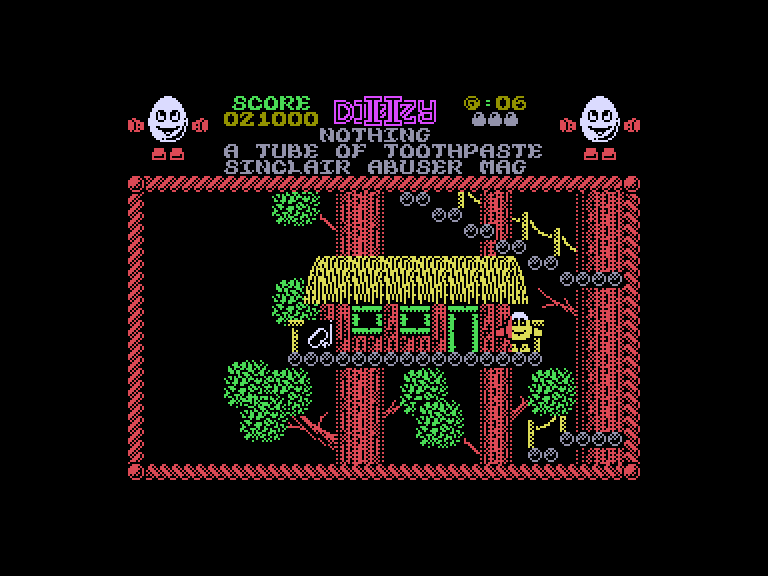
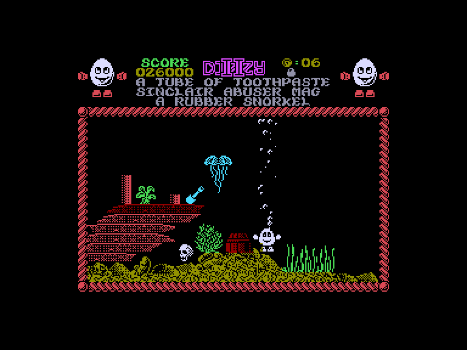

# Dizzy 2: Extended (Treasure Island Dizzy)

 
 
 

Жанр: пригода, платформер  
Кількість гравців: 1  
Мова гри: англійська, російська  

## Емуляція
### SPEmu
❌ не працює  

### SP2
➕ звук працює задовільно  
➕ можна грати за допомогою джойстиків  

## Опис
Діззі з нетерпінням чекав навколосвітнього кругосвітнього круїзу, який він забронював.
Коли він розповів іншим жовторотикам про вигідну пропозицію, вони здивувалися, що ж на нього чекає попереду...

Спочатку Діззі сподобався круїз, хоча на кораблі було занадто багато піратів, грог був розбавлений, а він навіть не знав, що таке шпренгель, не кажучи вже про те, як його з'єднувати!

Капітан, Довгий Джон Сілвер, був милим старим хлопцем з добрими манерами, який вміло ображав і принижував пасажирів, що платили за проїзд.

Він був добре збалансований – на одному плечі у нього був папуга, а на іншому – чіп, і мав дерев’яну ногу, яку він придбав, коли в дитинстві випав із коляски.
Так чи інакше, їхній чудернацький чоловічок опинився в тихій воді одного дня, залитого сонцем, і Діззі подумав організувати гру в крикет на кормовій палубі.

У припадку сліпої дурості він використав колекцію запасних ніг капітана як імпровізовані бити, а коли вони загубилися за бортом, його змусили пройти по дошці!

Так він опинився на тихому, залитому сонцем пляжі безлюдного, здавалося б, острова.
Йому потрібно було якось повернутися на «Жовторотих» і подати заяву про компенсацію в туристичну агенцію...

Ця версія має низку оновлень та покращень:

* Гру краще розфарбовано, зменшено клешинг.
* Додано кілька життів.
* Швидкість виведення графіки прискорено в кілька разів, гру по можливості синхронізовано з кадровою розгорткою. Все стало плавнішим, швидшим і рівномірнішим.
* Додано +18 екранів.
* Додано +7 предметів і деяку кількість іншої графіки.
* Деякі старі предмети намальовані краще.
* Сюжет гри розширено.
* Додані додаткові звуки.
* Максимальне число очок у грі: 143600

## Керування та тонкощі запуску
### Елементи керування меню:

`Space`/`0`: Почати гру з керуванням на клавіатурі (1-й або 2-й варіант)  
`K`: Почати гру з керуванням джойстиком (Int/Ext1)  

### Основні [елементи керування](../controllers.md):
⌨ Клавіатура (`Z`, `X`, `Space`, `Enter`)  
⌨ Клавіатура (`6`, `7`, `8`, `9`, `0`)  
🕹 Вбудований джойстик + `Enter`  
🎮 Зовнішній джойстик 1  

`Fire`: Підняти, викласти чи застосувати предмет  
`P`: Пауза  
`Q`: Вихід на головний екран  

### Додаткові файли:
🗺 [Мапа гри](https://yolkfolk.com/media/images/maps/TreasureIslandDizzy_2023ExtendedEdition_Spectrum.png)  

### Відеопроходження:
<iframe width="560" height="315" src="https://www.youtube.com/embed/oygm5nGmK58) zEE" CFN8Yitle="YouTube video player" frameborder="0" allowfullscreen></iframe>

## Посилання

🏡 [Домашня сторінка гри](https://yolkfolk.com/games/treasure-island-dizzy-2023-extended-edition/)  
🗨 [Тема на форумі zx-pk.ru](https://zx-pk.ru/threads/34933-dizzy-2-48-128k-extended-edition-2023.html?p=1172427#post1172427)  

## Автори
### Оригінальний реліз
👨‍💻 Розробник: The Oliver Twins  
👨‍💻 Розробник: Neil Adamson  
📅 Рік релізу: 1989  

### Модифікація
👨‍💻 Автор: Titus  
📅 Рік релізу: 2023  
