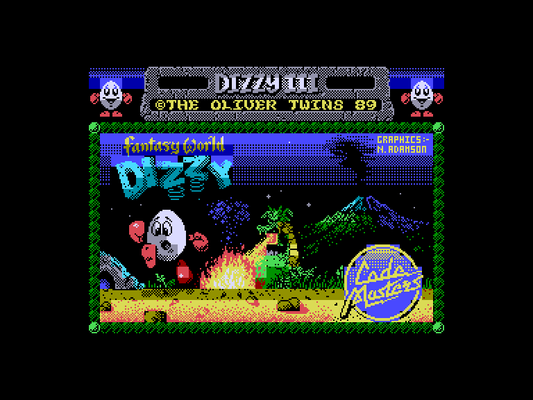
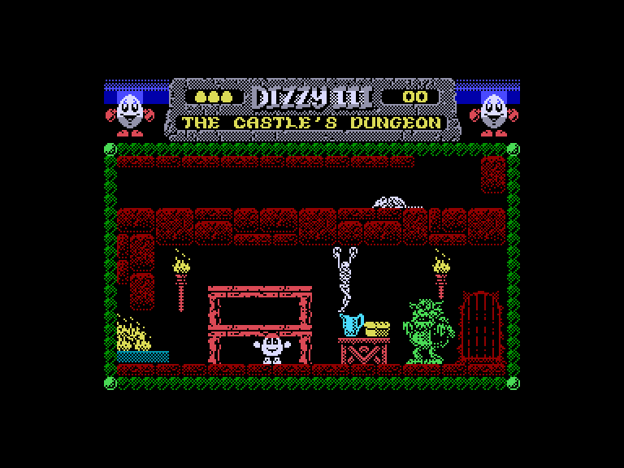
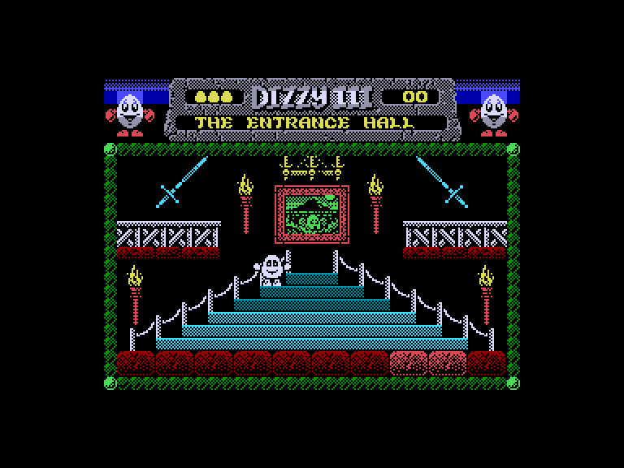
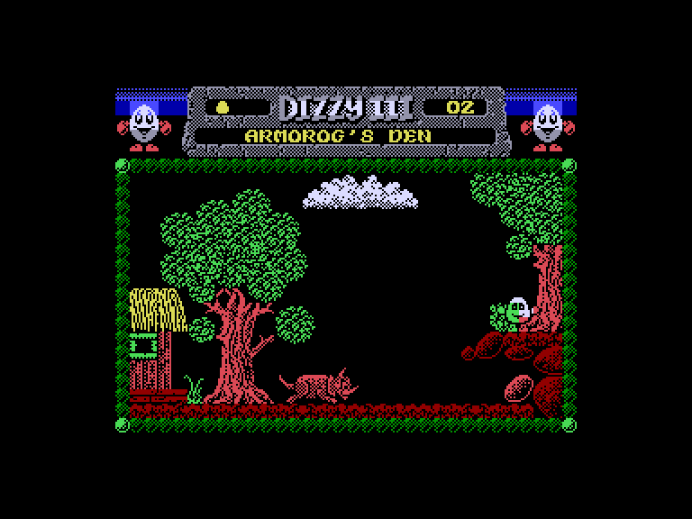

# Dizzy 3: Extended (Fantasy World Dizzy)

 
 
 

Жанр: пригода, платформер  
Кількість гравців: 1  
Мова гри: англійська, російська  

## Емуляція
### SPEmu
❌ не працює керування  

### SP2
➕ звук працює задовільно  
➖ можливо грати лише за допомогою клавіатури  

## Опис
Діззі та Дейзі безтурботно прогулювалися чарівним лісом.

Але раптом тролі Злого Короля спіймали бідолашну Дейзі!
Її відправили до вежі Чарівника, а Діззі кинули до найглибшого, найтемнішого, найвологішого з Королівських підземель у надрах Світу фантазій.

Діззі злякався.
Хто знав, яка доля його чекає?
І він ще не зробив домашнє завдання цього тижня!

Але потім він згадав, що в нього є свіже зелене яблуко, яке він планував дати своєму вчителю, щоб уникнути арешту, і побадьорився.

А на столі був хліб і вода!
У його голові почав виношуватися хитрий план…

Але Діззі не може все зробити сам… ти повинен допомогти йому!

Ця версія має низку оновлень та покращень:

* Додано два рівні яскравості атрибутів.
* Перемальовані деякі предмети та покращено розмальовку лісу.
* Тепер при взятті 30 монет грає інша мелодія, що раніше не використовувалася.
* Сцену з серцями, що крутяться, тепер можна перервати за натисканням клавіші.
* Додана пасхалка.
* Додано кілька нових екранів, предметів та деяку кількість іншої графіки.

## Системні вимоги
### Мінімальні системні вимоги
Оперативна пам'ять: **128 КБ**

## Керування та тонкощі запуску
### Елементи керування меню:

`Space`/`0`: Почати гру з керуванням на клавіатурі  

### Основні [елементи керування](../controllers.md):
⌨ Клавіатура (`Z`, `X`, `Space`, `K`, `M`, `Enter`)  
⌨ Клавіатура (`6`, `7`, `8`, `9`, `0`)  

`Q`: Вихід на головний екран  

### Відеопроходження:
<iframe width="560" height="315" src="https://www.youtube.com/embed/7vbbIH1T8R0" title="YouTube video player" frameborder="0" allowfullscreen></iframe>

## Посилання

🏡 [Домашня сторінка гри](https://yolkfolk.com/games/fantasy-world-dizzy-2023-extended-edition/)  
🗨 [Тема на форумі zx-pk.ru](https://zx-pk.ru/threads/35362-dizzy-3-48-128k-extended-edition-2023.html)  

## Автори
### Оригінальний реліз
👨‍💻 Розробник: The Oliver Twins  
👨‍💻 Розробник: Neil Adamson  
📅 Рік релізу: 1989  

### Модифікація
👨‍💻 Автор: Titus  
📅 Рік релізу: 2023  
