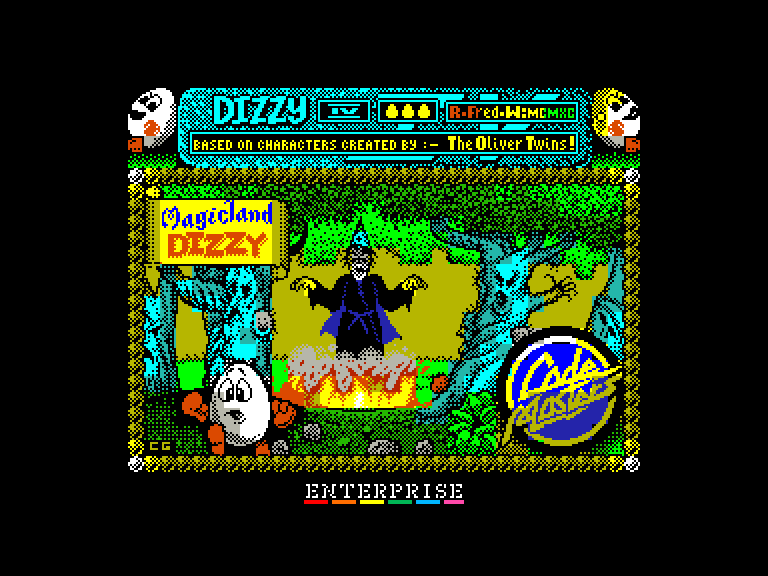
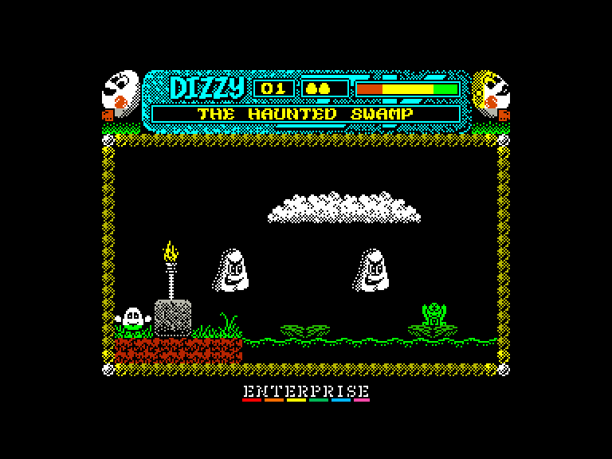
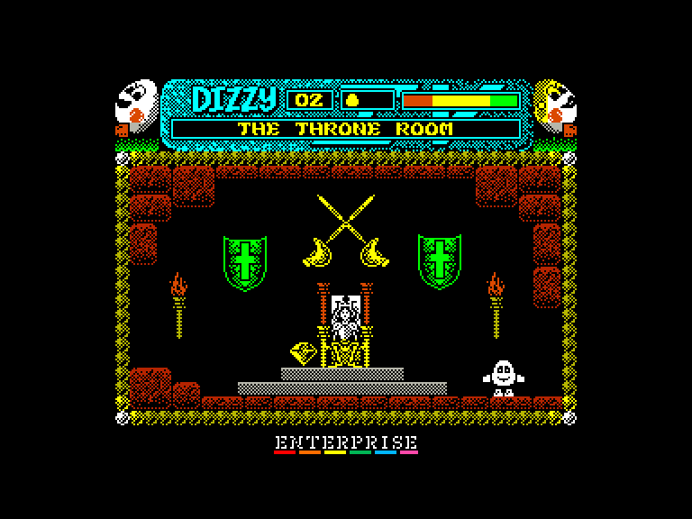
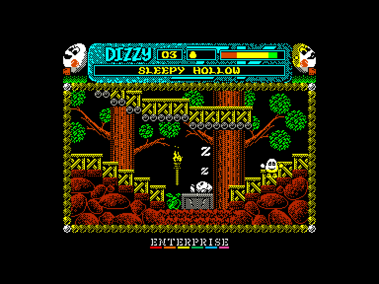

# Dizzy 4: Classic + (Magicland Dizzy)

 
 
 

Жанр: пригода, платформер  
Кількість гравців: 1  
Мова гри: англійська, російська  

## Емуляція
### SPEmu
➕ можна грати за допомогою зовнішнього джойстика  

### SPEmu128
❌ гра не реагує на натискання клавіш  

### SP2
➖ можливо грати лише за допомогою клавіатури  

## Опис
Злий Чаклун Закс повернувся! У якості жахливої помсти він переніс Яйценародців у дивний Казковий світ і наклав на них злі закляття, щоб ув'язнити навіки.

Діззі мусить звільнити шістьох Яйценародців, зруйнувавши чари, а потім знищити Закса раз і назавжди, перш ніж він зможе повернутися додому.

Ця версія має низку оновлень та покращень:

* Додано два рівні яскравості атрибутів.
* Перемальовані деякі предмети та покращено розмальовку лісу.
* Додана пасхалка.

## Системні вимоги
### Мінімальні системні вимоги
Оперативна пам'ять: **128 КБ**

## Керування та тонкощі запуску
### Елементи керування меню:

`Space`/`0`: Почати гру  

### Основні [елементи керування](../controllers.md):
⌨ Клавіатура (`Z`, `X`, `Space`, `K`, `M`, `Enter`)  
⌨ Клавіатура (`6`, `7`, `8`, `9`, `0`)  
🎮 Зовнішній джойстик 2 *(тільки у емуляторі SPEmu)*  

`Q`: Вихід на головний екран  

### Додаткові файли:
🗺 [Мапа гри](https://yolkfolk.com/media/images/maps/MagiclandDizzy_2024ClassicEdition_Spectrum.png)

### Відеопроходження:
<iframe width="560" height="315" src="https://www.youtube.com/embed/GqafPQDuCLg" title="YouTube video player" frameborder="0" allowfullscreen></iframe>

## Посилання

🏡 [Домашня сторінка гри](https://yolkfolk.com/games/magicland-dizzy-2024-classic-edition/)  
🗨 [Тема на форумі zx-pk.ru](https://zx-pk.ru/threads/35721-dizzy-4-48-128k-classic-edition-2024.html)  

## Автори
### Оригінальний реліз
👨‍💻 Розробник: The Oliver Twins  
👨‍💻 Розробник: Neil Adamson  
📅 Рік релізу: 1990  

### Модифікація
👨‍💻 Автор: Titus  
📅 Рік релізу: 2024  
