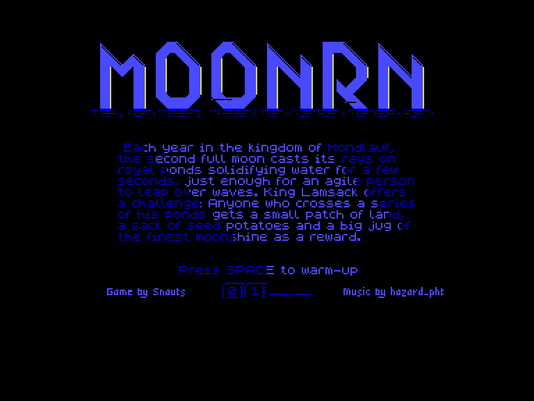
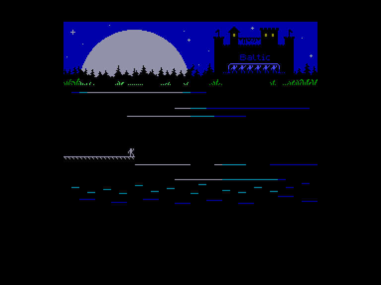
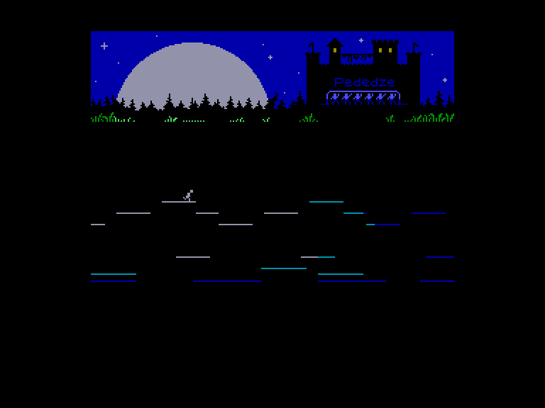
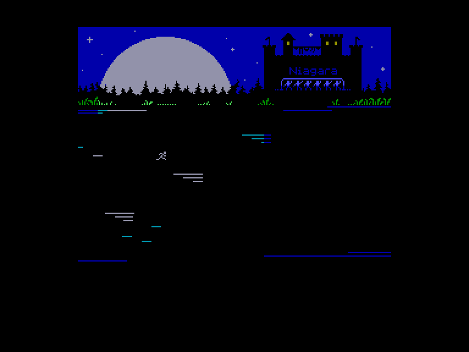

# MoonRN

 
 
 

Жанр: аркада  
Кількість гравців: 1  
Мова гри: англійська  

## Емуляція
### SPEmu / SPEmu128
❌не працює  
### SP2
➕ можна грати за допомогою джойстиків  
⚠ Емулюється тільки перша версія гри (без екрану завантаження).

## Опис

У королівстві Мондлауф щороку під час другого повного місяця вода в королівських ставках твердне на кілька секунд. Спритна людина може встигнути перестрибнути через хвилі. Король Ламсак пропонує випробування: кожен, хто подолає серію його ставків, отримає в нагороду невелику ділянку землі, мішок насіннєвої картоплі та великий глечик найкращого самогону.

Паркур-платформер для однієї кнопки. Стрибайте та робіть подвійні стрибки по платформах, створених місячним світлом. Дістаньтеся до правого краю плоту, щоб зупинитися та перейти на наступний рівень.

## Системні вимоги
### Мінімальні системні вимоги
Оперативна пам'ять: **128 КБ**

## Керування та тонкощі запуску

### Основні [елементи керування](../controllers.md):
⌨ Клавіатура (`Space`)  
🎮 Зовнішній джойстик 1

## Посилання

💾 [Завантажити гру](https://drive.google.com/drive/folders/19qsL5r-nS5UYUmssiztTc-ggGIvKK-X3)  
📃 [Spectrum Computing](https://spectrumcomputing.co.uk/entry/44037/ZX-Spectrum/MoonRN)  
🏡 [Домашня сторінка гри](https://snauts.itch.io/moonrn)  

## Автори

🖥 Платформа: [ZX Spectrum](https://spectrumcomputing.co.uk/entry/44037/ZX-Spectrum/MoonRN)  
👨‍💻 Програмісти: Snauts  
📅 Рік релізу: 2025  