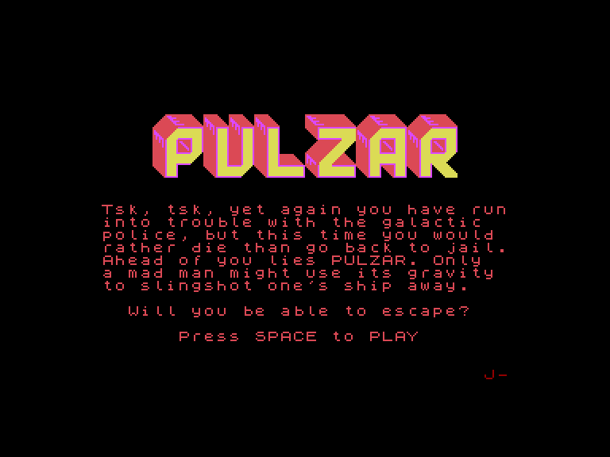
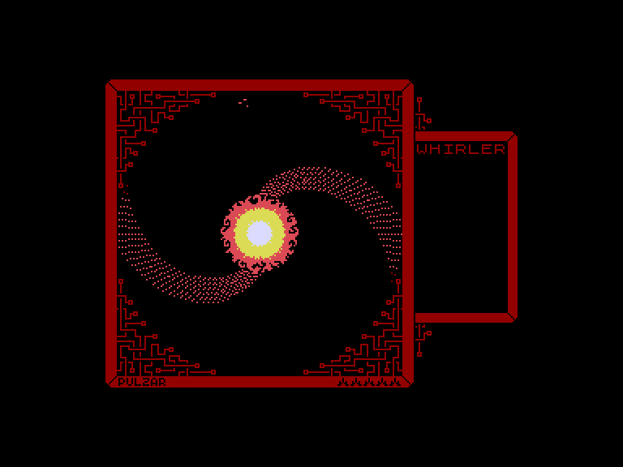
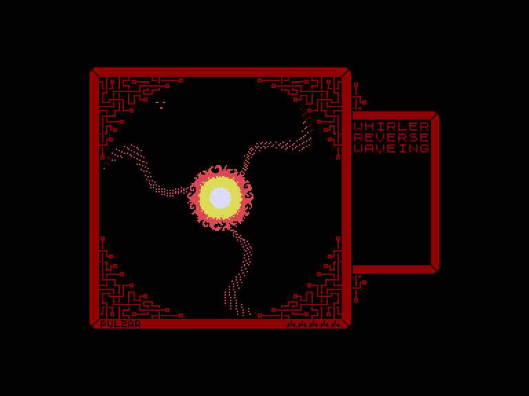
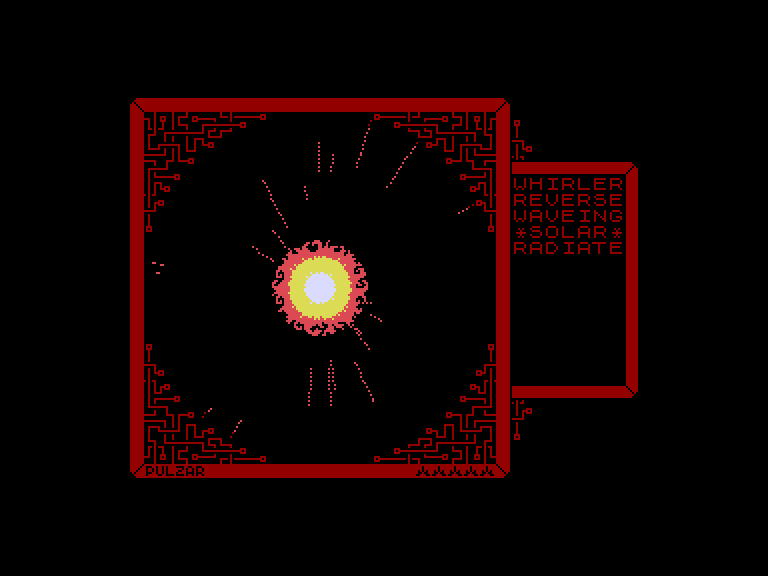

# Pulzar

 
 
 

Жанр: аркада  
Кількість гравців: 1  
Мова гри: англійська  

## Емуляція
### SPEmu / SPEmu128
❌не працює  
### SP2
➕ працює

## Опис

Цього разу ви знову вляпались у неприємності з галактичною поліцією, але краще померти, ніж повернутися до в'язниці. Попереду — зірка PULZAR. Лише божевільний може використати її гравітацію, щоб розігнати свій корабель і втекти.

Чи зможете ви врятуватися?

## Системні вимоги
### Мінімальні системні вимоги
Оперативна пам'ять: **128 КБ**

## Керування та тонкощі запуску

### Основні [елементи керування](../controllers.md):
⌨ Клавіатура (`Space`)  

## Посилання

📃 [Spectrum Computing](https://spectrumcomputing.co.uk/entry/43353/ZX-Spectrum/Pulzar)  
🏡 [Домашня сторінка гри](https://snauts.itch.io/pulzar)  

## Автори

🖥 Платформа: [ZX Spectrum](https://spectrumcomputing.co.uk/entry/43353/ZX-Spectrum/Pulzar)  
👨‍💻 Програмісти: Snauts  
📅 Рік релізу: 2024  