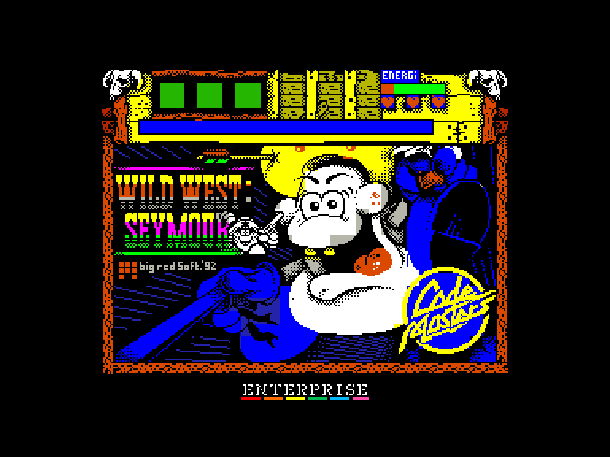
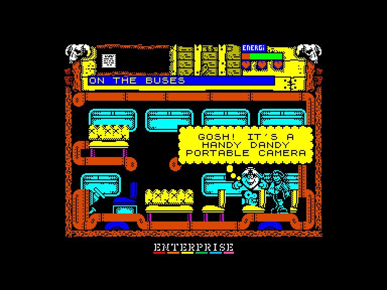
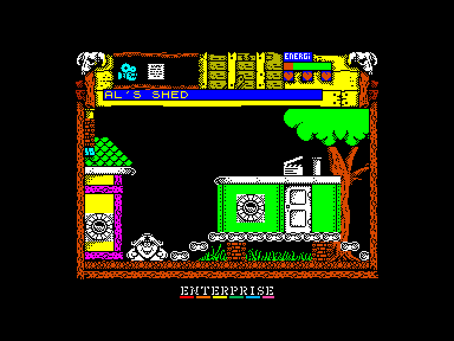
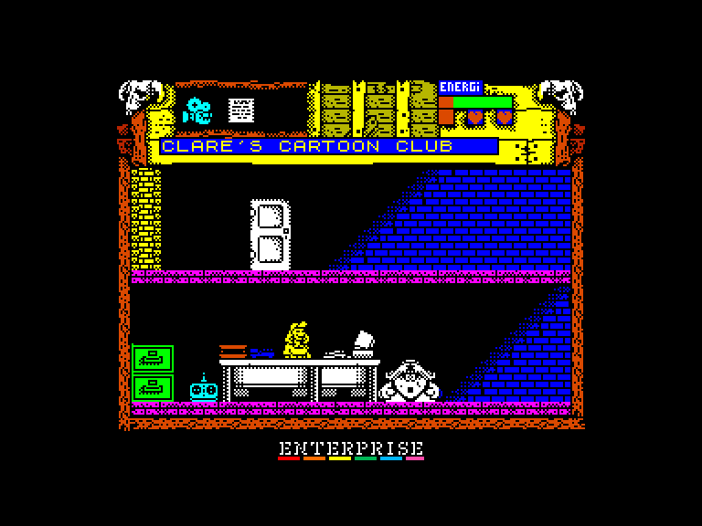

# Wild West Seymour

| | | | |
| --- | --- | --- | --- |
|||||

Жанр: пригода, платформер  
Кількість гравців: 1  
Мова гри: англійська  

## Емуляція
### SPEmu
➕ можна грати за допомогою зовнішнього джойстика  

### SPEmu128
➕ можна грати за допомогою зовнішнього джойстика  
➕ музика AY  

### SP2
➖ можливо грати лише за допомогою клавіатури  

## Опис
Сеймур прибуває в штаб-квартиру Codies, щоб почати роботу над наступним фільмом: ковбойським вестерном. На жаль, зйомки були саботовані! Ель Бандіто, таємничий ворог Сеймура, зробив усе можливе, щоб зупинити процес: сценарій зник, плівка не готова, батарейок до камери немає, світло розбито та забита мийка! Мало того, Ігровий Джин зник безвісти, а оператор Піт пошкодив руку. Бідолаха.

Допоможіть Сеймуру запустити процес, інакше світ може ніколи не побачити його чудовий фільм!

Ігровий Джин - це персонаж, який любить допомагати людям грати в ігри.  Якщо ви дасте йому кілька спеціальних кодів, він постарається зробити все можливе, щоб допомогти вам.

Записуйте спеціальні коди, які ви отримуєте в кінці кожного акту.  На початку гри ви можете миттєво повернутися до цього акту, пройшовши через двері, позначені як акт 2, 3 або 4.  У цей момент Джин запитає у вас ваше кодове слово, яке потрібно ввести з клавіатури.  Якщо ви не знаєте жодного коду, просто просто вийдіть з лівого боку екрану.

## Керування та тонкощі запуску
### Елементи керування меню:

`Space`: Почати гру  

### Основні [елементи керування](../controllers.md):
⌨ Клавіатура (`Z`, `X`, `Space`, `Enter`)  
⌨ Клавіатура (`6`, `7`, `8`, `9`, `0`)  
🎮 Зовнішній джойстик 2 *(тільки у емуляторі SPEmu)*  

`Q`: Вихід на головний екран  
`P`: Пауза  

### Додаткові файли:
🗺 [Мапа гри](https://maps.speccy.cz/maps/Seymour3.png)

### Коди рівней:
Акт 2: `21D135008`  
Акт 3: `10C700068`  
Акт 4: `238A35008`  

### Відеопроходження:

## Посилання

📃 [Spectrum Computing](https://spectrumcomputing.co.uk/entry/9415/ZX-Spectrum/Wild_West_Seymour)  

## Автори
### Оригінальний реліз
👨‍💻 Розробник: Big Red Software Ltd  
📅 Рік релізу: 1992  
